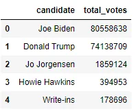
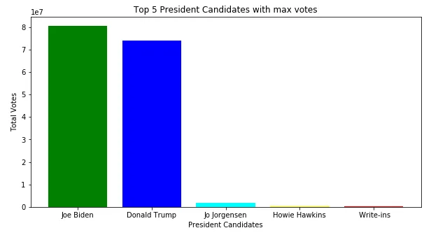
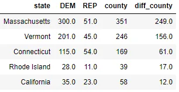
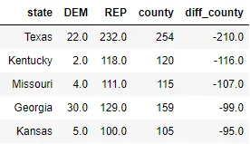

## The United States(US) is the only country with a continuous democracy for more than 200years. However, the US is more accurately defined as a constitutional republic. “Constitutional” refers to the fact that the government in the US is based on a Constitution, which is the supreme law of the US. The US elects its president every four years. The most recent election is the 2020 elections, which generated a lot of attention around the world. Although every citizen, who is eligible can vote, a presidential candidate needs 270 electoral college votes to win the presidency. There are two major parties in the US; Republican party and Democrat party. The current president is Joe Biden, a Democrat won with 279 electoral college votes. The former president, Donald Trump is a Republican, while his predecessor, Barack Obama is a Democrat. **Analysis** Performed analysis on US election results [data](https://www.kaggle.com/unanimad/us-election-2020) and made some EDA of the total votes distribution among candidates, parties and counties.

```python
df_president = pd.read_csv("president_county_candidate.csv")
max_voted_candidate = df_president.groupby('candidate')['total_votes'].sum()
top_5_candidates = max_voted_candidate.sort_values(ascending=False)[:5].reset_index()
top_5_candidates
```



```python
plt.figure(figsize=(10,5))
plt.bar(top_5_candidates['candidate'], top_5_candidates['total_votes'], color=[ 'green', 'blue', 'cyan', 'yellow', 'red'])
plt.ylabel("Total Votes")
plt.xlabel("President Candidates")
plt.title("Top 5 President Candidates with max votes")
plt.show()
```



## US Voting Results
The following code snippet and map shows that state wise total number of votes polled.

```python
df_president_states = pd.read_csv("president_state.csv")
state_codes = pd.read_csv('world_country_and_usa_states_latitude_and_longitude_values.csv')
df_state_votes = df_president_states.merge(state_codes, left_on='state', right_on='usa_state')
fig = px.choropleth(df_state_votes,
                    locations='usa_state_code',
                    color="total_votes",
                    range_color=(0, 10000000),
                    locationmode = 'USA-states',
                    scope="usa",
                    title='USA Presidential Votes Counts'
                   )
fig.update_layout(margin={"r":0,"t":0,"l":0,"b":0})
fig.show()
```


## 2020 USA Election: Vote Percentages by State
In this section considered only Democrat and Republic votes for the visualization purpose.

```python
democrat = df_president['party'] == 'DEM'
republican = df_president['party'] == 'REP'
df_president_county = df_president[democrat|republican]
df_president_county = df_president_county.groupby(['state','party'])['total_votes'].sum()
df_president_county = df_president_county.unstack()
df_president_county = df_president_county.reset_index()

df_president_county = df_president_county.merge(state_codes, left_on='state', right_on='usa_state')
df_president_county['percent_republic'] = df_president_county['REP']*100/(df_president_county['REP']+df_president_county['DEM'])

fig = px.choropleth(df_president_county,
                    locations="usa_state_code",
                    color = "percent_republic",
                    locationmode = 'USA-states',
                    hover_name="state",
                    range_color=[25,75],
                    color_continuous_scale = 'RdBu',
                    scope="usa",
                    title="2020 USA Election: Percent of Population Voting for the Republic Party"
                    )
fig.show()
```


## States with highest number of county but Republicans got less wins
Here we look into the states which has highest number of county but Republicans got very less wins. This are the some of the counties which made the difference.

```python
df_state_county = df_president.groupby('state')['county'].nunique()
df_president_county = df_president[democrat|republican]
df_president_county = df_president_county.groupby(['state','party'])['won'].sum()
df_president_county = df_president_county.unstack()
df_president_county = df_president_county.reset_index()
df_president_county = df_president_county.merge(df_state_county, on='state')
df_president_county['diff_county'] = df_president_county['DEM'] - df_president_county['REP']
df_president_county.sort_values(by=['diff_county', 'county'], ascending=[0, 0]).head(5)
```



The Republican party has got very less wins in Massachusetts, Vermont and Connecticut states which are having highest number of counties.

## States with max county which made the difference
```python
df_president_county.sort_values(by=['diff_county', 'county'], ascending=[1, 0]).head(5)
```



The Democratic party got very less wins in the Texas, Kentucky, Missouri, Georgia and Kansas states which are having highest number of counties, which made the difference.

## Conclusion
Both Republican and Democratic parties have very less votes different. The results shows that a great victory for Joe Biden, a Democrat with 279 electoral college votes. The number of votes polled made a history.
