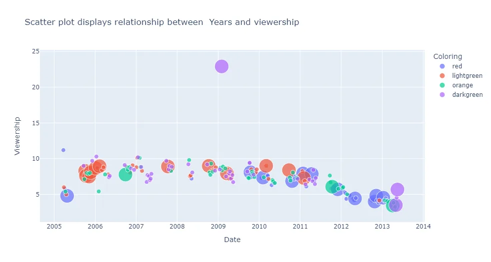
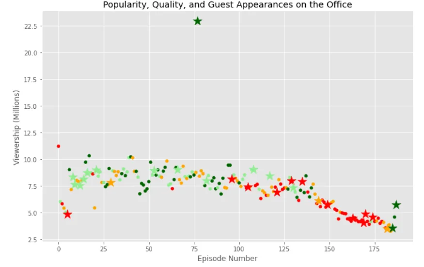
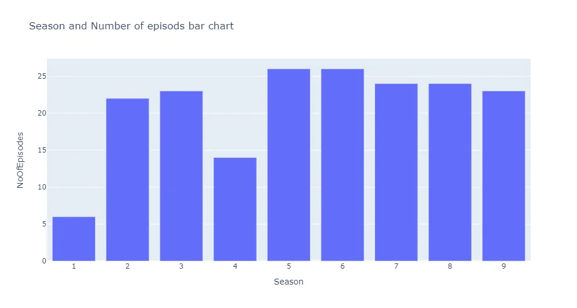
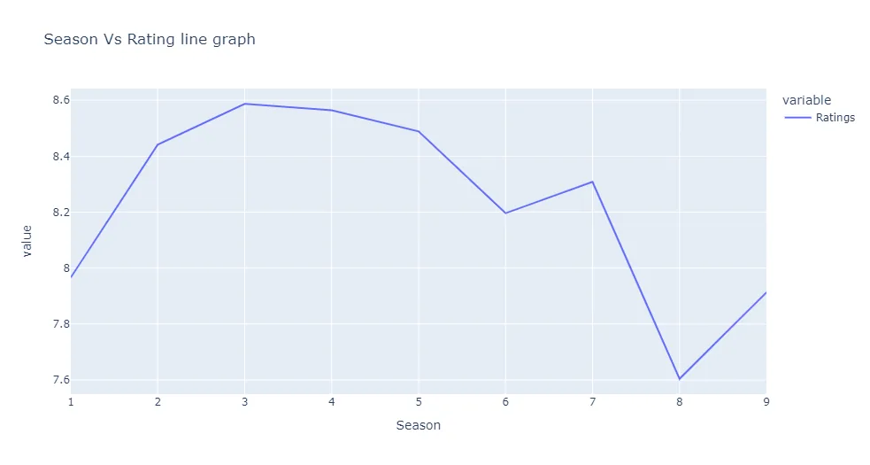

**The Office!** What started as a British documentary series about office culture in 2001 has since spawned ten other variants across the world, including an Israeli version (2010-13), a Hindi version (2019-), and even a French Canadian variant (2006-2007). Of all these iterations (including the original), the American series has been the longest-running, spanning 201 episodes over nine seasons.

[Kaggle](https://www.kaggle.com/nehaprabhavalkar/the-office-dataset) is where the data was extracted.

The dataset contains information on a variety of characteristics of each episode. In detail, these are:

- **episode_number:** Canonical episode number.
- **season:** Season in which the episode appeared.
- **episode_title:** Title of the episode.
- **description:** Description of the episode.
- **ratings:** Average IMDB rating.
- **votes:** Number of votes.
- **viewership:** Number of US viewers in millions.
- **duration:** Duration in the number of minutes.
- **release_date:** Airdate.
- **guest_stars:** Guest stars in the episode (if any).
- **director:** Director of the episode.
- **writers:** Writers of the episode.

The first step is to import the required libraries and load the data into pandas data frame as show below. Plotly was the main library used to generative interactive visual insights.

```python
import pandas as pd
import matplotlib.pyplot as plt
import seaborn as sns
import numpy as np
import plotly.express as px
plt.rcParams['figure.figsize']=[11,7]
plt.style.use("ggplot")
```

Data was imported using pandas and the date column set to be datetime.

```python
# Here we imported the data, and set the Date column to be: datetime not object
office_df=pd.read_csv('the_office_series.csv',parse_dates=['Date'])
df=office_df.copy()
```

The function below used to generate hind sights on the data before making further analysis. For instance, we ca observe that GuestStars is the only variable with both null and non null values. In this case the are 29 non null data points.

```python
df.info()
<class 'pandas.core.frame.DataFrame'>
RangeIndex: 188 entries, 0 to 187
Data columns (total 12 columns):
 #   Column        Non-Null Count  Dtype
---  ------        --------------  -----
 0   Unnamed: 0    188 non-null    int64
 1   Season        188 non-null    int64
 2   EpisodeTitle  188 non-null    object
 3   About         188 non-null    object
 4   Ratings       188 non-null    float64
 5   Votes         188 non-null    int64
 6   Viewership    188 non-null    float64
 7   Duration      188 non-null    int64
 8   Date          188 non-null    datetime64[ns]
 9   GuestStars    29 non-null     object
 10  Director      188 non-null    object
 11  Writers       188 non-null    object
dtypes: datetime64[ns](1), float64(2), int64(4), object(5)
memory usage: 17.8+ KB
```

The function below shows that there are 159 null data points on GuestStars variable.

```python
# Check null values in a dataset
df.isna().sum()
Unnamed: 0        0
Season            0
EpisodeTitle      0
About             0
Ratings           0
Votes             0
Viewership        0
Duration          0
Date              0
GuestStars      159
Director          0
Writers           0
dtype: int64
```

Based on insights of non values, another variable created to slice the that so that we have a variable contains data with guest stars and the another without guest stars.

```python
# create 'has_guests' column that contains boolean values for whether there is a guest star or not
guest=df.GuestStars.isnull()
has_guest=[False if i else True for i in guest]
has_guest
df['has_guests']=has_guest
df.head()

# change the name of the first column to be episode_number
df.rename(columns={'Unnamed: 0':'episode_number'},inplace=True)
df.head()
```

## Exploratory data analysis
### 1. Viewership vs Time.

To see the relationship between viewership and ratings and guest appearance along with the series, we need to separate the data with colors and size as there are at most 3 dimensions we can draw.

Create colors of red if the scaled rating is less than 0.25, orange if less than 0.5, light green if less than 0.75, and dark green if more than 0.75.

Create different sizes of dots; the size of 250 if the episode contains guest star and 25 if does not.

```python
 # Below is the interactive chart which shows viewership across the years
fig = px.scatter(df, x="Date", y="Viewership",title="Scatter plot displays relationship between  Years and viewership",
                 color="Coloring", size='Size' )

fig.show()
```



One outlier (episode) with the scaled rating of more than 7.5 and that contains guest stars has 22.5 million viewers. What is that episode?

```python
df[df['viewership'] == max(df['viewership'])]
```

```python
episode_number           77
season                    5
episodetitle  Stress Relief
ratings                 9.7
votes                  8170
viewership            22.91
duration                 60
date          2009-02-01 00:00:00
gueststars    Cloris Leachman, Jack Black, Jessica Alba
director      Jeffrey Blitz
writers       Paul Lieberstein
scaled_ratings       0.96875
has_guest               True
```

The scatter plot below show the association between viewership and episode number.

```python
fig = plt.figure()
# plotting using scatter plots two dataframes, the first one that contains data
# with existence of guest stars, The other one for data with no guest stars with
# different markers

plt.scatter(x=non_guests_df.episode_number,y=non_guests_df.Viewership,
            c=non_guests_df.Coloring,
            s=non_guests_df.Size)

plt.scatter(x=guests_df.episode_number,y=guests_df.Viewership,
           c=guests_df.Coloring,
            s=guests_df.Size,marker='*')

plt.xlabel('Episode Number')
plt.ylabel('Viewership (Millions)')
plt.title('Popularity, Quality, and Guest Appearances on the Office')
plt.show()
```



We can observe the 75 episode number with viewership above 22.5 million as an outlier.

How many episodes in each season

```python
# In this case we count the number of episodes in each season
e=df.groupby(('Season'),as_index=False).count()
e=e[['Season','episode_number']]
e.rename(columns={'episode_number':'NoOfEpisodes'},inplace=True)
fig = px.bar(e, x="Season", y="NoOfEpisodes",title="Season and Number of episods bar chart")
fig.show()
```



There are only 6 episodes in Season 1 and 14 in Season 2.

Relationship between season and rating

```python
# Grouping the data by season and calculate the average of the ratings for each season
rating=df.groupby('Season')['Ratings'].mean()

fig = px.line( rating,
              title = 'Season Vs Rating line graph')

fig.show()
```



The line graph above shows that season 3 has the most rating on average whilist season 8 has the least rating.

As we know there is an outlier in the `viewership` column that has guest stars. Even an outlier contains, the mean values are almost the same and viewership does not seem to increase if guest stars are present.
