**INTRODUCTION:**

In this blog, I became the Sherlock Holmes of the dataset and we will explore some key interesting facts and figures from NAICS data to precise our understanding. We will learn how to read multiple data files in python, aligned and adjust columns based on our needs, drop the extra rows, merge multiple data frames and apply EDA to explore our findings by visualizations.

**INFORMATION ABOUT DATA :**

**-** **What is NAICS?****:** The North American Industry Classification System (NAICS) is an industry classification system developed by the statistical agencies of Canada, Mexico and the United States, it is designed to provide common definitions of the industrial structure of the three countries and a common statistical framework to facilitate the analysis of the three economies.

**-** **NAICS Structure****:** NAICS uses a hierarchical structure. A "hierarchy" is the relationship of one item to a particular category:

**- Sector**: 2-digit code:

**- Subsector**: 3-digit code

**- Industry Group**: 4-digit code

**- NAICS Industry**: 5-digit code

**- National Industry**: 6-digit code

NAICS works as a hierarchical structure for defining industries at different levels of aggregation. For example, a 2-digit NAICS industry (e.g., 23 - Construction) is composed of some 3-digit NAICS industries (236 - Construction of buildings, 237 - Heavy and civil engineering construction, and a few more 3-digit NAICS industries). Similarly, a 3-digit NAICS industry (e.g., 236 - Construction of buildings), is composed of 4-digit NAICS industries (2361 - Residential building construction and 2362 - Non-residential building construction).

**Raw data****:** 15 CSV files beginning with RTRA. These files contain employment data by industry at different levels of aggregation; 2-digit NAICS, 3-digit NAICS, and 4-digit NAICS. Columns mean as follows:

(***i) SYEAR: Survey Year***

***(ii) SMTH: Survey Month***

***(iii) NAICS: Industry name and associated NAICS code in the bracket (iv) _EMPLOYMENT_: Employment***

**-** **LMO Detailed Industries by NAICS****:** An excel file for mapping the RTRA data to the desired data. The first column of this file has a list of 59 industries that are frequently used. The second column has their NAICS definitions. Using these NAICS definitions and RTRA data, we will create a monthly employment data series from 1997 to 2018 for these 59 industries.

**-** **Data Output Template****:** An excel file with an empty column for employment. We should fill the empty column with the data we will prepare from our analysis.

STEPS OF WORKING:

I break my analysis into diverse steps that became more comfortable for you to understand the work. According to this blog, seven general steps should be followed for this analysis.

Step 1: Import libraries and LMO detailed sheet and adjust the column NAICS.

Step 2: Read all categories of RTRA files.

Step 3: Align and break the column to make data reliable.

Step 4: Combined month and year column to make a date.

Step 5: Merging the RTRA data frames with LMO detailed sheet and dropping the N/A rows, concatenate all data frames to construct a Combined data frame.

Step 6: Read the main Output data template, merging it with a Combined data frame to produce the Final data frame which is used for further analysis.

Step 7: Apply exploratory data analysis to find some interesting results with the Final data frame.

Let's understand the working of all steps one by one.

1) First import the libraries and read the LMO detailed sheet and replace the '&' with ',' in the NAICS column of the data.

```python
import numpy as np
import pandas as pd
import matplotlib.pyplot as plt
import seaborn as sns
```

```python
# Read the Lmo detailed file containing codes of industries
lmo = pd.read_csv(r'C:\Users\Mairaj-PC\Desktop\LMO_Detailed_Industries_by_NAICS.csv')
```

```python
# Replace & with ,
lmo['NAICS'] = lmo.NAICS.str.replace('&', ',')
lmo.head()
```

Output is:

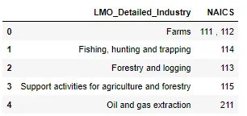

2) After the first step, we will read all RTRA files. So, make a function imported_data() that will take two arguments links of datafile and name of a data frame in which data file to be saved. We use this function to read all RTRA files of 2, 3 and 4 digits.

```python
# Now load the RTRA files
# create the function to import these file

def imported_data(data_file, data_to_saved):
    """""
    Args:

    data_file : dataframe to import data
    data_saved : new dataframe in which we save and combined same categories of dataframe

    Output:

    Combined dataframe for each category
    """""
    for file in data_file:
        df = pd.read_csv(file)
        data_to_saved = data_to_saved.append(df, ignore_index = True)
    return data_to_saved
```

Now apply above function to 2 digit NAICS datasets

```python
# import the 2 digit NAICS files
data_2NAICS = pd.DataFrame()
list_2NAICS = [r'C:\Users\Mairaj-PC\Desktop\A_NEWLY_HIRED_DATA_ANALYST\RTRA_Employ_2NAICS_97_99.csv',
               r'C:\Users\Mairaj-PC\Desktop\A_NEWLY_HIRED_DATA_ANALYST\RTRA_Employ_2NAICS_00_05.csv',
               r'C:\Users\Mairaj-PC\Desktop\A_NEWLY_HIRED_DATA_ANALYST\RTRA_Employ_2NAICS_06_10.csv',
               r'C:\Users\Mairaj-PC\Desktop\A_NEWLY_HIRED_DATA_ANALYST\RTRA_Employ_2NAICS_11_15.csv',
               r'C:\Users\Mairaj-PC\Desktop\A_NEWLY_HIRED_DATA_ANALYST\RTRA_Employ_2NAICS_16_20.csv'
              ]
data_2NAICS = imported_data(list_2NAICS, data_2NAICS)
data_2NAICS.head()
```

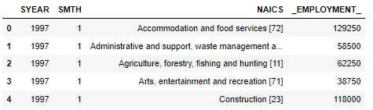

Similarly, we apply this function for 3 and 4 digit dataset.

3) In 2 and 3 digit data frames, the NAICS column contains the name of industries and their code so, we break this column to make a different column for the name and code. The str.split() and str.replace() functions

are helpful for this step.

```python
# Now break the two digit NAICS column and separte string and numbers

# first start with 2 digit
df = pd.DataFrame(data_2NAICS['NAICS'].astype('str').str.split('[').to_list(), columns=['NAICS','NAICS_CODE'])
df['NAICS_CODE']= df['NAICS_CODE'].astype('str').str.strip(']').str.replace('-',',')
data_2NAICS['NAICS']= df['NAICS']
data_2NAICS['NAICS_CODE']= df['NAICS_CODE']
data_2NAICS.head()
```

The output shows the NAICS column break into two columns NAICS and NAICS_CODE.

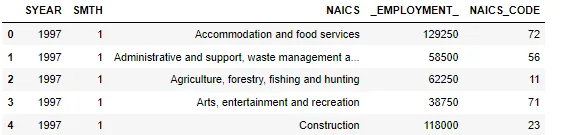

Similar approach used for 3 digit data.

4) In the data frames, the year and month column define separately. We make a function date_column() to combine these two columns to make a Date column for all three data frames.

```python
# now combine the SYEAR and SMONTH column in one
def date_column(df):
    df['Date'] = pd.to_datetime(df['SYEAR'].astype('str') + df['SMTH'].astype('str'), format='%Y%m')
    df = df.sort_values('Date')
    df.drop(columns=['SYEAR', 'SMTH'], inplace=True)
    return df
```

```python
# Now apply above function to 2 digit dataframe
data_2NAICS = date_column(data_2NAICS)
data_2NAICS.head()
```

The output have column of Date inplace of year and month.

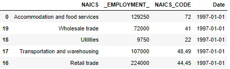

5) Now our data is ready for merge, 2 and 3 digits data frames have the same structure of column as compared to 4 digits. So, for 2 and 3 digits merging, we make a new function namely merging() that is used to merge these two data frames with LMO detailed dataset and drop the N/A rows. We use left merge and used code column for merging between these two data frames.

```python
# Now create a function to merge the all categories files with lmo file and drop na rows
def merging(first_df):
    new_df = first_df.merge(lmo, left_on = 'NAICS_CODE', right_on = 'NAICS', how = 'left').drop(columns = ['NAICS_x', 'NAICS_y'], axis = 1)
    new_df = new_df.dropna()
    return new_df
```

```python
# for 2 digit dataframe
new_2NAICS = merging(data_2NAICS)
new_2NAICS
```

The merge dataframe is given by:

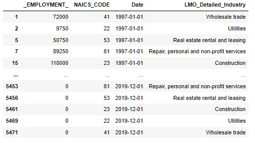

Similar steps used for 3 digit data set. For 4 digit data frame, we apply left merging manually that shown below:

```python
# for 4 digit datframe, we merge manually because it has arrange in different manner than other two dataframes
new_4NAICS = data_4NAICS.merge(lmo, left_on = 'NAICS_CODE', right_on = 'NAICS', how = 'left').drop('NAICS', axis = 1)
new_4NAICS = new_4NAICS.dropna()
new_4NAICS
```

The output is:

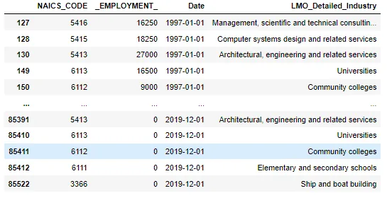

After the merging, we concatenate all three data frames to make a combined data frame by using pandas.concat() command.

```python
# now concatenate all three dataframe to make one combined dataframe
combined_NAICS = pd.concat([new_2NAICS, new_3NAICS, new_4NAICS])
```

6) After the making of the Combined data frame, we read the main output data template excel file by using pandas.read_excel() command.

```python
# import the output data sheet
Output_data = pd.read_excel(r'C:\Users\Mairaj-PC\Desktop\A_NEWLY_HIRED_DATA_ANALYST\Data_Output_Template.xlsx')
Output_data.head()
```

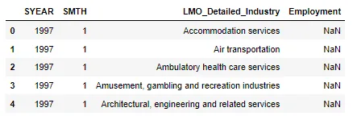

In this data frame, the employment column is empty so we need to fill this in by merging this data with our made Combined data frame. We apply left merging with 'Date' and 'LMO Detailed Industry ' columns, dropping the N/A rows and arranging the columns that make sense and are easy to read for others.

```python
# first apply date_column function to combine year and month column
Output_data = date_column(Output_data)
```

```python
# Now merge output_data with our made combined dataframe to fill the 'Employment' column
final_df = Output_data.merge(combined_NAICS, left_on=['Date','LMO_Detailed_Industry'], right_on=['Date','LMO_Detailed_Industry'], how='left').drop('Employment', axis = 1)

# Remove na rows
final_df = final_df.dropna()

# Rename _EMPLOYMENT_ column
final_df = final_df.rename({'_EMPLOYMENT_':'Employment'}, axis = 1)

# Also move Date column as first column of the dataframe
column_name = ['Date', 'LMO_Detailed_Industry', 'Employment', 'NAICS_CODE']
final_df = final_df.reindex(columns = column_name)
final_df
```

The final dataframe is:

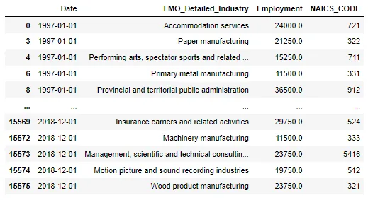

7) Now our data is ready for analysis, let's explore the data. In this blog, we find the answers to five different questions and show results with visualization.

i) How much employment is available in all industries through the year?

To find this answer first, apply the group by and sort the result in descending order. Let's make a barplot to show the output.

```python
final_df1 = final_df.groupby('LMO_Detailed_Industry')['Employment'].sum().sort_values(ascending = False)
# lets explore with chart
new_df1 = pd.DataFrame({'Industries':final_df1.index, 'Employments':final_df1.values})
plt.figure(figsize=(5,15))
sns.barplot(x= 'Employments', y= 'Industries', data = new_df1)
```

The Barplot is given by:

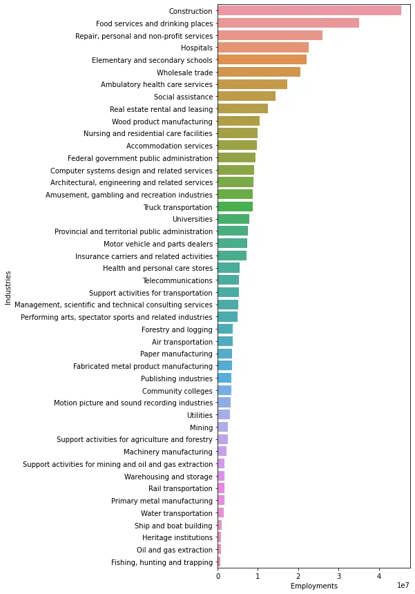

The output shows the top 3 industries are Construction, Food services and drinking places and Repair, personal and non-profit services.

ii) Find some key statistical results from the top 3 industries?

To apply statistical analysis, we make the top_3 data frame that contains entries from these industries. For analysis, we used the boxplot that will help to explore all descriptive statistics in a single diagram.

```python
top_3 = final_df[final_df['LMO_Detailed_Industry'].isin(['Construction', 'Food services and drinking places', 'Repair, personal and non-profit services'])]
top_3 = top_3[['LMO_Detailed_Industry', 'Employment']]

sns.boxplot(x = 'Employment', y = 'LMO_Detailed_Industry' , data = top_3)
plt.show()
plt.clf()
```

The Boxplot is :


The boxplot shows the employment in Construction varied from 1 million to 2.4 million and its median is almost 1.9 million. The other two industries are not wide as much with Construction. Food services range from over 1 million to 1.7 million and its median is just above 1.3 million. For repair and personal, it ranges from 0.8 million to 1.2 million and median is close to 9.5 million. One notable point is that no outlier was found in all three categories which proves our data was cleaned properly and reliable for analysis.

iii) How the total employment grows over the period?

For this analysis, we add the employment of all industries throughout the period and make a line plot to explore the result.

```python
final_df3 = final_df.groupby('Date')['Employment'].mean()
plt.figure(figsize=(20,10))
sns.lineplot(data = final_df3)
plt.xlabel('Time from 1997 to 2018')
plt.ylabel('Total Number of Employment')
plt.title('Employment trend during the years')
plt.show()
```

The Line plot is:

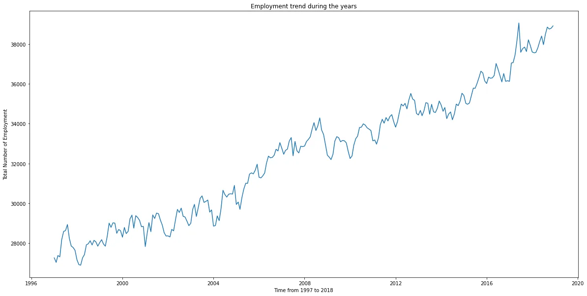

Overall, the trend is increasing over time a short decline sees nearest to the year 2008. As we know the global crises came all over the world from December 2007 to June 2009. Now explore the crises deeply.

iv) Let's explore how employment affects the crises period?

We used Construction industries data during the period of crisis. We make a line plot to understand the trend throughout the crisis.

```python
# we saw the trend during the crisis that how it affect the employment (Check with highest category construction)
year_06_10 = final_df[(final_df.Date >= '2007-12-01') & (final_df.Date < '2009-06-30') & (final_df['LMO_Detailed_Industry'] == 'Construction')]

final_df4 = year_06_10.groupby('Date')['Employment'].sum()

plt.figure(figsize=(20,10))
sns.lineplot(data = final_df4)
plt.xlabel('Time from December 2006 to June 2009')
plt.ylabel('Number of Employment in Contruction')
plt.title('Employment trend during the years of crisis')
plt.show()
```

The trend line plot shown below:

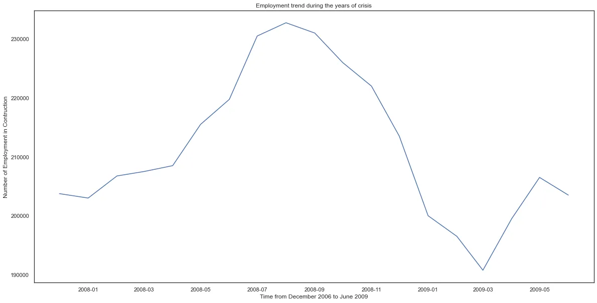

The output shows, the first ten months crises did not affect the trend but after that, the employment declined from 2.3 million to 1.9 million in the next six months.

v) Which is the most effective year that generates the highest number of employment opportunities?

For this analysis, we make the new column for the year and plot the employment in the bar plot.

```python
final_df5 = final_df
final_df5['YEAR'] = pd.DatetimeIndex(final_df5['Date']).year
final_df5[['YEAR', 'LMO_Detailed_Industry', 'Employment']]
# Now make the plot
final_df5_adj = final_df5.groupby('YEAR')['Employment'].sum()

plt.figure(figsize=(20,10))
sns.barplot(x = final_df5_adj.index , y = final_df5_adj.values)
plt.ylabel('Number of Employment')
plt.title('Total number of employment each year')
plt.show()
```

The Barplot is:

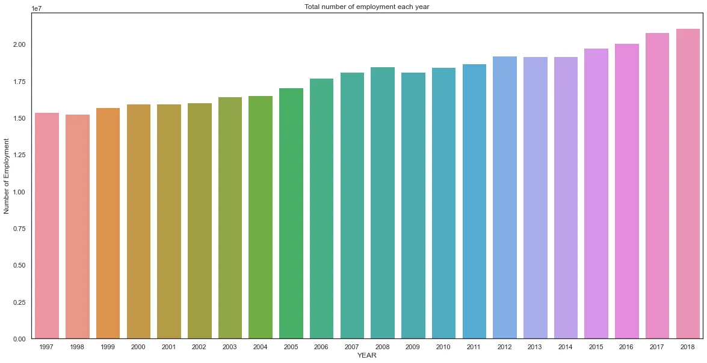

The most effective is 2018, the trend is upward so that is likely to happen that the last year of our data is more effective than previous years. I hope this blog is helpful to you.
