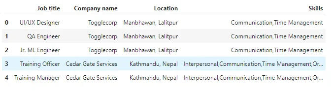
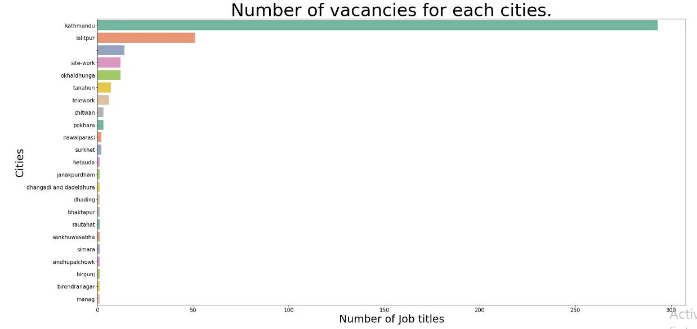
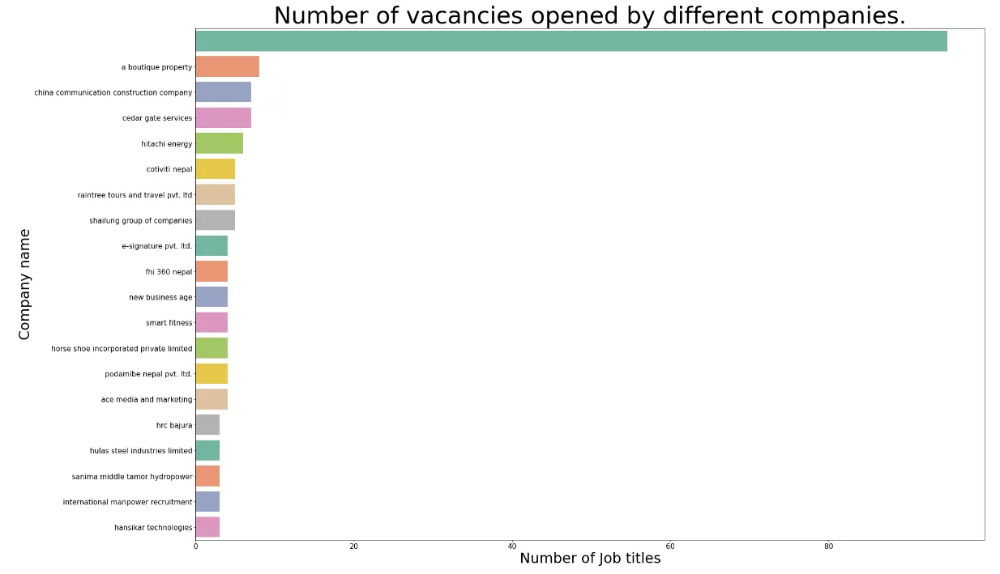
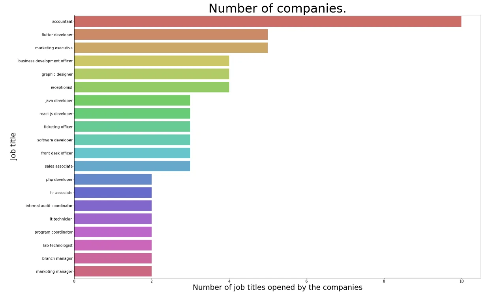

This blog is about vacancies in the Nepali job market and get idea on most frequent jobs and location where we can get most of these jobs.The dataset was in CSV form which was fetched from the famous job search website name as [merojob.com](https://merojob.com/) and [jobaxle.com](https://jobaxle.com/).

The web scraped dataset is looked like below image. The code used to scrap the data from jobexle is **web_scraping_jobaxle.ipynb** and from merojob is **web_scraping_merojob.ipynb,** you can find it from this[**link.**](https://github.com/awalGaurab/EDA_Nepali_Job_Market)


Let's move toward data analysis section. First import necessary libraries and try to read data and display first five rows.

```python
import pandas as pd
import seaborn as sns
import matplotlib.pyplot as plt
pd.set_option('display.max_rows', 500)

data = pd.read_csv('Merojob_jobaxle.csv')
data.head()
```



Now try to get ideas about our data with the help of some statistical methods.

```python
data.shape
(417, 4)

data.info()
<class 'pandas.core.frame.DataFrame'>
RangeIndex: 417 entries, 0 to 416
Data columns (total 4 columns):
 #   Column        Non-Null Count  Dtype
---  ------        --------------  -----
 0   Job title     417 non-null    object
 1   Company name  417 non-null    object
 2   Location      417 non-null    object
 3   Skills        294 non-null    object
dtypes: object(4)
memory usage: 13.2+ KB
```

From the above lines of code, we have gain some ideas about data like the shape and most importantly there are no any missing values in the columns of the dataset.That means we do not need to handle the missing values.The text of the dataset are on capital and small letters.We need to make them uniform which was done on below line of code.

```python
for col in data.columns:
data[col] = data[col].str.lower()
```

During investigation we found that the name of city is not uniform.The two line of code replace city name and other intergers/string with Kathmandu and string with lalitpur by lalitpur.

```python
data.replace(r'(^.*kathmandu.*$)', 'kathmandu',inplace = True,regex = True)

data.replace(r'(^.*lalitpur.*)', 'lalitpur',inplace = True,regex = True)
```

Also, places like putalisadak,lazimpat,baneshwor lies on Kathmandu and kupandole,kumaripati lies on lalitpur city so that we are going to handle this problem. Here, we make a list of places that lies on kathmandu and replace all these values by kathmandu.

```python
ktm_list = ['bhatbhateni, naxal','lazimpat,gairidhara', 'budhanilkantha,narayanthan','putalisadak','maharajgunj','tripureshowr','minbhawan, prayag marga','lainchaur','bishalnagar chandol, naxal','pepsicola', 'anamnagar-29','bhimsengola, old baneshwor','new baneshwor','new baneshwor (behind bicc and next to ace institue of mana…','new baneshwor ( indra square building, 7th floor)','sukedhara,dhumbarahi','dilibazar', 'hybrid (shorakhutte)','banasthali','house no 470, didi bahini marga', 'freshco nepal pvt. ltd.,','new plaza , putalisadak', 'lazimpat - 2','thamel', 'balaju chowk', 'thamel , nursing chowk','thamel, nursing chowk','starlight building, sahayogi nagar, janata sadak, ktm32,44…', 'putalisadak,','lazimpat']

data.loc[data['Location'].isin(ktm_list),'Location'] = 'kathmandu'
```

```python
lalitpur_list = ['lalitpur','kandevsthan, kupondole','bakhundole, lalipur','balkumari',]

data.loc[data['Location'].isin(lalitpur_list),'Location'] = 'lalitpur'
```

```python
remote_list = ['work from home','hybrid','remote']
data.loc[data['Location'].isin(remote_list),'Location'] = 'telework'
```

```python
site_list= ['hdcs-chaurjahari hospital rukum (west)','mugling to pokhara site','eastern nepal','remote areas','nepal and up, gorakhpur, silguri and bhutan','project site office and, frequently travel to project sites','different head quater of nepal','(province 2 only)','badimalika municipality 8 bajura head office, travel to pro…','biratnagar, chitwan, butwal, pokhara, kohalpur','jhapa , morang , sunsari , saptari , siraha , mohattari ,pa…']

data.loc[data['Location'].isin(site_list),'Location'] = 'site-work'
```

```python
chitwan_list = ['chitwan ,bharatpur']

data.loc[data['Location'].isin(chitwan_list),'Location'] = 'chitwan'
```

```python
nawalparasi_list = ['mukundapur, nawalparasi','nawalparasi west, bardaghat']

data.loc[data['Location'].isin(nawalparasi_list),'Location'] = 'nawalparasi'
```

```python
tanahun_list = ['dumre,tanahun','dumre, tanahun']
data.loc[data['Location'].isin(tanahun_list),'Location'] = 'tanahun'
```

```python
sindhupalchowk_list = ['yangri, sidhupalchwok']
data.loc[data['Location'].isin(sindhupalchowk_list),'Location'] = 'sindhupalchowk'
```

```python
rautahat_list = ['chandrapur, rautahat']
data.loc[data['Location'].isin(rautahat_list),'Location'] = 'rautahat'
```

```python
birendranagar_list = ['birendranagar, nepal']
data.loc[data['Location'].isin(birendranagar_list),'Location'] = 'birendranagar'
```

```python
birgunj_list = ['birgunj, parsa']
data.loc[data['Location'].isin(birgunj_list),'Location'] = 'birgunj'
```

```python
data['Location'].unique()

array(['lalitpur', 'kathmandu', 'telework', 'chitwan', 'simara','sankhuwasabha', 'surkhet', 'dhading', 'site-work', ' ','okhaldhunga', 'manag', 'sindhupalchowk', 'nawalparasi',
'rautahat', 'tanahun', 'dhangadi and dadeldhura', 'birendranagar','janakpurdham', 'hetauda', 'birgunj', 'bhaktapur', 'pokhara'],dtype=object)
```

There are some null values on skills column but we are not working with skills at this time so we leave as it is. And moving ahead data exploration part.

```python
dataset = pd.DataFrame(data.groupby(['Location'], as_index=False,sort =True)['Job title'].count())

fig = plt.figure(figsize = (30, 15))
p = sns.barplot(x='Job title',y='Location',data=dataset.sort_values('Job title',ascending=False),palette="Set2")
p.axes.set_title("Number of vacancies for each cities.",fontsize=50)
p.set_xlabel("Number of Job titles",fontsize=30)
p.set_ylabel("Cities",fontsize=30)
p.tick_params(labelsize=15)plt.show()
```

This code will create a graph of the number of vacancies on different cities in descending order.From the graph we can conclude that kathmandu city has largest number of vacancies nearly 300.



```python
dataset = pd.DataFrame(data.groupby(['Company name'], as_index=False, sort=True)['Job title'].count())

fig = plt.figure(figsize = (30, 20))
p = sns.barplot(x='Job title',y='Companyname', data=dataset.sort_valu es('Job title',ascending=False).head(20),palette="Set2")
p.axes.set_title("Number of vacancies opened by different companies.",fontsize=50)
p.set_xlabel("Number of Job titles",fontsize=30)
p.set_ylabel("Company name",fontsize=30)
p.tick_params(labelsize=15)plt.show()
```



From the graph, there are a lot vacancies that have no category, a boutique property field has second largest number of vacancies.

```python
fig = plt.figure(figsize = (30, 20))
p = sns.barplot(x='Company name',y='Job title',data=jobtitle.s ort_values('Company name',ascending=False).head(20),palette ='hls')
p.axes.set_title("Number of companies.",fontsize=50)
p.set_xlabel("Number of job titles opened by the companies",fontsize=30)
p.set_ylabel("Job title",fontsize=30)
p.tick_params(labelsize=15)
plt.show()
```



From the above graph we got that the accountant job title have largest job vacancies and flutter developer and so on.

All of these codes and plots can be accessed from the [github](https://github.com/awalGaurab/EDA_Nepali_Job_Market).
