The Office is an American Mockumentary sitcom television series that depicts the everyday lives of office employees in the Scranton, Pennsylvania, branch of the fictional Dunder Mifflin Paper Company.

In this post, we will focus on a dataset of The Office episodes, and try to understand how the popularity and quality of the series varied over time.

This project forms part of the curriculum of **Data Insight's Data Science Program** offered on **DataCamp.**

### Dataset
The dataset: datasets/office_episodes.csv, was downloaded from Kaggle [here](https://www.kaggle.com/nehaprabhavalkar/the-office-dataset).

### Importing Libraries
The libraries needed for this analysis are imported

```python
import pandas as pd
import matplotlib.pyplot as plt
from sklearn.preprocessing import MinMaxScaler
import seaborn as sns
```

### Initializing the MinMaxScaler
We, then initialize the MinMaxScaler for normalizing values within a range in order for easy comparison and analysis

```python
mmscaler = MinMaxScaler()
```

### Reading the csv file

The csv file is read as a dataframe and stored in the variable, 'office'. The first five rows are inspected.

```python
office = pd.read_csv('the_office_series.csv')
office.head()
```

The results from the inspection is displayed below:


We realize the dataframe has the following information in it.

- **Unnamed:** no specific information in this column
- **Season:** Season in which the episode aired.
- **EpisodeTitle:** Title of the episode.
- **About:** Description of the episode.
- **Ratings:** Average IMDB rating.
- **Votes:** Number of votes.
- **Viewership:** Number of viewers in millions.
- **Duration:** Duration in number of minutes.
- **Date:** The date the episode was aired.
- **GuestStars:** Guest stars in the episode (if any).
- **Director:** Director of the episode.
- **Writers:** Writers of the episode.

### Cleaning Phase
We get further information regarding the type of entries in each column, number of entries, together with null ones among others using:

```python
office.info()
```

The results are displayed as follows:

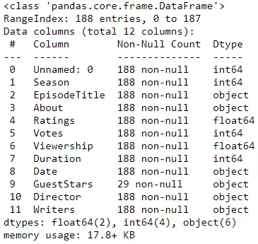

We can infer that a column without null entries has **188** rows. The 'GuestStars' column has some null values. These are episodes which did not star any actor/actress apart from the original cast. The 'Date' column is also ascribed as an object instead of datetime.

We then commence our cleaning phase by changing the type of the 'Date' column to datetime and drop the 'Unnamed' column.

```python
office.Date = pd.to_datetime(office.Date)
```

```python
office.drop('Unnamed: 0', axis = 1, inplace = True)
```

Let's view the changes

```python
office.info()
```

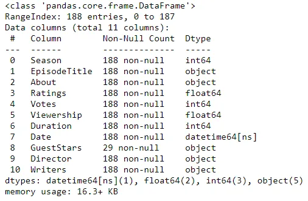

We now have our office dataframe set for analysis.

### Analysis
**Average Ratings, Votes and Viewership per Season**

We start by grouping according to seasons and finding the average of the ratings, votes and views. This is done using the .groupby() and .mean() attributes.

```python
averages = office.groupby('Season')[['Ratings', 'Votes', 'Viewership']].mean().reset_index()
```

The result is as follows:

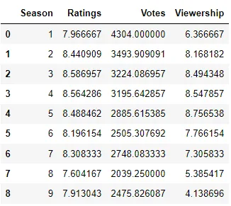

We then visualize these findings with a line plot.

```python
sns.set_style('whitegrid')
sns.set_context('notebook', font_scale = 1)
sns.set_palette('Set1')

plt.plot(averages.Season, mmscaler.fit_transform(averages[['Ratings']]), label = 'Ratings')
plt.plot(averages.Season, mmscaler.fit_transform(averages[['Votes']]), label = 'Votes')
plt.plot(averages.Season, mmscaler.fit_transform(averages[['Viewership']]), label = 'Viewership')
plt.xlabel('Season')
plt.ylabel('Normalized Values')
plt.title('Average Ratings, Votes and Viewership against Season')
plt.legend()
plt.show()
```

We utilized matplotlib's plot feature to plot the Season on the x-axis and the average values on the y-axis. The values were normalized using the MinMaxScalar in order to have them on the same scale. This was done since they were plotted on the same graph. Seaborn library was also used to style the plot to make it visually appealing.

Let's have a look at the visualization.

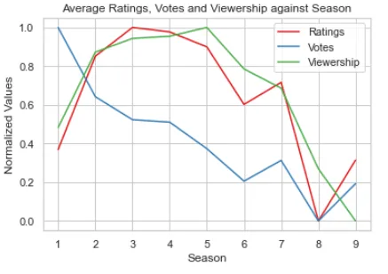

From our plot, it can be deduced that the average votes decreased as the series ensued. The average ratings and viewership were closely correlated. They both increased in the first three seasons, plateaued for the next two and decreased for the remaining part of the series.

**Analysis on Guest Stars**

For the purpose of analyzing the effect of guest stars on the ratings, votes and viewership of the series, we will add another column, 'has_guests', which has a 'True' value if there were guest stars in an episode and 'False' for no guest stars.

```python
office['has_guests'] = office.GuestStars.notna()
```

```python
office.head()
```


We group according to 'Season' and 'has_guests' and then re-calculate the average ratings, votes and viewership.

```python
guests_average = office.groupby(['Season', 'has_guests'])[['Ratings', 'Votes', 'Viewership']].mean().reset_index()
```

This yields:

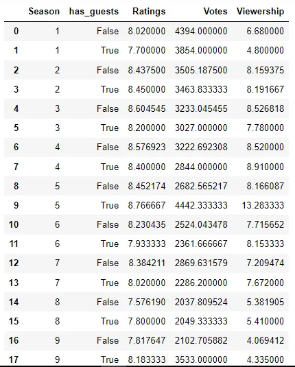

We then employ seaborn's barplot feature to view the average values each season according to whether there were guest stars in an episode or not.

```python
def barchart_avg(df, x_values, y_values):
    sns.set_style('ticks')
    sns.set_context('poster', font_scale = 0.8)
    sns.set_palette('Set1')
    sns.barplot(data = df, x = x_values, y = y_values, hue = 'has_guests')
    plt.title('Average ' + y_values + ' per Season by Guest Stars Appearance')
    plt.show()
```

We call the function with each feature being measured.

```python
ratings_avg = barchart_avg(guests_average, 'Season', 'Ratings')
```

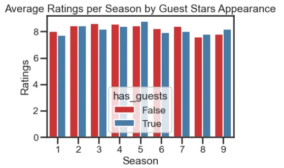

Episodes without guest stars were rated slightly ahead of those with guest stars appearance in most seasons. The converse was however witnessed in seasons 5, 8 and 9.

```python
votes_avg = barchart_avg(guests_average, 'Season', 'Votes')
votes_avg
```

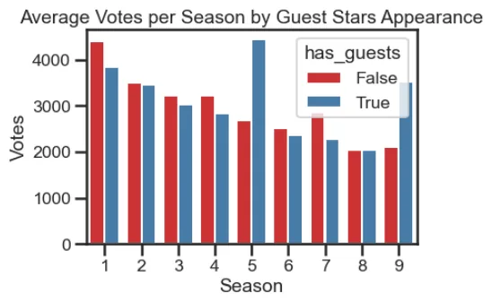

We observe more votes being cast in episodes without guest stars were than those with guest stars appearance in most seasons. The situation was however different in seasons 5, 8 and 9. The difference was not much in seasons 2 and 8 but those of seasons 1, 5, 7 and 9 were significant.

```python
views_avg = barchart_avg(guests_average, 'Season', 'Viewership')
```

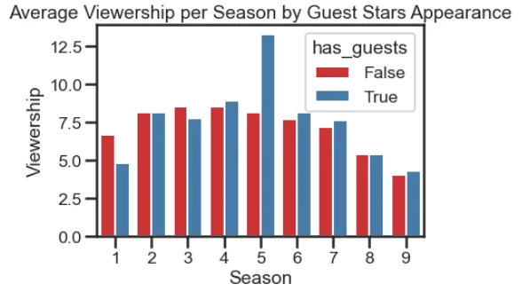

Views for both types of episodes were almost at par with switches between the two types. Episodes with guests stars in season 5, however had very high views as compared to episodes in other seasons.

We continue further probe into the effects of guest stars appearance by analyzing the how the number of guest stars in each episode affects the rating, views and votes casted. We subset the 'office' dataframe to obtain just the rows with guests.

```python
guests = office[office.has_guests == True].copy()
guests.head()
```


We now initialize and empty list and add the number of guest stars in each episode to it. We then add a new column, 'num_guests' to the guests dataframe. This contains the number of guest stars in each episode.

```python
num_guests = []
for i in guests.GuestStars:
    num_guests.append(len(i.split(',')))

guests['num_guests'] = num_guests
guests.head()
```


We now group according to Season and sum the number of guests in each episode.

```python
num_guests_avg = guests.groupby('Season').num_guests.sum().reset_index()
```

This results in:

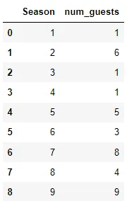

A bar plot of the table yields:

```python
sns.set_style('darkgrid')
sns.set_context('paper', font_scale = 1.5)
sns.set_palette('Set2')
sns.barplot(data = num_guests_avg, x = 'Season', y = 'num_guests')
plt.title('Number of Guest Stars in Each Season')
plt.show()
```

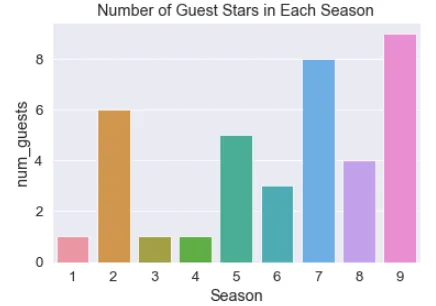

We observe seasons 2, 5, 7 and 9 with at least 5 guest stars appearance with the highest being season 9 with 9 stars. Seasons 1, 3 and 4 all had 1 star.

We finally look at the effect of the number of guest stars appearance on the various features analyzed so far.

```python
def barchart(df, x_values, y_values):
    sns.set_style('ticks')
    sns.set_context('paper', font_scale = 1)
    sns.set_palette('Set2')
    sns.barplot(data = guests, x = x_values, y = y_values, hue = 'num_guests', ci = None)
    plt.title(y_values + ' per Season by Number of Guest Stars in each Episode')
    plt.show()
```

```python
ratings_guests = barchart(guests, 'Season', 'Ratings')
```

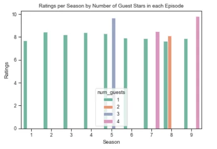

In seasons where the episodes had 3 or more guest stars appearance, the ratings were higher as compared with seasons with lesser guests appearance.

```python
votes_guests = barchart(guests, 'Season', 'Votes')
```

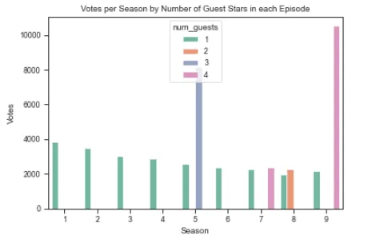

Same can be said for the number of votes cast. There was an exception in season 7 where an episode with 4 guest stars appearance had quite low votes.

```python
views_guests = barchart(guests, 'Season', 'Viewership')
```

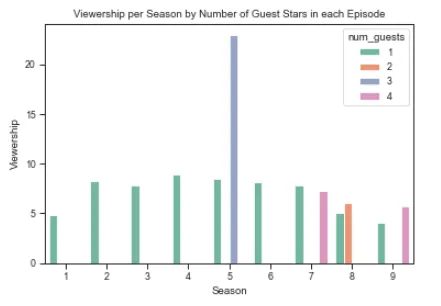

Viewership was quite low for episodes with high number of guest stars. An episode in season 5 however had very high views, six times the lowest views for a guest star appearance.

[Here](https://github.com/catiemokeseku/the-office-series.git) is a link to the repo.
