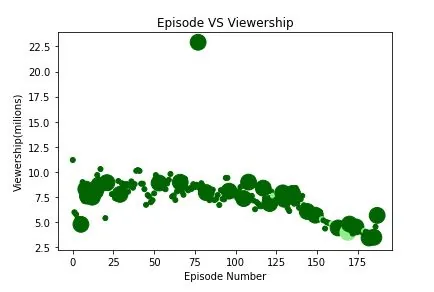
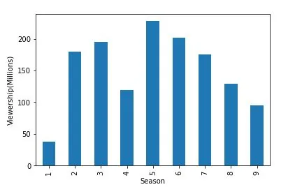

The Office is a British television series first aired in the UK on BBC Two on 9 July 2001. Written and directed by Ricky Gervais and Stephen Merchant, and produced by Ash Atalla, the programme follows the day-to-day lives of office employees in the Slough branch of the fictional Wernham Hogg paper company.

So, in this blog we are going to have fun by playing with the the office data set provided by the kaggle. We will visualizing some trends from the series ratings and their viewership.

**Let's start.**

As always using jupyter notebook for visualizing our findings from the Office Series episodes data. The data set can be downloaded from Kaggle. Importing necessary libraries and data-set from kaggle can be done through below code.

```python
import pandas as pd
import matplotlib.pyplot as plot
```

```python
data=pd.read_csv('Desktop/Kaggle/the_office_series.csv',index_col=[0])
```

## Viewership of Episodes.
The apparent trend which we have observed is the popularity of the Office series has slightly decreased till the last episode, and some unexpected ratings which was received by ffb

```python
col=[]
for index,row in data.iterrows():
    if row['Ratings']/10 < 0.25:
        col.append("red")
    elif ((row['Ratings']/10 >= 0.25) & (row['Ratings']/10 < 0.50)):
        col.append("orange")
    elif ((row['Ratings']/10 >= 0.50) & (row['Ratings']/10 < 0.75)):
        col.append("lightgreen")
    elif row['Ratings']/10 >= 0.75:
        col.append("darkgreen")
size=[250 if pd.notna(data.GuestStars[n]) else 25 for n in range(len(data))]
```

The above code does set the color for ratings in col list and size list is based on the appearances of guest stars in an episode, sets the marker size.

```python
fig=plot.figure()
plot.scatter(x=data.index,y=data['Viewership'],c=col,s=size)
```



From the above plot there is no clear evidence of viewership affected by the appearance of guest stars.

## Viewership with Seasons.
Now for viewership change with season we will plot the data on bar plot clearly examine the change in viewers interests in The Office Series. For this we will first group the data by Season and then performing sum on viewership and at last plotting bar plot.

### Code

```python
data.groupby(by=["Season"]).Viewership.sum().plot.bar()
```



The above bar plot shows the viewers interests were at the peak in the fifth season and was the most watched season. After which the viewers interests were steadily decreased, which might be due very long period of the series.
