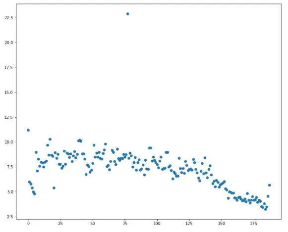
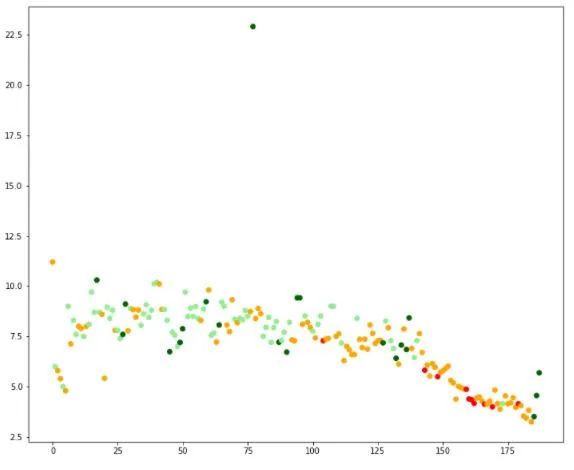
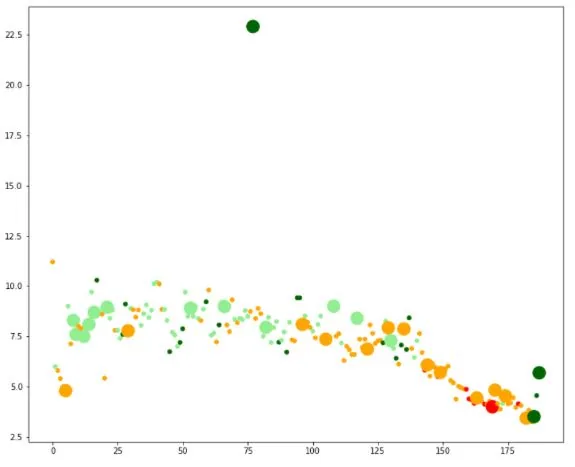
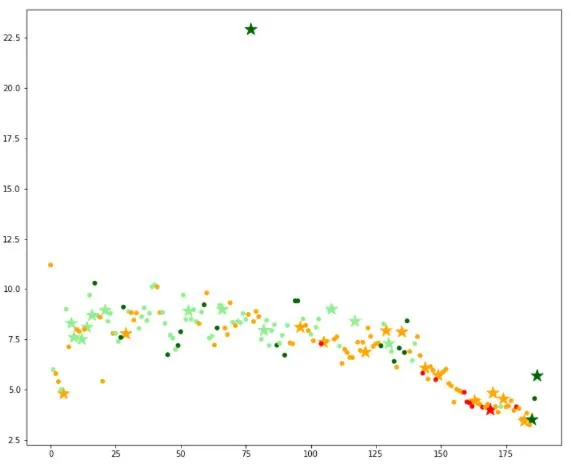
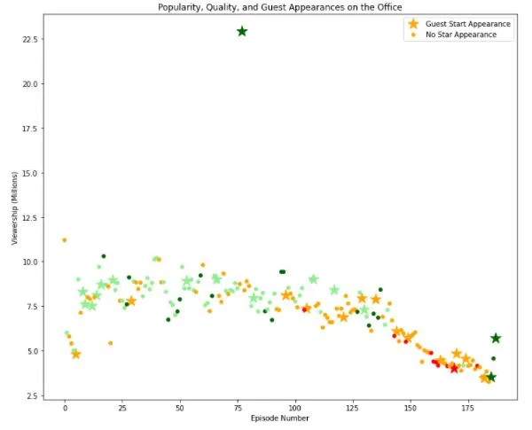

***The Office*** is an American mockumentary sitcom television series that depicts the everyday work lives of office employees in the Scranton, Pennsylvania, branch of the fictional Dunder Mifflin Paper Company. It aired from March 24, 2005, to May 16, 2013, spanning a total of nine seasons and 201 episode.

The series was filmed in a [single-camera setup](https://en.wikipedia.org/wiki/Single-camera_setup) without a [studio audience](https://en.wikipedia.org/wiki/Studio_audience) or a [laugh track](https://en.wikipedia.org/wiki/Laugh_track) to simulate the look of an actual documentary. *The Office* originally featured [Steve Carell](https://en.wikipedia.org/wiki/Steve_Carell), [Rainn Wilson](https://en.wikipedia.org/wiki/Rainn_Wilson), [John Krasinski](https://en.wikipedia.org/wiki/John_Krasinski), [Jenna Fischer](https://en.wikipedia.org/wiki/Jenna_Fischer), and [B. J. Novak](https://en.wikipedia.org/wiki/B._J._Novak) as the main cast and many other casts were also involved as guest stars during the filming of the show.

Today, we will analyze the variation of total views of each of the episode of the show along with its ratings. We will also identify the guest start who were involved in the most watched episode of the show. The information on the shows is available in the original dataset provided in [Kaggle](https://www.kaggle.com/nehaprabhavalkar/the-office-dataset). The data set is available locally named as office_episodes.csv.

The data set contains the following information on a the episodes of the show.

**office_episodes.csv**

- **episode_number:** Canonical episode number.
- **season:** Season in which the episode appeared.
- **episode_title:** Title of the episode.
- **description:** Description of the episode.
- **ratings:** Average IMDB rating.
- **votes:** Number of votes.
- **viewership_mil:** Number of US viewers in millions.
- **duration:** Duration in number of minutes.
- **release_date:** Airdate.
- **guest_stars:** Guest stars in the episode (if any).
- **director:** Director of the episode.
- **writers:** Writers of the episode.
- **has_guests:** True/False column for whether the episode contained guest stars.
- **scaled_ratings:** The ratings scaled from 0 (worst-reviewed) to 1 (best-reviewed).

To begin the analysis, we first import the necessary libraries.

```python
import pandas as pd
import matplotlib.pyplot as plt
```

Since we'll be analyzing the dataset with a scatter plot, we will import the *matplotlib* library.

```python
office_data = pd.read_csv('datasets/office_episodes.csv')
```

We read the dataset in a variable named *office_data* and use the *read_csv* function of the *pandas* library to read the dataset.

Let us now review the data contained in the dataset.

```python
office_data.info()
```

which yields the following output.

```python
<class 'pandas.core.frame.DataFrame'>
RangeIndex: 188 entries, 0 to 187
Data columns (total 14 columns):
 #   Column          Non-Null Count  Dtype
---  ------          --------------  -----
 0   episode_number  188 non-null    int64
 1   season          188 non-null    int64
 2   episode_title   188 non-null    object
 3   description     188 non-null    object
 4   ratings         188 non-null    float64
 5   votes           188 non-null    int64
 6   viewership_mil  188 non-null    float64
 7   duration        188 non-null    int64
 8   release_date    188 non-null    object
 9   guest_stars     29 non-null     object
 10  director        188 non-null    object
 11  writers         188 non-null    object
 12  has_guests      188 non-null    bool
 13  scaled_ratings  188 non-null    float64
dtypes: bool(1), float64(3), int64(4), object(6)
memory usage: 19.4+ KB
```

Here we see that the data is correctly placed with the data type correctly identified for almost all the data except for the *release_date* column which is identified as an object. We need to correct the data type for the column.

Also, we can see that the data contains 14 columns with 188 different data.

```python
office_data['release_date'] = pd.to_datetime(office_data['release_date'])
```

On plotting the given data with *episode_number* on the horizontal axis and *viewership_mil* on the vertical axis, we get,

```python
fig = plt.figure()
plt.scatter(data=office_data, x='episode_number', y='viewership_mil')
plt.show()
```



Currently, the plot is not very informative in itself. We'll be adding more details in the plot.

The first step is to differentiate the plot based on the ratings of the episodes.

The *ratings* column contains data which rate each episode through the scale of 1 to 10. So instead of using this scale, we differentiate the episodes through their scaled rating provided in the *scaled_ratings* columns.

The scaled rating defined here is the **normalized rating** which is given as:

𝑋′ = (𝑋−𝑋𝑚𝑖𝑛)/(𝑋𝑚𝑎𝑥−𝑋𝑚𝑖𝑛)

where 𝑋𝑚𝑖𝑛 and 𝑋𝑚𝑎𝑥 represents the minimum and maximum value respectively.

The normalized rating (Scaled rating) has value between 0 and 1 which allows more efficient way for representing them. Using the scaled values, we assign various colors for various ratings defined as:

- Rating< 0.25 **Red**
- 0.25 >= Rating < 0.50 **Orange**
- 0.50 >= Rating < 0.75 **Lightgreen**
- 0.75 >= Rating **Darkgreen**

To implement the above condition, we define a function *color_r* which takes in a value and assign the color to the value.

```python
def color_r(scale):
    if scale < 0.25: return 'red'
    elif (scale>= 0.25) & (scale<0.50): return 'orange'
    elif (scale>=0.50) & (scale<0.75): return 'lightgreen'
    elif (scale>=0.75): return 'darkgreen'
```

We then define a new column *color_rat* which takes in the color parameter assigned from the function defined above. The function is applied via the *apply* function in the *scaled_rating* column.

```python
office_data['color_rat'] = office_data['scaled_ratings'].apply(color_r)
```

Let' s apply color to the plots.

```python
fig = plt.figure(figsize=(12,10))
plt.scatter(data=office_data, x='episode_number', y='viewership_mil', c='color_rat')
plt.show()
```



Now that we have applied different colors for different ratings with red representing the lowest rating while green representing the highest rating, we will now vary the size of the markers.

To differentiate the plot with the size parameters for episodes with appearance of guest stars, we define a list which contains bool value from the *has_guests* column.

```python
size = list(office_data['has_guests'])
```

Based on the values in the list size, we assign size of 25 if the value is **False** and a value of 250 if the value is **True**.

```python
for i, val in enumerate(size):
    if val == True: size[i] = 250
    else: size[i] = 25
```

We then create a column *m_size* with the size parameter in it and plot the graph with the size included.

```python
office_data['m_size'] = size
```

```python
fig = plt.figure(figsize=(12,10))
plt.scatter(data=office_data, x='episode_number',y='viewership_mil', c='color_rat', s='m_size')
plt.show()
```



Let's not change the marker style in addition to the marker size. In order to change the marker style, we need to pass the *marker* parameter to the scatter plot. But first, we need to separate the values from the *office_data* table.

For this we define two new tables: *has_guest* and *no_guest* and set the marker style to star (\*) for episodes with guest start appearance.

```python
has_guest = office_data[office_data['has_guests']==True]
no_guest = office_data[office_data['has_guests']==False]
```

We then create separate plot but within the same figure as follows:

```python
fig = plt.figure()
plt.scatter(data=has_guest, x='episode_number',y='viewership_mil', c='color_rat', s='m_size', marker='*')
plt.scatter(data=no_guest, x='episode_number',y='viewership_mil', c='color_rat', s='m_size', marker='o')
plt.show()
```



This completes the plot and the information we need to show. Let's now finish the plot by adding axis titles, chart title and legend to the plot.

```python
fig = plt.figure()
plt.scatter(data=has_guest, x='episode_number', y='viewership_mil', c='color_rat', s='m_size', marker='*', label='Guest Start Appearance')
plt.scatter(data=no_guest, x='episode_number', y='viewership_mil', c='color_rat', s='m_size', marker='o', label='No Star Appearance')
plt.xlabel('Episode Number')
plt.ylabel('Viewership (Millions)')
plt.title('Popularity, Quality, and Guest Appearances on the Office')
plt.legend()
plt.show()
```



If we look at the plot above, we see that the total viewers start to decrease as the series extends i.e. as the episode number gets larger. Also the appearance of the guest stars are more frequent for the later episodes.

Let's now see the guest start appearance for the most viewed episode of the series.

For this we first set the max value of the *viewership_mil* column.

```python
x = office_data['viewership_mil'].max()
```

We now iterate through the rows of the DataFrame and for the maximum value of *viewership_mil* we extract the names of the guest stars. Since there are many appearance in a single episode, we split the value using the *str.split* function. This gives a list with the names of the stars.

```python
for i, val in office_data.iterrows():
    if val['viewership_mil'] == x:
        z=str(val['guest_stars'])
        y=z.split(',')
```

```python
print(y)
```

This gives us the output:

```python
['Cloris Leachman', ' Jack Black', ' Jessica Alba']
```

*This post is based on the project* ***'Investigating Netflix Movies and Guest Stars in The Office'*** *available in DataCamp.*

The notebook for the complete is available in my [GitHub](https://github.com/Clown-Face/DataInsight/blob/7eabd68cb71036a726e798d150e6b8985c89d52a/Investigating%20Guest%20Stars%20in%20The%20Office.ipynb) repo.

[Wikipedia](https://en.wikipedia.org/wiki/The_Office_(American_TV_series)) has been referred for the creation of this post.
