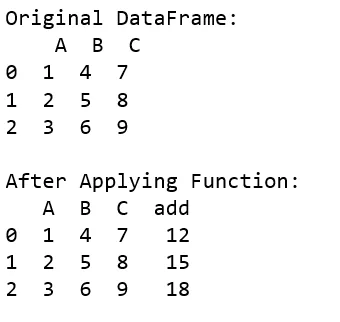

Apply function in pands is one of the commonly used functions for manipulating a pandas dataframe and creating new variables. Pandas Apply function returns some value after passing each row/column of a data frame with some function. The function can be both default or user-defined.

Applying a function to all rows in a Pandas DataFrame is one of the most common operations during data wrangling. Pandas DataFrame apply function is the most obvious choice for doing it. It takes a function as an argument and applies it along an axis of the DataFrame. However, it is not always the best choice.

Lets start with importing the panda

```python
import pandas as pd
```

Now function to add,

```python
def add(a, b, c):
    return a + b + c
```

Here is the main function for running the overall program

```python
def main():
# create a dictionary with
# three fields each
data = {
    'A':[1, 2, 3],
    'B':[4, 5, 6],
    'C':[7, 8, 9] }
# Convert the dictionary into DataFrame
df = pd.DataFrame(data)
print("Original DataFrame:\n", df)
df['add'] = df.apply(lambda row : add(row['A'], row['B'], row['C']), axis = 1)
print('\nAfter Applying Function: '
# printing the new dataframe
print(df)
```

The Output for above code :


