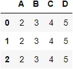
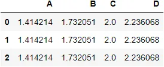
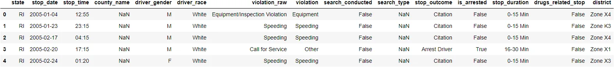
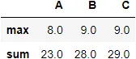
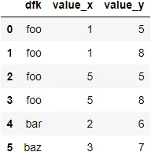
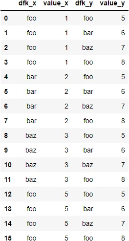
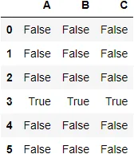

Pandas.apply allow users to pass a function to every cell in the dataframe. Ander conditions of the function it works to dataframe it increase the simplicity and readability of code.

DataFrame.apply(func, axis=0, raw=False, result_type=None, args=(), \*\*kwargs) fun: function you want to apply to rows or columns

axis(0 or index,1 or column) axis:0 or 'index': apply function to each column. axis:1 or 'column': apply function to each row.

row:(False is Default,Determines if row or column is passed as a Series or ndarray object) if row = False :passes each row or column as a Series to the function. else: the passed function will receive ndarray objects instead

args :tuple Positional arguments to pass to func in addition to the array/series.

\*\*kwargs:additional keyword arguments to pass as keywords arguments to func.

```python
import pandas as pd
import numpy as np
df3 = pd.DataFrame([[2,3,4,5]] * 3, columns=['A', 'B','C','D'])
df3
```



```python
df4 = df3.apply(np.sqrt)
```



```python
#sum each column alone so you will get 4 values
df3.apply(np.sum,axis = 0)
```

```python
A     6
B     9
C    12
D    15
dtype: int64
```

```python
#sum all row so you will get 3 rows
df3.apply(np.sum,axis = 1)
```

```python
0    14
1    14
2    14
dtype: int64
```

```python
df = pd.read_csv('traffic.csv')
df.head()
dfi.export(df.head(),'df.png')
```



```python
def use_apply(i):
        j = "NotFound"
        if i == 'M':
            j ="Male"
        elif i == "F":
            j = "Female"

        return j

result = df['driver_gender'].apply(use_apply)
result
```

```python
0          Male
1          Male
2          Male
3          Male
4        Female
          ...
91736    Female
91737    Female
91738      Male
91739    Female
91740      Male
Name: driver_gender, Length: 91741, dtype: object
```

As we see above we change every cell in column driver_gender as function said

***pandas.DataFrame.agg***

This Function help you to do some operations at the same time so reduce your code.

DataFrame.agg(func=None, axis=0, \*args, \*\*kwargs)

func : accept functions to perform them this function accept list of funtions

axis: The default is (0)to perform along columns

axis :1 to perform along rows

\*args: to add some parameters

\*\*kwargs:Keyword arguments to pass to func to name identify parameters

```python
df3 = pd.DataFrame([[1, 2, 3],
                   [4, 5, 6],
                   [7, 8, 9],
                   [np.nan, np.nan, np.nan],
                    [3,4,5],
                    [8,9,6]],
                  columns=['A', 'B', 'C'])
df3.agg(['max','sum'])
```



```python
df3.agg(sum)
```

```python
A    23.0
B    28.0
C    29.0
dtype: float64
```

```python
df3.agg(min)
A    1.0
B    2.0
C    3.0
dtype: float64
```

## *Merge Dataframe*

If You have tow Data sets and you want to Work at them at the same time to get results from them all you should use merge.

dataframe pandas.merge(left, right, how='inner', on=None, left_on=None, right_on=None, left_index=False, right_index=False, sort=False, suffixes=('_x', '_y'), copy=True, indicator=False, validate=None)

left: Dataframe name

right: the second dataframe name

how:(inner defult, outer, left, right, cross)

left: use keys from left data frame

right: use keys from right data frame

inner: intersection between the two data frame

outer: the union of the two data frame

on: column name which should be in the two data Frame

left_on: column or index level names to join on in the left DataFrame.

right_on: column or index level names to join on in the right DataFrame.

left_index: default False, use index of the left dataframe

right_index: use index of the right dataframe

suffixes: to distinguish between two data frame columns if there exist the same names

```python
df4 = pd.DataFrame({'dfk': ['foo', 'bar', 'baz', 'foo'],
                    'value': [1, 2, 3, 5]})
df5 = pd.DataFrame({'dfk': ['foo', 'bar', 'baz', 'foo'],
                    'value': [5, 6, 7, 8]})
pd.merge(df4,df5,on ='dfk') # intersection
```



```python
pd.merge(df4,df5,how = 'outer' ,on = 'dfk')
```


```python
df4.merge(df5,how = 'cross') # cross product
```



## *pandas.isnull*
Catch Empty cells and Return True if NaN and False if not

```python
df3.isnull()
```



## *pandas.unique(values)*
Return unique values

```python
# notice that the output not sorted
pd.unique(pd.Series([4,5,7,8,9,99,4,5,4 ,2,33]))
```

```python
array([ 4,  5,  7,  8,  9, 99,  2, 33], dtype=int64)
```

```python
pd.unique([("m", "n"), ("z", "x"), ("n", "v"), ("z", "x")])
# note that (a,b) != (b,a)
```

```python
array([('m', 'n'), ('z', 'x'), ('n', 'v')], dtype=object)
```

***melt in pandas***

used to change Data format from wide-----> to long(⬇️)

```python
m = {"Name": ["Aya", "Lisa", "David"], "ID": [1, 2, 3], "Role": ["CEO", "Editor", "Author"]}

df = pd.DataFrame(m)

print(df)
print('\n________________________________________\n')

df_melted = pd.melt(df, id_vars=["ID"], value_vars=["Name", "Role"])

print(df_melted)
```

```python
    Name  ID    Role
0    Aya   1     CEO
1   Lisa   2  Editor
2  David   3  Author

________________________________________

   ID variable   value
0   1     Name     Aya
1   2     Name    Lisa
2   3     Name   David
3   1     Role     CEO
4   2     Role  Editor
5   3     Role  Author
```

we can use pivot to unmelt dataframe

```python
m = {"Name": ["Aya", "Lisa", "David"], "ID": [1, 2, 3], "Role": ["CEO", "Editor", "Author"]}

df = pd.DataFrame(m)

print(df)
print('\n________________________________________\n')

melted = pd.melt(df, id_vars=["ID"], value_vars=["Name", "Role"], var_name="Attribute", value_name="Value")

print(melted)
print('\n________________________________________\n')

# unmelting using pivot()

unmelted = melted.pivot(index='ID', columns='Attribute')

print(unmelted)
```

```python
    Name  ID    Role
0    Aya   1     CEO
1   Lisa   2  Editor
2  David   3  Author

________________________________________

   ID Attribute   Value
0   1      Name     Aya
1   2      Name    Lisa
2   3      Name   David
3   1      Role     CEO
4   2      Role  Editor
5   3      Role  Author

________________________________________
           Value
Attribute   Name    Role
ID
1            Aya     CEO
2           Lisa  Editor
3          David  Author
```

```python
unmelted = unmelted['Value'].reset_index()
unmelted.columns.name = None
print(unmelted)
```

```python
   ID   Name    Role
0   1    Aya     CEO
1   2   Lisa  Editor
2   3  David  Author
```

[resourse:https://pandas.pydata.org/docs/reference/api/pandas.melt.html](https://pandas.pydata.org/docs/reference/api/pandas.melt.html)

<https://predictivehacks.com/?all-tips=save-a-pandas-dataframe-as-an-image>

<https://github.com/AyaMohammedAli/Pandas-Techniques-for-Data-Manipulation-in-Python>
