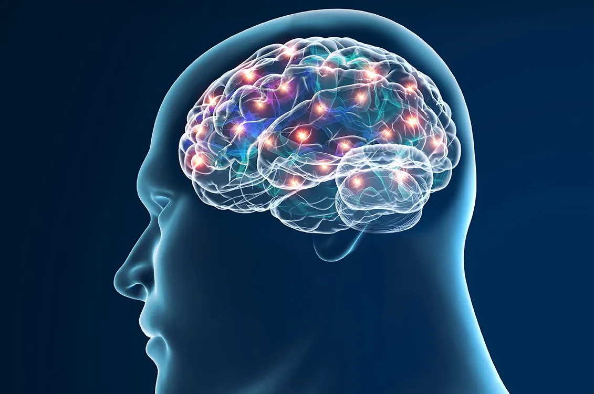

*“Eventually, doctors will adopt AI and algorithms as their work partners. This leveling of the medical knowledge landscape will ultimately lead to a new premium: to find and train doctors who have the highest level of emotional intelligence.”*

*―* ***Eric Topo******l,*** [***Deep Medicine: How Artificial Intelligence Can Make Healthcare Human Again***](https://www.goodreads.com/work/quotes/63790687)

Neurodegenerative diseases are a heterogeneous group of diseases It is characterized by the gradual deterioration of the structure and the function of the nervous system. They are incurable and debilitating diseases that causes a mental function problem, also known as dementia. Neurodegenerative diseases affect millions of people around the world. Alzheimer and Parkinson are the most common neurodegenerative diseases. In 2016, An estimated 5.4 million Americans have Alzheimer's disease. estimate By 2020, 930,000 people in the United States could have Parkinson's disease.

The goal of the project is to build a model to accurately predict the presence of Parkinson disease in individuals as the early detection of neurodegenerative disease Illness may help identify individuals who can participate in Neuroprotective agents research, or ultimately, try to stop its progression.

We have the parkinson dataset found in [UCI ML Parkinson](https://archive.ics.uci.edu/ml/machine-learning-databases/parkinsons/), This dataset is composed of a range of biomedical voice measurements from 31 people, 23 with Parkinson's disease (PD). Each column in the table is a particular voice measure, and each row corresponds one of 195 voice recording from these individuals ("name" column). The main aim of the data is to discriminate healthy people from those with PD, according to "status" column which is set to 0 for healthy and 1 for PD.

The data is in ASCII CSV format. The rows of the CSV file contain an instance corresponding to one voice recording. There are around six recordings per patient, the name of the patient is identified in the first column.

```python
#read the file
data = pd.read_csv('parkinsons.data')
data.info()
```

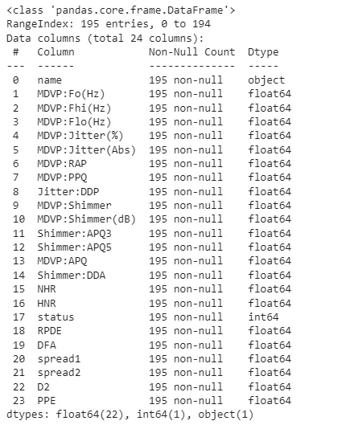

Attribute Information:

Matrix column entries (attributes):

***name :*** ASCII subject name and recording number

***MDVP:Fo(Hz) :*** Average vocal fundamental frequency

***MDVP:Fhi(Hz) :*** Maximum vocal fundamental frequency

***MDVP:Flo(Hz) :*** Minimum vocal fundamental frequency

***MDVP:Jitter(%),MDVP:Jitter(Abs),MDVP:RAP,MDVP:PPQ,Jitter:DDP:*** Several measures of variation in fundamental frequency

***MDVP:Shimmer,MDVP:Shimmer(dB),Shimmer:APQ3,Shimmer:APQ5,MDVP:APQ,Shimmer:DDA :*** Several measures of variation in amplitude

***NHR,HNR :*** Two measures of ratio of noise to tonal components in the voice

***status :*** Health status of the subject (one) - Parkinson's, (zero) - healthy

***RPDE,D2 :*** Two nonlinear dynamical complexity measures

***DFA :*** Signal fractal scaling exponent

***spread1,spread2,PPE :*** Three nonlinear measures of fundamental frequency variation.

```python
data.shape
```

```python
(195, 24)
```

There is 195 rows/samples and 24 columns/features in our dataframe. I

**Exploratory Data Analysis:**

Let's view some statistics:

```python
data.describe()
```

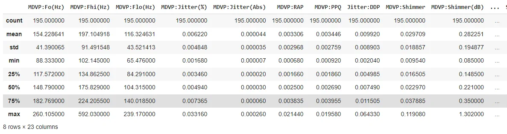

The DataFrame contains numerical data, the description contains these information for each column:

count - The number of not-empty values.

mean - The average (mean) value.

std - The standard deviation.

min - the minimum value.

25% - The 25% percentile*.*

*50% - The 50% percentile*.

75% - The 75% percentile\*.

max - the maximum value.

\*Percentile meaning: how many of the values are less than the given percentile.

In order to explore furthermore the dataset there's a number of questions we need to answer via exploring:

1- Is there any missing values?

```python
data.isnull().sum()
```

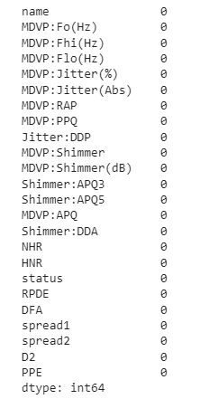

2- Is the target data labeled?

```python
sns.countplot(data['status'])
plt.savefig('countplot.png')
```

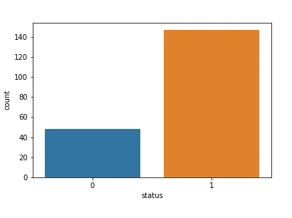

We can see that the target data is unlabeled, the number of PD people is bigger that healthy people and this need to be fixed before feeding the data to the model.

3- How does the feature's values change for each status?

```python
#the histplot function to check the variation of feature's values
def histplot(col):
  """"
    The function will create a histplot for each column in
    the DataFrame for each status

    Args:
    -----------------------------------------
    col: A column in the DataFrame

    Returns:
    ----------------------------------------
    a facetgrid histplot
  """
  g = sns.FacetGrid(data, col="status")
  g.map(sns.histplot, col)
  plt.show()

for col in list(data.select_dtypes(exclude=["object"]).columns)[1:]:
  histplot(col)
```

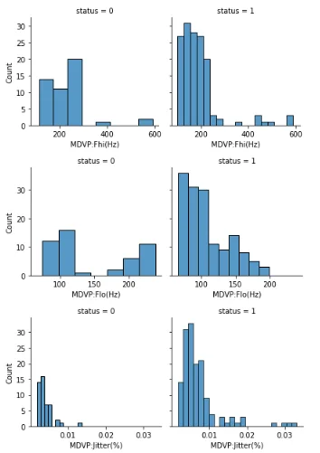

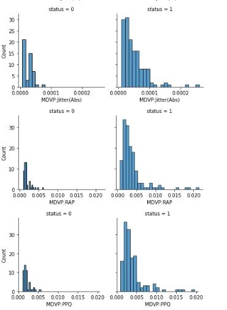

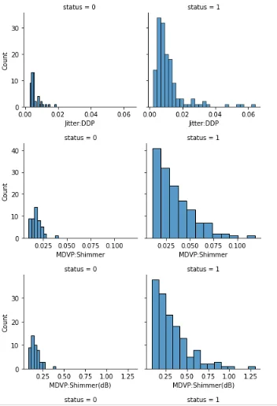

The rest of the plots are shown in the code. We can see clearly that there's big variations in the features, the voice measurments have higher values and bigger spreads for PD people compared to healthy ones. This shows that parkinson can be easily detected with those measurements.

4- How is the data distributed? to answer this will create a distplot for each feature. Why is this question important? well, for the only and simple reason that, any model except tree based ones assumes that the data is normally distributed.

```python
#the distplot function to check the distribution of our data
def distplot(col):
  """"
    The function will create a distplot for each column in
    the DataFrame

    Args:
    -----------------------------------------
    col: A column in the DataFrame

    Returns:
    ----------------------------------------
    Distplot
  """
  sns.distplot(data[col])
  plt.show()

for col in list(data.select_dtypes(exclude=["object"]).columns)[1:]:
  distplot(col)
```

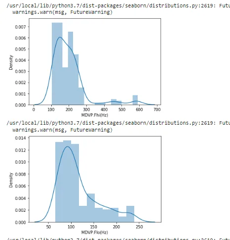

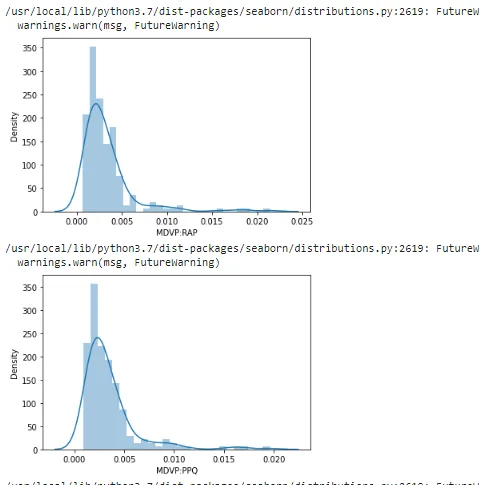

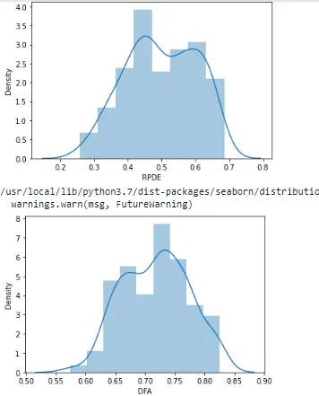

We can clearly see that pretty much for all features the data is normally distributed. Finding out that we have normal distribution help us in what exactly? Detecting outliers.

5- Is there any outliers in the dataset?: The Empirical Rulestates that, for a normal distributution, almost all observed data will fall within three standard deviations (denoted by σ) of the mean or average (denoted by µ). The perfect plot that will help us accomplishing this task is the boxplot

```python
#the boxplot function to find if there's any outliers
def boxplot(col):
  """"
    The function will create a boxplotplot for each column in
    the DataFrame

    Args:
    -----------------------------------------
    col: A column in the DataFrame

    Returns:
    ----------------------------------------
   boxptplot
  """
  sns.boxplot(data[col])
  plt.show()

for col in list(data.select_dtypes(exclude=["object"]).columns)[1:]:
boxplot(col)
```

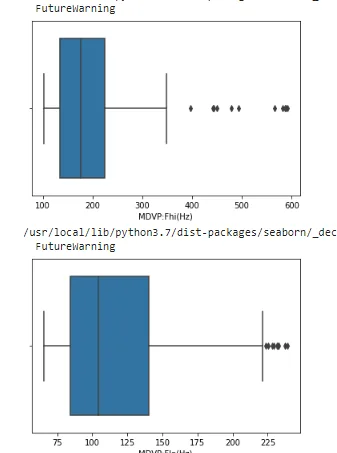

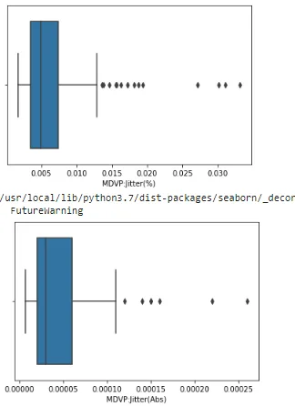

Throughout each plot we can easily spot the outliers. The approch I used to remove outliers is: calcuate the mean and standard deviation for each column and remove what's beyond mean - 3(standard deviatons) and among (mean+ 3 standard deviations) because *t**he 99.7% Rule states that approximately 99.7% of observations fall within three standard deviations of the mean on a normal distribution.*

```python
#removing outliers
for col in list(data.select_dtypes(exclude=["object"]).columns)[1:]:
  for i in range(3):
    mean = data[col].mean()
    std= data[col].std()
    cut_off = std*3
    lower,upper = mean-cut_off, mean+cut_off
    data = data[(data[col]<upper) & (data[col]>lower)]
data.shape
```

```python
(145, 24)
```

We can see that the outliers has been removed.

6- Are all this features important for the prediction?: Let's check how the features are correlated with each other:

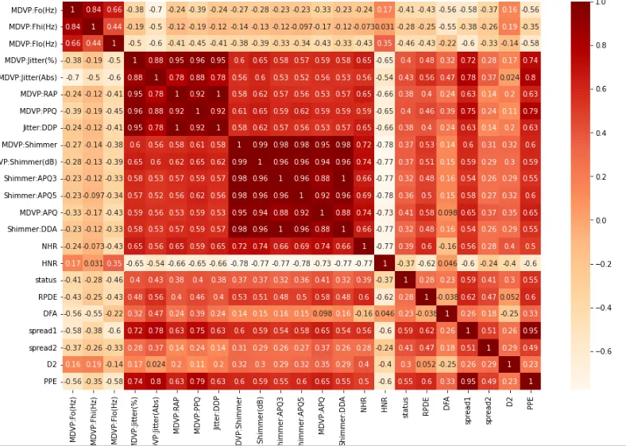

Despite the Diagonal = 1 that refers to the correlation of each feature with itself, there are some features which are highly correlated with each other(corr > 0.95),this means that they have the same impact on the prediction as they move the sameway, so they need to be removed if they affect the accuracy of our model, we'll check the importance of the features in the prediction once we create the model.

**-** **Training The Model:**

First, we create the feature and target datasets:

```python
X = data.drop(columns=['name','status'], axis=1)
y = data['status']
```

Then, we split the data into train and test using the stratify argument to balance the target data:

```python
X_train, X_test,y_train,y_test = train_test_split(X, y, test_size=0.2, random_state=1111,  stratify=y)
```

We need to scale the data to cure the skewness in its distribution:

```python
scaler = StandardScaler()
```

```python
scaler.fit(X_train)
```

```python
X_train = scaler.transform(X_train)
X_test = scaler.transform(X_test)
```

We need to create the model with tunned parameters, for this we use the gridsearch to help us identifying their values:

```python
# Create the parameter grid: gbm_param_grid
gbm_param_grid = {
    'colsample_bytree': [0.3, 0.7],
    'n_estimators': [50],
    'max_depth': [2, 5]
}

# Instantiate the regressor: gbm
gbm = xgb.XGBClassifier(objective='binary:logistic',missing=None, seed=1111)

# Perform grid search: grid_mse
grid_mse = GridSearchCV(estimator=gbm, param_grid=gbm_param_grid,
                        scoring='accuracy', cv=4, verbose=1)
grid_mse.fit(X_train, y_train)

# Print the best parameters and lowest RMSE
print("Best parameters found: ", grid_mse.best_params_)
print("BEST ACCURACY: ", grid_mse.best_score_)
```

```python
Fitting 4 folds for each of 4 candidates, totalling 16 fits Best parameters found:  {'colsample_bytree': 0.3, 'max_depth': 5, 'n_estimators': 50} BEST ACCURACY:  0.9051724137931034
```

```python
model = xgb.XGBClassifier(colsample_bytree=0.3, max_depth=5, n_estimators=50)
model.fit(X_train, y_train)
```

After fitting the data with our model we need to verifiy the features importance to see if we need to remoe any:

```python
from xgboost import plot_importance
plt.figure(figsize=(15,10))
plot_importance(model, )
```

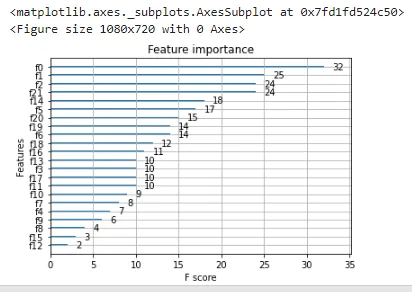

Pretty much all the features are important. Let's do the prediction and check the accuracy of model:

```python
pred = model.predict(X_test)
```

```python
print(accuracy_score(y_test,pred))
```

```python
0.9310344827586207
```

```python
ConfusionMatrixDisplay.from_predictions(y_test,
                                        pred,
                                        display_labels=['Healthy','have parkinson'])
```

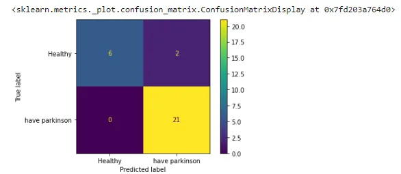

The model achieved an accuracy of 93%, and as the confusion matrix shows: 6 healthy people out of 9 were well diagnosed and 21 PD people out of 21 were diagnoses with parkinson.. This is perfect!

Let's give our model a try: we'll give it values of a healthy person and see if he can give the right diagnosis:

```python
input_data = (197.07600,206.89600,192.05500,0.00289,0.00001,0.00166,0.00168,0.00498,0.01098,0.09700,0.00563,0.00680,0.00802,0.01689,0.00339,26.77500,0.422229,0.741367,-7.348300,0.177551,1.743867,0.085569)

# changing input data to a numpy array
input_data_as_numpy_array = np.asarray(input_data)

# reshape the numpy array
input_data_reshaped = input_data_as_numpy_array.reshape(1,-1)

# standardize the data
std_data = scaler.transform(input_data_reshaped)

prediction = model.predict(std_data)
print(prediction)

if (prediction[0] == 0):
  print("The Person does not have Parkinsons Disease")

else:
  print("The Person has Parkinsons")
```

```python
[0] The Person does not have Parkinsons Disease
```

Checkout my [web app](https://asmakrl-disease-prediction-web-app-app-ouvmk0.streamlitapp.com/) so you can try it, you only need to scal your values before you input them into the app

**-** **Closing Thoughts****:** AI will be a powerful plus f early diagnosis of diseases, just feed it good data and it will make anything possible.

You can find the code [Here](https://github.com/asmakrl/datacampstd/blob/main/Predicting%20Neuro%20Degenerative%20diseases/EDA_and_classification_modelling_for_parkinson.ipynb).
