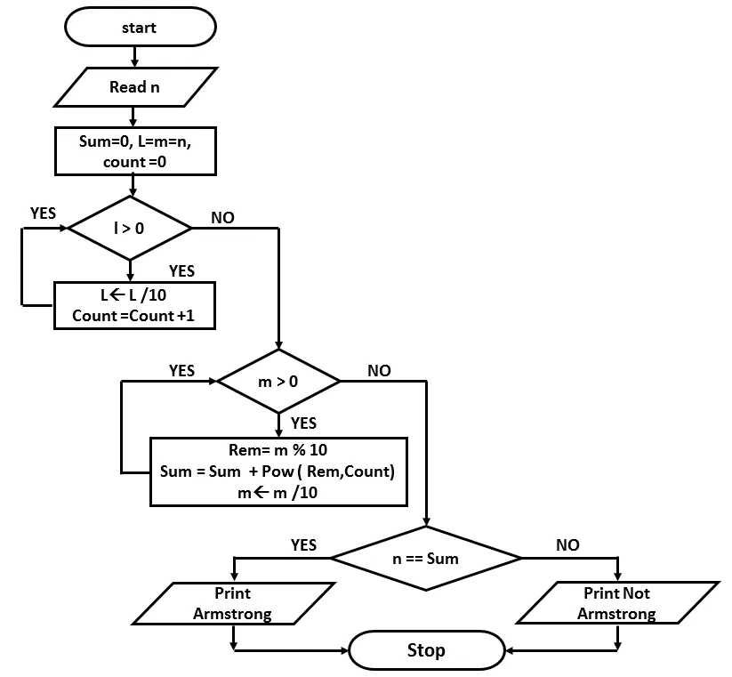
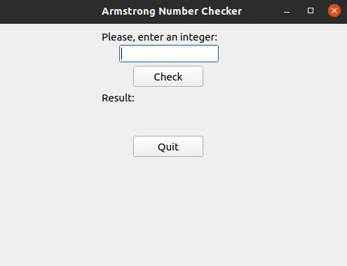
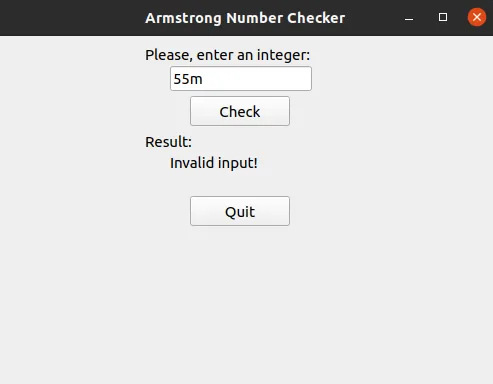
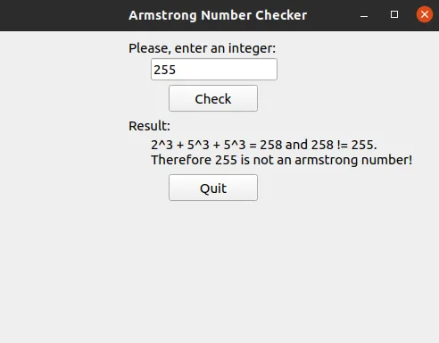
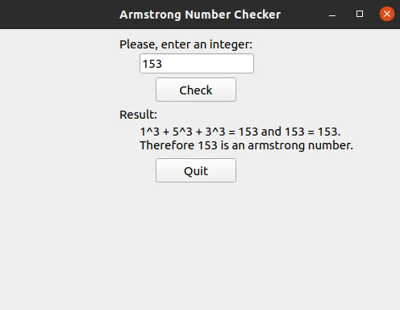
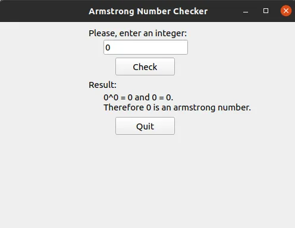
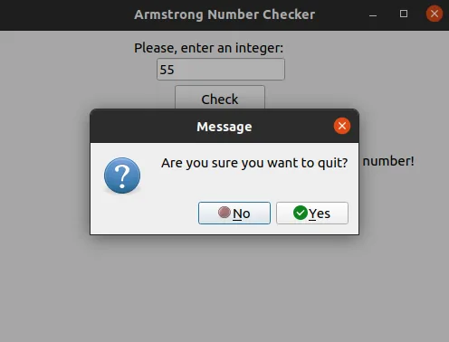

## Introduction:
What is an Armstrong number? Let's first answer this question. Let's say an integer has length n, and if we get the number itself when we find the sum of n-th powers of each digit in the number, then it is an Armstrong number. For this purpose, we create a simple, user-friendly GUI with the help of Python and PyQt5 library. Here is how the app looks like:

## Code and Explanation:
- importing necessary libraries

- Function to find the length of the integer

- Function to check whether the given integer is Armstrong or not

First of all, we check for the correctness of the input with the help of the try-except. If the information is not an integer, it is useless to check if it is an Armstrong number, and we return an error message. After making sure that the user input is correct, we start checking for being an Armstrong number. First, we find the **length** of the integer and create a copy of it (we will use copy during the following process so that we don't affect the original number, and we can use it at the end). Inside the while loop, we take the last digit of the number and add its power to **length** to the variable **arm** (short for Armstrong) at each iteration. Besides, at each iteration, we also store the power process to the string and we will use it to show the user how the **arm** variable is found. Lastly, we compare this **arm** variable with the original integer to check whether they are equal and return the corresponding message.

- Creating GUI for our program

With the help of this class, we create a window with a title explaining the role of the app. Inside the window, we create a text label at the top that helps users determine what input they should put in the input box below. Check button checks for Armstrong number, with the help of is_armstrong function we created and sets the output below with descriptive text label. If the quit button or close sign is clicked, a message box appears to confirm whether the user is sure about closing the app.

- Creating a window object from our class and generating a user interface

## Everything is ready**; now, **let's play with our app:
- Invalid input

- Valid input, which is not an Armstrong

- Correct input, which is an Armstrong

- Special case - input 0

- Closing our app

## Conclusion:
In conclusion, we created a simple app to check for the Armstrong number, showed an error message for the invalid input, displayed the corresponding output for valid inputs by explicitly showing the process, and made sure when the user accidentally clicks the close or quit button, the app doesn't close and shows confirmation message. You can look at the whole code together from the link below:

<https://github.com/KananMahammadli/Data-Insight2021/tree/main/Assignments/1%20-%20Writing%20Simple%20Apps%20Using%20Python/2%20-%20Armstrong%20Number%20Checker%20App>
