In a world flooded by information, a filtering mechanism is compulsory. Recommender systems have taken a massive leap towards this goal, significantly improving the user experience in the online environment. There are two main approaches, content-based and collaborative filtering, with advantages and drawbacks. We propose an article recommender system that integrates content-based, collaborative, and metadata recommendations, allowing users to select the method that best suits their needs. The first approach uses keywords to find similar articles, given a query or an entire document. Collaborative filtering is implemented using a P2P network in which data is distributed evenly across all peers.

The last technique uses data from a semantic repository containing information about articles (e.g., title, author, domain), which can be interrogated using natural language-like queries. In addition, we present the results obtained from employing the P2P network in terms of providing timely responses to the collaborative filtering technique and ensuring reliability through data replication.


**1. Introduction**

Due to the increased number of documents and more specific articles published on the web daily, the research process for newly available resources can become overwhelming, especially for novices. This is where an article recommender system becomes useful due to its ability to provide a personalized list of suggested articles. In general, there are two main approaches in the recommendation process: content-based filtering and collaborative filtering.

The first method uses the content of an item and the previous user’s preferences when computing recommendations. At the same time, the later approach predicts a user’s affinity to a certain item, depending on other users’ preferences.

The project starts with an overall perspective regarding article recommender systems and semantic and peer-to-peer networks, all depicted in Section 2. Later on, it presents ARS, an implemented article recommendation system in which all previous approaches are integrated. Section 4 addresses the results and performance of the P2P network, while the last section focuses on conclusions and future work.

**1.2. The problem**

The explosive growth in the amount of available digital information and the number of visitors to the Internet has created a potential challenge of information overload, which hinders timely access to items of interest on the Internet. Information retrieval systems like Google, DevilFinder, and Altavista have partially solved this problem. Still, prioritization and personalization (where a system maps available content to user’s interests and preferences) of information were absent. This has increased the demand for recommender systems more than ever before. Recommender systems are information filtering systems that deal with the problem of information overload by filtering vital information fragments out of large amounts of dynamically generated information according to users' preferences, interests, or observed behavior about items. The recommender system has the ability to predict whether a particular user would prefer an item or not based on the user’s profile.

Recommender systems are software tools designed for providing suggestions of items that could be of interest to a certain user. The range of recommended items is very large, from what products to buy, to music that a person could listen to or articles to read. This kind of system is meant to help users with little experience evaluating certain products or simply ease their choice when dealing with a large variety of alternatives.

**1.2.1 Article Recommendation systems**

A very important part of regular research activities is reading what others have published. Due to the increasing number of documents on the web, selecting relevant materials can prove to be a cumbersome process. There are many possible methods of filtering available articles – for example, students search for guidance from their mentors who can easily evaluate the quality of an article. Furthermore, some of the factors considered when choosing a paper include 3 the author(s), the journal in which it was published, the prestige of the conference at which it was presented, and, of course, its actual content. This method is quite effective for a small number of articles, but the effort becomes overwhelming when hundreds of thousands of articles are chosen.

Even for an experienced researcher, keeping pace with everything being published in his/her area of research can become a challenge. Article recommender systems represent a feasible solution to this problem. Thus, various experts or simple readers' opinions can be used to select qualitative materials. The users of such a system need not be only experts; they can also be novices in a certain domain that wish to learn, get acquainted with current approaches, and need guidance.

**1.3. The importance of recommender systems**

We live in a world where recommendations are so common that we tend to forget the apparent ease with which these systems designed to optimize our consumer choices have been incorporated into practically any device and platform. We’re used to constantly receiving recommendations, but how they have settled in our daily life is a long and interesting history marked by ups and downs, the ambition of a few pioneer companies, and some other dreamers.

**1.4. Recommendation filtering techniques**

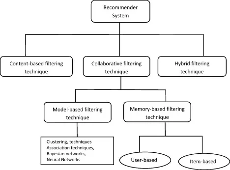

The use of efficient and accurate recommendation techniques is very important for a system that will provide good and useful recommendations to its individual users. This explains the importance of understanding the features and potentials of different recommendation techniques. Fig shows the anatomy of different recommendation filtering techniques.

**1.4.1. Content-based filtering**

The content-based technique is a domain-dependent algorithm and emphasizes more on analyzing the attributes of items to generate predictions. The content-based filtering technique is the most successful when documents such as web pages, publications, and news are recommended. In the content-based filtering technique, the recommendation is made based on the user profiles using features extracted from the content of the items the user has evaluated in the past. Items that are mostly related to the positively rated items are recommended to the user. CBF uses different types of models to find similarities between documents to generate meaningful recommendations. It could use Vector Space Model such as Term Frequency Inverse Document Frequency (TF/IDF) or Probabilistic models such as Naı¨ve Bayes Classifier, Decision Trees, or Neural Networks to model the relationship between different within a corpus. These techniques make recommendations by learning the underlying model with either statistical analysis or machine learning techniques. Content-based filtering does not need the profile of other users since they do not influence recommendations. Also, if the user profile changes, the CBF technique still has the potential to adjust its recommendations within a very short period of time. The major disadvantage of this technique is the need to have in-depth knowledge and description of the features of the items in the profile.

**1.4.2. Collaborative filtering**

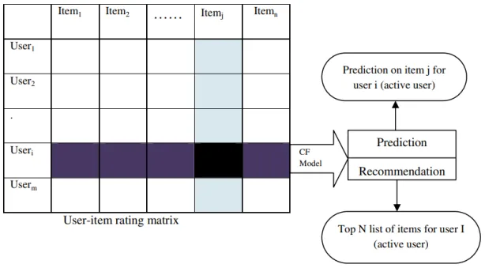

Collaborative filtering is a domain-independent prediction technique for content that cannot easily and adequately be described by metadata, such as movies and music. The collaborative filtering technique works by building a database (user-item matrix) of preferences for items by users. It then matches users with relevant interests and preferences by calculating similarities between their profiles to make recommendations. Such users build a group called a neighborhood. A user gets recommendations to items he has not rated before, which were already positively rated by users in his neighborhood. Recommendations that CF produces can be either predictions or recommendations. Prediction is a numerical value, Rij, expressing the predicted score of item j for user I, while Recommendation is a list of top N items the user will like the most, as shown in Fig. The collaborative filtering technique can be divided into two categories: memory-based and model-based.

**1.4.3. Hybrid filtering**

Hybrid filtering combines different recommendation techniques to gain better system optimization and avoid some limitations and problems of pure recommendation systems. The idea behind hybrid techniques is that a combination of algorithms will provide more accurate and effective recommendations than a single algorithm, as another algorithm can overcome the disadvantages of one algorithm. Using multiple recommendation techniques can suppress the weaknesses of an individual technique in a combined model. The combination of approaches can be done in any of the following ways: separate 59 implementations of algorithms and combine the result, utilizing some content-based filtering in a collaborative approach, some collaborative filtering in a content-based approach, creating a unified recommendation system that brings together both approaches.

**2. Software Used**

The main motivation for picking up this topic for my post is probably because I learned the value of reading late in life, and after I did, I regret not doing so since school. By reading, I mean books, and of them know the value of reading, as for me, it really changed my viewpoint on various things in life that I was taught by family and society around me. It introduced a new perspective, and I started to question the norms, which otherwise I never did. Most importantly, when I started making reading a daily habit, it also trained my mind to be analytical and make decisions based on critical thinking. In earlier years, between 2009–2013, I was only interested in reading books; however, over the past few years, I realized some good reading stuff that exists over the internet, like Scholarly write-ups, Ribbon Farm, etc., motivates me. “Internet is the world’s largest library. It’s just that all the books are on the floor” I figured that reading Articles has advantages. For example, they mostly have the latest information and are much more agile. If there is a breakthrough or reinvention of certain things, it reflects more efficiently in articles than in books. Another thing that really works for me is reading about the topics I might not be interested in, only to find out it is actually interesting. I would not do that with a book, as reading a book needs commitment in terms of time and attention. Some Articles have often exposed me to new topics, information, and authors. Sometimes when I was not sure what to read next, I often went to friends who are readers like me for suggestions on which book to read but often ran into a dead end as not many were into this habit. Thanks to the recommender system, I never ran into this problem again. So many services are available now that we are presented with recommendations based on our interests and preferences without asking for them.

**2.1 About** [**Dataset**](https://www.kaggle.com/datasets/gspmoreira/articles-sharing-reading-from-cit-deskdrop)

● Context

Deskdrop is an internal communications platform developed by CI&T, focused on companies using Google G Suite. This platform allows 95 company employees to share relevant articles with their peers and collaborate around them.

● Content

This rich and rare dataset contains a sample of 12 months' logs (Mar. 2016 - Feb. 2017) from CI&T's Internal Communication platform (DeskDrop). It contains about 73k logged user interactions on more than 3k public articles shared on the platform.

This dataset features some distinctive characteristics:

Item attributes: Articles' original URL, title, and contain plain text are available in two languages (English and Portuguese).

Contextual information: Context of the user's visits, like date/time, the client (mobile native app/browser), and geolocation.

Logged users: All users are required to login into the platform, providing a long-term tracking of users' preferences (not depending on device cookies).

Rich implicit feedback: Different interaction types were logged, making it possible to infer the user's level of interest in the articles (e.g., comments > likes > views).

Multi-platform: User's interactions were tracked on different platforms (web browsers and mobile native apps)

**2.2 Loading data: CI&T Deskdrop dataset**

It is composed of two CSV files:

● shared_articles.csv

● users_interactions.csv

Take a look in this kernels for a better picture of the dataset:

● Deskdrop datasets EDA

● DeskDrop Articles Topic Modeling

This section analyzes the articles shared on the platform (**shared_articles.csv**)

Contains information about the articles shared on the platform. Each article has its sharing date (timestamp), the original URL, title, content in plain text, the article' lang (Portuguese: pt or English: en), and information about the user who shared the article (author).

There are two possible event types at a given timestamp:

● CONTENT SHARED: The article was shared on the platform and is available for users.

● CONTENT REMOVED: The article was removed from the platform and unavailable for further recommendation.

For the sake of simplicity, we only consider the "CONTENT SHARED" event type here, assuming (naively) that all articles were available during the whole one-year period. For a more precise evaluation (and higher accuracy), only articles that were available at a given time should be recommended.

**Articles sharing and reading from CI&T DeskDrop EDA**

```python
import pandas as pd
articles_df=pd.read_csv(r'F:\R S\Datasets/shared_articles.csv')
```

```python
articles_df.head(3)
```

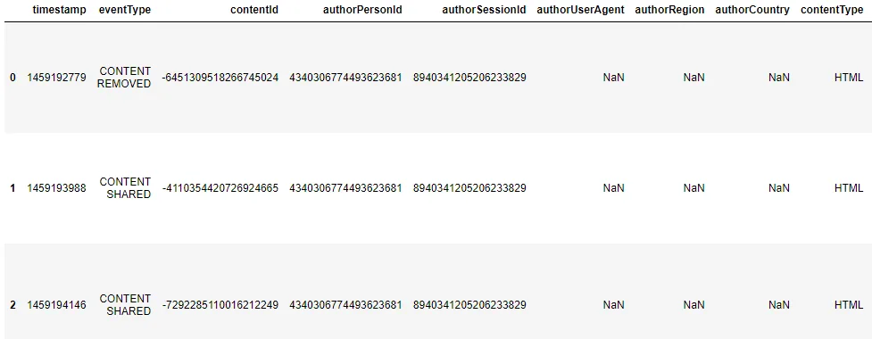

```python
articles_df.shape

(3122, 13)
```

```python
articles_df['eventType'].unique()

array(['CONTENT REMOVED', 'CONTENT SHARED'], dtype=object)
```

```python
articles_df.groupby('eventType').size().sort_values(ascending=False)

eventType
CONTENT SHARED     3047
CONTENT REMOVED      75
dtype: int64
```

Result: 3122 rows, 15 columns. Enough records to use for my analysis. I will filter out the removed articles as they will not help the recommendation.

```python
article_df=articles_df[articles_df['eventType']=='CONTENT SHARED']
article_df.shape

(3047, 13)
```

```python
article_df.head(3)
```

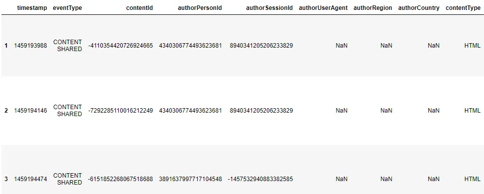

Result: 3047 rows, 13 columns. Not a significant drop from the actual dataset after eliminating the not existing articles.

The first and last shared articles

```python
from datetime import datetime
def to_datetime(ts):return datetime.fromtimestamp(ts)
def to_datetime_str(ts):return to_datetime(ts).strftime('%Y-%m-%d %H:%M:%S')

print('First article sharing: \t%s' % to_datetime(article_df['timestamp'].min()))
print('Last article sharing: \t%s' % to_datetime(article_df['timestamp'].max()))
```

```python
First article sharing: 	2016-03-28 21:39:48
Last article sharing: 	2017-02-28 20:51:11
```

Articles shared by month

```python
article_df['datetime'] = article_df['timestamp'].apply(lambda x: to_datetime(x))article_df['month'] = article_df['datetime'].apply(lambda x: '{0}-{1:02}'.format(x.year, x.month))article_df[article_df['eventType'] == 'CONTENT SHARED'].groupby('month').size() \
        .plot(kind='bar', title='articles shared by month')
```

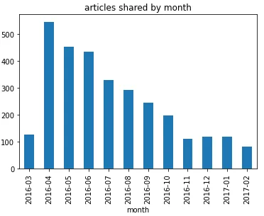

The total number of articles and authors.

```python
print('Distinct articles: \t%d' % len(article_df['contentId'].unique()))
print('Distinct sharers (users): \t%d' % len(article_df['authorPersonId'].unique()))
```

```python
Distinct articles: 	3047
Distinct sharers (users): 	252
```

Result: 3047 articles and 252 unique authors.

This section explores the dataset file containing user interactions on shared articles (**users_interactions.csv**).

Contains logs of user interactions on shared articles. It can be joined to articles_shared.csv by the contented column.

The eventType values are:

● VIEW: The user has opened the article.

● LIKE: The user has liked the article.

● COMMENT CREATED: The user created a comment in the article.

● FOLLOW: The user chose to be notified of any new comment in the article.

● BOOKMARK: The user has bookmarked the article for easy return in the future.

```python
interactions_df = pd.read_csv(r'F:\R S\Datasets/users_interactions.csv')

interactions_df.head(10)
```

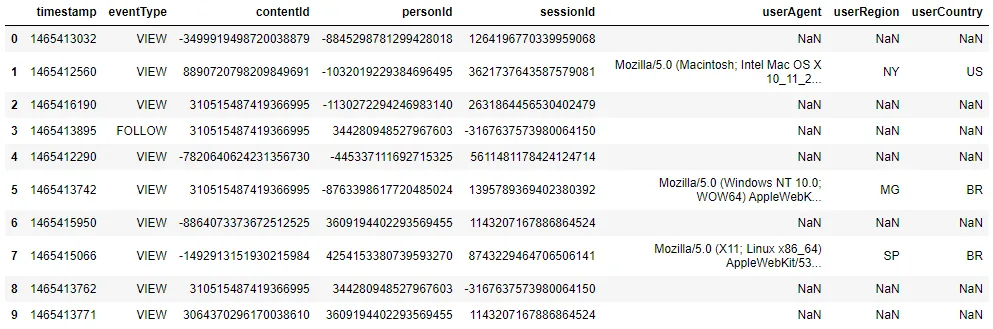

```python
interactions_df.shape
```

```python
(72312, 8)
```

Total of interactions 72312

First and last interactions.

```python
print('First interaction: \t%s' % to_datetime_str(interactions_df['timestamp'].min()))
print('Last interaction: \t%s' % to_datetime_str(interactions_df['timestamp'].max()))
```

```python
First interaction: 	2016-03-14 15:54:36
Last interaction: 	2017-02-28 21:21:51
```

Interaction by month.

```python
interactions_df['datetime'] = interactions_df['timestamp'].apply(lambda x: to_datetime(x))interactions_df['month'] = interactions_df['datetime'].apply(lambda x: '{0}-{1:02}'.format(x.year, x.month))interactions_df.groupby('month').size().plot(kind='bar', title='interaction by month')
```

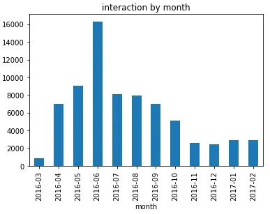

Total interactions and users.

```python
interactions_df.groupby('eventType').size().sort_values(ascending=False)
```

```python
eventType
VIEW               61086
LIKE                5745
BOOKMARK            2463
COMMENT CREATED     1611
FOLLOW              1407
dtype: int64
```

```python
total_interactions_count = len(interactions_df)total_users_count = len(interactions_df['personId'].unique())print('Total of interactions: \t%d' % total_interactions_count)print('Distinct users: \t%d' % total_users_count)
```

```python
Total of interactions: 	72312
Distinct users: 	1895
```

Analyzing how many articles (items) users have interacted with is important for recommender systems. The higher number of items consumed by users provides better modeling of users' preferences.

```python
interactions_df.groupby('personId')['contentId'].size().describe()
```

```python
count    1895.000000
mean       38.159367
std       104.143355
min         1.000000
25%         3.000000
50%        10.000000
75%        32.000000
max      1885.000000
Name: contentId, dtype: float64
```

We can observe that 50% of the users have interacted with 10 or more articles, making this dataset suitable for collaborative or content-based filtering methods.

The total number of interactions by country.

```python
country_code_dict = {'BR': ('BRA', 'Brazil'),'US': ('USA', 'United States'),'KR': ('KOR', 'South Korea'),'CA': ('CAN', 'Canada'),'JP': ('JPN', 'Japan'),'AU': ('AUS', 'Australia'),'GB': ('GBR', 'United Kingdom'),'DE': ('DEU', 'Germany'),'DE': ('DEU', 'Germany'),'IE': ('IRL', 'Ireland'),'IS': ('ISL', 'Iceland'),'SG': ('SGP', 'Singapure'),'AR': ('ARG', 'Argentina')}interactions_df['countryName'] = interactions_df['userCountry'].apply(lambda x: country_code_dict[x][1] if x in country_code_dict else None)interactions_by_country_df = pd.DataFrame(interactions_df.groupby('countryName').size() \
                            .sort_values(ascending=False).reset_index())interactions_by_country_df.columns = ['country', 'count']interactions_by_country_df
```

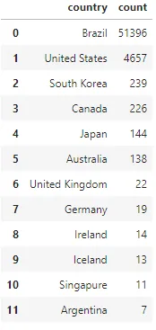

The total number of interactions by country on the world map.

```python
import plotly
plotly.offline.init_notebook_mode(connected=True)
```

```python
import plotly.offline as py
py.offline.init_notebook_mode()

data = [ dict(type = 'choropleth',locations = interactions_by_country_df['country'],z = interactions_by_country_df['count'],locationmode = 'country names',text = interactions_by_country_df['country'],colorscale = [[0,"rgb(153, 241, 243)"],[0.005,"rgb(16, 64, 143)"],[1,"rgb(0, 0, 0)"]],autocolorscale = False,marker = dict(line = dict(color = 'rgb(58,100,69)', width = 0.6)),colorbar = dict(autotick = True, tickprefix = '', title = '# of Interactions'))]

layout = dict(title = 'Total number of interactions by country',geo = dict(showframe = False,showcoastlines = True,projection = dict(type = 'equirectangular'),margin = dict(b = 0, t = 0, l = 0, r = 0)))

fig = dict(data=data, layout=layout)py.iplot(fig, validate=False, filename='worldmap')
```

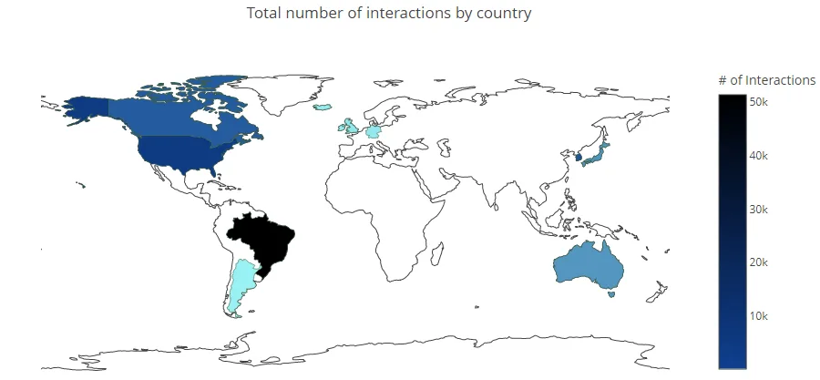

**2.3 Data Munging**

As there are different interaction types, we associate them with weight or strength, assuming that, for example, a comment in an article indicates a higher interest of the user in the item than a like or a simple view.

Feature engineering

```python
event_type_strength = {'VIEW': 1.0,'LIKE': 2.0,'BOOKMARK': 3.0,'FOLLOW': 4.0,'COMMENT CREATED': 5.0,}

interactions_df['eventStrength']=interactions_df['eventType'].apply(lambda x: event_type_strength[x])
```

Users can interact with articles multiple times.

```python
interactions_df.groupby(['personId', 'contentId']).size()
```

```python
personId              contentId
-9223121837663643404  -8949113594875411859    1
                      -8377626164558006982    1
                      -8208801367848627943    1
                      -8187220755213888616    1
                      -7423191370472335463    8
                                             ..
 9210530975708218054   8477804012624580461    4
                       8526042588044002101    1
                       8856169137131817223    1
                       8869347744613364434    1
                       9209886322932807692    1
Length: 40710, dtype: int64
```

For example, interaction of (personId= -9223121837663643404) on (contentId= - 7423191370472335463)

```python
interactions_df[(interactions_df['personId']==9210530975708218054) &(interactions_df['contentId']==8477804012624580461)].sort_values(by=['timestamp'])
```

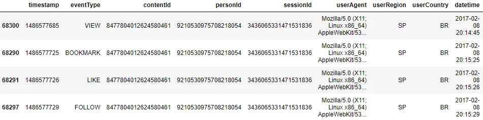

Another example, interaction of (personId=9210530975708218054) on (contentId=8477804012624580461)

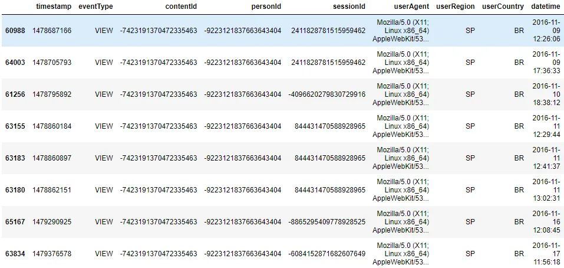

Recommender systems have a problem known as user cold-start. It is hard to provide personalized recommendations for users with few or very few consumed items due to the lack of information to model their preferences. For this reason, we keep only users with at least 5 interactions in the dataset.

Users with at least 5 interactions:

```python
total_users_count = len(interactions_df['personId'].unique())
users_interactions_count_df = interactions_df.groupby(['personId', 'contentId']).size().groupby('personId').size()
users_with_enough_interactions_df = users_interactions_count_df[users_interactions_count_df >= 5].reset_index()[['personId']]

print('Total users: \t%d' % total_users_count)
print('Users with at least 5 interactions: %d' % len(users_with_enough_interactions_df))
```

```python
Total users: 	1895
Users with at least 5 interactions: 1140
```

Interactions from users with at least 5 interactions:

```python
total_interactions_count = len(interactions_df)
interactions_from_selected_users_df = interactions_df.merge(users_with_enough_interactions_df,how='right',left_on='personId',right_on='personId')

print('Total of interactions: \t%d' % total_interactions_count)
print('Interactions from users with at least 5 interactions: %d' % len(interactions_from_selected_users_df))
```

```python
Total of interactions: 	72312
Interactions from users with at least 5 interactions: 69868
```

Type of interactions from selected users

```python
interactions_from_selected_users_df.groupby(['eventType','eventStrength']).size().sort_values(ascending=False)
```

```python
eventType        eventStrength
VIEW             1.0              58865
LIKE             2.0               5625
BOOKMARK         3.0               2420
COMMENT CREATED  5.0               1579
FOLLOW           4.0               1379
dtype: int64
```

Apply log transformation to smooth the distribution:

On the Desktop, users can view an article many times and interact with it differently (e.g., like or comment). Thus, to model the user interest in a given article, we aggregate all the interactions the user has performed in an item by a weighted sum of interaction type strength and apply a log transformation to smooth the distribution.

```python
import math
def smooth_user_preference(x):return math.log(1+x, 2)

interactions_full_df=interactions_from_selected_users_df \
                    .groupby(['personId', 'contentId'])['eventStrength'].sum()\.apply(smooth_user_preference).reset_index()

print('Unique user/item interactions: %d' % len(interactions_full_df))interactions_full_df.head(10)
```

```python
Unique user/item interactions: 39106
```

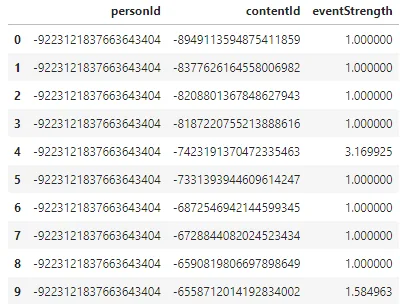

Unique user/item interactions: 39106

**2.4 Build items Profiles**

Here we use a very popular technique in information retrieval (search engines) named TF-IDF. This technique converts unstructured text into a vector structure, where a position in the vector represents each word. The value measures how relevant a given word is for an article. As all items will be represented in the same Vector Space Model, it is to compute the similarity between articles.

```python
from nltk.corpus import stopwords
import nltk
nltk.download('stopwords')
```

Ignoring stopwords (words with no semantics) from English and Portuguese (as we have a corpus with mixed languages)

```python
from sklearn.feature_extraction.text import TfidfVectorizer
stopwords_list = stopwords.words('english') + stopwords.words('portuguese')
vectorizer = TfidfVectorizer(analyzer='word',ngram_range=(1, 2),min_df=0.003,max_df=0.5,max_features=5000,stop_words=stopwords_list)
tfidf_matrix = vectorizer.fit_transform(article_df['title'] + "" + article_df['text'])
```

```python
item_ids = article_df['contentId'].tolist()
tfidf_matrix.shape

(3047, 5000)
```

Trains a model whose vector size is 5000, composed of the main unigrams and bigrams found in the corpus, ignoring stopwords.

**Understanding TF-IDF for Machine Learning:**

TF-IDF stands for term frequency-inverse document frequency, and it is a measure used in the fields of information retrieval (IR) and machine learning that can quantify the importance or relevance of string representations (words, phrases, lemmas, etc.) in a document amongst a collection of documents (also known as a corpus).

What is TF (term frequency)?

Term frequency works by looking at the frequency of a particular term you are concerned with relative to the document. There are multiple measures, or ways, of defining frequency:

● Number of times the word appears in a document (raw count).

● Term frequency adjusted for the length of the document (raw count of occurrences divided by the number of words in the document).

● Logarithmically scaled frequency (e.g. log(1 + raw count)).

● Boolean frequency (e.g., 1 if the term occurs, or 0 if the term does not occur in the document).

What is IDF (inverse document frequency)?

Inverse document frequency looks at how common (or uncommon) a word is amongst the corpus. IDF is calculated as follows, where t is the term (word) we are looking to measure the commonness of, and N is the number of documents (d) in the corpus (D). The denominator is simply the number of documents in which the term, t, appears in.

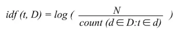

Note: It can be possible for a term to not appear in the corpus at all, which can result in a divide-by-zero error. One way to handle this is to take the existing count and add 1. Thus making the denominator (1 + count). An example of how the popular library scikit-learn handles this can be seen below.

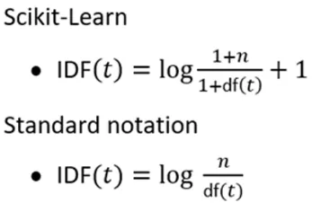

The reason we need IDF is to help correct words like “of,” “as,” “the,” etc., since they frequently appear in an English corpus. Thus by taking inverse document frequency, we can minimize the weighting of frequent terms while making infrequent terms have a higher impact.

Finally, IDFs can also be pulled from either a background corpus, which corrects for sampling bias or the dataset being used in the experiment at hand.

Putting it together: TF-IDF

To summarize, the key intuition motivating TF-IDF is the importance of a term is inversely related to its frequency across documents.TF gives us information on how often a term appears in a document, and IDF gives us information about the relative rarity of a term in the collection of documents. By multiplying these values together, we can get our final TF-IDF value.

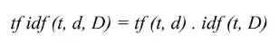

The higher the TF-IDF score, the more important or relevant the term is; as a term gets less relevant, its TF-IDF score will approach 0.

Where to use TF-IDF?

As we can see, TF-IDF can be a very handy metric for determining a term's importance in a document.

But how is TF-IDF used?

There are three main applications for TF-IDF. These are in machine learning, information retrieval, and text summarization/keyword extraction.

Using TF-IDF in machine learning & natural language processing: Machine learning algorithms often use numerical data, so when dealing with textual data or any natural language processing (NLP) task, a sub-field of ML/AI dealing with text, that data first needs to be converted to a vector of numerical data by a process known as vectorization. TF-IDF vectorization involves calculating the TFIDF score for every word in your corpus relative to that document and then putting that information into a vector (see image below using example documents “A” and “B”). Thus each document in your corpus would have its own vector, and the vector would have a TF-IDF score for every single word in the entire collection of documents. Once you have these vectors, you can apply them to various use cases, such as seeing if two documents are similar by comparing their TF-IDF vector using cosine similarity.

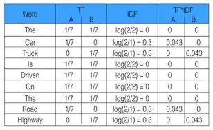

A = “The car is driven on the road”; B = “The truck is driven on the highway” Image from freeCodeCamp - How to process textual data using TF-IDF in Python.

**2.5 Build train and test sets**

Evaluation is important for machine learning projects because it allows for objectively comparing different algorithms and more objectively comparing hyperparameter choices. One key aspect of evaluation is to ensure that the trained model generalizes for data it was not trained on, using Cross-validation techniques. We are using here a simple cross-validation approach named holdout, in which a random data sample (20% in this case) is kept aside in the training process and exclusively used for evaluation. All evaluation metrics reported here are computed using the test set.

```python
from sklearn.model_selection import train_test_split
interactions_train_df, interactions_test_df = train_test_split(interactions_full_df,stratify=interactions_full_df['personId'],test_size=0.20,random_state=42)
```

Interactions on train and test set

```python
print('# interactions on Train set: %d' % len(interactions_train_df))
print('# interactions on Test set: %d' % len(interactions_test_df))
```

```python
# interactions on Train set: 31284
# interactions on Test set: 7822
```

For example (personId=3609194402293569455)

```python
interactions_train_df[interactions_train_df['personId']==3609194402293569455].groupby('personId').size()
```

```python
personId
3609194402293569455    769
dtype: int64
```

```python
interactions_test_df[interactions_test_df['personId']==3609194402293569455].groupby('personId').size()
```

```python
personId
3609194402293569455    192
dtype: int64
```

**2.6 Build user profiles**

To model the user profile, we take all the item profiles the user has interacted with and average them. The interaction strength weights the average; in other 111 words, the articles the user has interacted with the most (e.g., liked or commented) will have a higher strength in the final user profile.

```python
import scipy
import numpy as np
import sklearn

def get_item_profile(item_id):idx = item_ids.index(item_id)item_profile = tfidf_matrix[idx:idx+1]return item_profile

def get_item_profiles(ids):item_profiles_list = [get_item_profile(x) for x in ids]item_profiles = scipy.sparse.vstack(item_profiles_list)return item_profiles

def build_users_profile(person_id, interactions_indexed_df):interactions_person_df = interactions_indexed_df.loc[person_id]user_item_profiles = get_item_profiles(interactions_person_df['contentId'])

    user_item_strengths = np.array(interactions_person_df['eventStrength']).reshape(-1,1)#Weighted average of item profiles by the interactions strengthuser_item_strengths_weighted_avg = np.sum(user_item_profiles.multiply(user_item_strengths), axis=0) / np.sum(user_item_strengths)user_profile_norm = sklearn.preprocessing.normalize(user_item_strengths_weighted_avg)return user_profile_norm

def build_users_profiles():interactions_indexed_df = interactions_train_df[interactions_train_df['contentId'] \
                                                   .isin(article_df['contentId'])].set_index('personId')

    user_profiles = {}for person_id in interactions_indexed_df.index.unique():user_profiles[person_id] = build_users_profile(person_id, interactions_indexed_df)return user_profiles
```

Let's take a look at the profile. It is a unit vector of 5000 lengths. The value in each position represents how relevant is a token (unigram or bigram) for me. Looking at my profile, the top relevant tokens represent my professional interests in machine learning, deep learning, artificial intelligence, and google cloud platforms! So we might expect good recommendations here!

```python
user_profiles = build_users_profiles()
len(user_profiles)
```

```python
1140
```

Show an example for user profiles, for user ID: -1479311724257856983

```python
tfidf_feature_names = vectorizer.get_feature_names()
myprofile = user_profiles[-1479311724257856983]print(myprofile.shape)pd.DataFrame(sorted(zip(tfidf_feature_names,user_profiles[-1479311724257856983].flatten().tolist()), key=lambda x: -x[1])[:20],columns=['token', 'relevance'])
```

```python
(1, 5000)
```

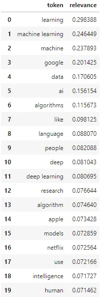

**2.7 Content-Based Filtering model**

Content-Based Filtering uses only information about the description and attributes of the items users have previously interacted with to model user preferences. In other words, these algorithms try to recommend items that are similar to those that a user liked in the past (or is examining in the present). In particular, various candidate items are compared with the user's previously-rated items. The best-matching items are recommended, making this method robust to avoid the cold-start problem. It is simple to use the raw text to build item profiles and user profiles for textual items like articles, news, and books.

**2.7.1 Cosine similarity**

Cosine similarity is a metric used to measure how similar the documents are, irrespective of their size. Mathematically, it measures the cosine of the angle between two vectors projected in a multi-dimensional space.

The cosine similarity is advantageous because even if the two similar documents are far apart by the Euclidean distance (due to the size of the document), chances are they may still be oriented closer together. The smaller the angle, the higher the cosine similarity.

The figure shows the angle between two vectors in a two-dimensional space. The angle is a measure of similarity between two vectors. If the cosine value is equal to 1, that means that the two vectors are congruent and that the angle between them is equal to zero. Still, if the cosine value is less than one, this determines The extent to which these two vectors intersect and thus the relative extent of similarity between the search word and the data.

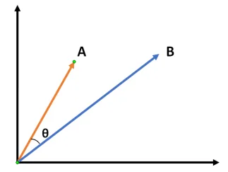

The mathematical equation for calculating cosine-similarity is:

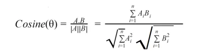

Where A and B are the two vectors, we are looking for similarities between them, and n is the number of words in each vector.

```python
from sklearn.metrics.pairwise import cosine_similarity
class ContentBasedRecommender:

    MODEL_NAME = 'Content-Based'def __init__(self, items_df=None):self.item_ids = item_idsself.items_df = items_df

    def get_model_name(self):return self.MODEL_NAME

    def _get_similar_items_to_user_profile(self, person_id, topn=1000):#Computes the cosine similarity between the user profile and all item profilescosine_similarities = cosine_similarity(user_profiles[person_id], tfidf_matrix)#Gets the top similar itemssimilar_indices = cosine_similarities.argsort().flatten()[-topn:]#Sort the similar items by similaritysimilar_items = sorted([(item_ids[i], cosine_similarities[0,i])for i in similar_indices], key=lambda x: -x[1])return similar_items

    def recommend_items(self, user_id, items_to_ignore=[], topn=10, verbose=False):similar_items = self._get_similar_items_to_user_profile(user_id)#Ignores items the user has already interactedsimilar_items_filtered = list(filter(lambda x: x[0]not in items_to_ignore, similar_items))recommendations_df = pd.DataFrame(similar_items_filtered, columns=['contentId', 'recStrength']) \
        .head(topn)

        if verbose:if self.items_df is None:raise Exception('"items_df" is required in verbose mode')recommendations_df = recommendations_df.merge(self.items_df, how = 'left', left_on = 'contentId', right_on = 'contentId')[['recStrength', 'contentId', 'title', 'url', 'lang']]return recommendations_df
```

```python
content_based_recommender_model = ContentBasedRecommender(article_df)
```

```python
cosine_sim = cosine_similarity(tfidf_matrix, tfidf_matrix, True)
display(cosine_sim.shape)
display(cosine_sim)
```

```python
(3047, 3047)
array([[1.        , 0.08465909, 0.0222425 , ..., 0.068002  , 0.12352273,         0.01430446],        [0.08465909, 1.        , 0.04461005, ..., 0.05051726, 0.07149041,         0.02423383],        [0.0222425 , 0.04461005, 1.        , ..., 0.02575883, 0.07441887,         0.        ],        ...,        [0.068002  , 0.05051726, 0.02575883, ..., 1.        , 0.08226153,         0.08417553],        [0.12352273, 0.07149041, 0.07441887, ..., 0.08226153, 1.        ,         0.05897947],        [0.01430446, 0.02423383, 0.        , ..., 0.08417553, 0.05897947,         1.        ]])
```

```python
indices = pd.Series(article_df.index, index=article_df['title'])display(indices[:10])
```


So, cosine similarity checks each pair of elements vector and finds the cosine angle between them. The less the angle, the more similar the elements are to each other. The values lie between 0 & 1. In this case, it’s a 3k by 3 matrices with values ranging from 0 to 1.

**2.8 Model Evaluation**

Evaluation is important for machine learning projects because it allows objectively comparing different algorithms and models' hyperparameter choices. One key aspect of evaluation is to ensure that the trained model generalizes for data it was not trained on, using Cross-validation techniques. We are using here a simple cross-validation approach named holdout, in which a random data sample (20% in this case) is kept aside in the training process and exclusively used for evaluation. All evaluation metrics reported here are computed using the test set.

**Recall@k**

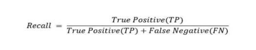

In the context of recommendation systems, we are most likely interested in recommending top-N items to the user. So it makes more sense to compute precision and recall metrics in the first N items instead of all the items. Thus the notion of precision and recall at k, where k is a user-definable integer that the user sets to match the objective of the top-N recommendation.

```python
#Indexing by personId to speed up the searches during evaluationinteractions_full_indexed_df = interactions_full_df.set_index('personId')interactions_train_indexed_df = interactions_train_df.set_index('personId')interactions_test_indexed_df = interactions_test_df.set_index('personId')
```

```python
def get_items_interacted(person_id, interactions_df):# Get the user's data and merge in the article information.interacted_items = interactions_df.loc[person_id]['contentId']return set(interacted_items if type(interacted_items) == pd.Series else [interacted_items])
```

```python
model_evaluator = ModelEvaluator()print('Evaluating Content-Based Filtering model...')cb_global_metrics, cb_detailed_results_df = model_evaluator.evaluate_model(content_based_recommender_model)print('\nGlobal metrics:\n%s' % cb_global_metrics)cb_detailed_results_df.head(10)
```

```python
Evaluating Content-Based Filtering model...
1139 users processed

Global metrics:
{'modelName': 'Content-Based', 'recall@5': 0.16312963436461264, 'recall@10': 0.26118639734083354}
```

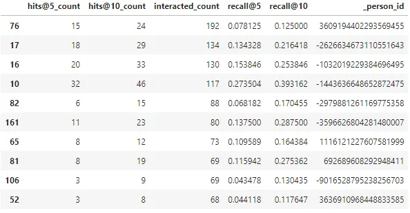

Here we evaluate the Popularity model according to the method described above. It achieved the Recall@5 of 0.162, which means that the Popularity model ranked about 16% of interacted items in the test set among the top-5 items (from lists with 100 random items). And Recall@10 was even higher (26%), as expected.

**Store model artifact:**

```python
import pickle
pickle.dump( item_ids, open( "F:\G P\Recommendation systems model/service/item_ids.p", "wb" ) )
pickle.dump( user_profiles, open( "F:\G P\Recommendation systems model/service/user_profiles.p", "wb" ) )
pickle.dump( tfidf_matrix, open( "F:\G P\Recommendation systems model/service/tfidf_matrix.p", "wb" ) )
pickle.dump( content_based_recommender_model, open( "F:\G P\Recommendation systems model/service/content_based_recommender_model.p", "wb" ) )
```

**2.9 Model Deployment**

The simplest way to deploy a machine learning model is to create a web service for prediction. We use the Flask web framework to wrap a simple random forest classifier built with scikit-learn.

We need at least three steps to create a machine learning web service. The first step is to create a machine learning model, train it and validate its performance. The following script will train a random forest classifier. Model testing and validation are not included here to keep it simple. But do remember those are an integral part of any machine learning project.

Open service file on pycharm

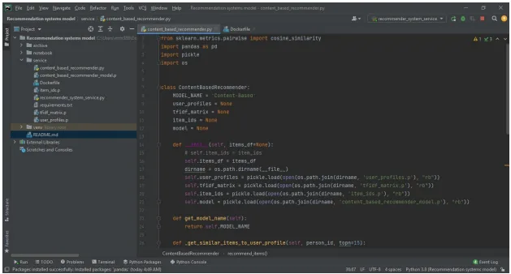

In the next step, we need to persist with the model. The environment where we deploy the application often differs from where we train them. Training usually requires a different set of resources. Thus this separation helps organizations optimize their budget and efforts. Scikit-learn offers python specific serialization that makes model persistence and restoration effortless. The following is an example of storing the trained model in a pickle file.

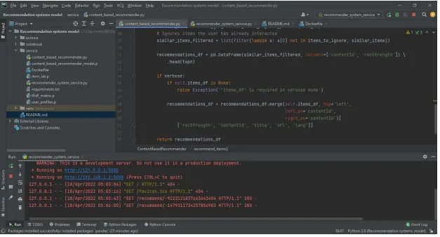

Finally, we can serve the persisted model using a web framework. The following code creates a GET API using Flask. This file is hosted in a different environment, often in a cloud server.

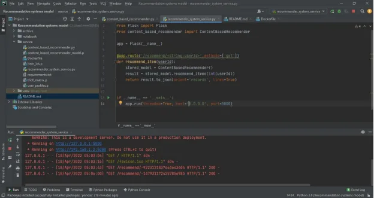

Then we go to “http://127.0.0.1:5000/recommend/-1479311724257856983”

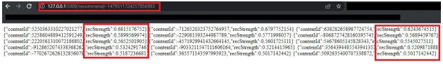

And finally, we get a recommendation system with "recStrength" 68% in the top 15 articles with Recall@15

**3. Conclusion**

Recommender systems open new opportunities for retrieving personalized information on the Internet. It also helps to alleviate the problem of information overload, a common phenomenon with information retrieval systems. It enables users to access products and services that are not readily available to users on the system. This project discussed the two traditional recommendation techniques and highlighted their strengths and challenges with diverse kinds of hybridization strategies used to improve their performances. Various learning algorithms used in generating recommendation models and evaluation metrics used in measuring the quality and performance of recommendation algorithms were discussed. This knowledge will empower researchers and serve as a road map to improve the state-of-the-art recommendation techniques.

[Github Repository](https://github.com/mahmudmursi/Recommendation-System-Model)

[LinkedIn](https://www.linkedin.com/in/mahmudmursi/)
