A data analyst is someone who identifies and communicates insights from a given data. Some key responsibilities of a data analyst are to remove errors and mistakes from datasets and use statistical tools to interpret and identify trends and patterns that could be of value.

In this article, we will be using data from the North American Industry Classification System (NAICS) Canada.

The North American Industry Classification System (NAICS) is an industry classification system developed by the statistical agencies of Canada, Mexico and the United States. Created against the background of the North American Free Trade Agreement, it is designed to provide common definitions of the industrial structure of the three countries and a common statistical framework to facilitate the analysis of the three economies. NAICS is based on supply-side or production-oriented principles, to ensure that industrial data, classified to NAICS, are suitable for the analysis of production-related issues such as industrial performance.

Description of the North American Industry Classification System (NAICS). All you would need to understand for this task is, how the

NAICS works as a hierarchical structure for defining industries at different levels of aggregation.

For example, a 2-digit NAICS industry (e.g., 23 - Construction) is

composed of some 3-digit NAICS industries (236 - Construction of buildings, 237 - Heavy and civil engineering construction, and a few more 3-digit NAICS industries).

Similarly, a 3-digit NAICS industry (e.g., 236 - Construction of buildings), is composed of 4-digit NAICS industries (2361 - Residential building construction and 2362 - Non-residential building construction).

15 CSV files beginning with RTRA. These files contain employment data by industry at different levels of aggregation; 2-digit NAICS, 3-digit NAICS, and 4-digit NAICS. Columns name as follows:

1. SYEAR: Survey Year

2. SMTH: Survey Month

3. NAICS: Industry name and associated NAICS code in the bracket

4. _EMPLOYMENT_: Number of Employment associated in the specified industry.

Each level of aggregation (i.e.2-digit NAICS, 3-digit NAICS, and 4-digit NAICS) has survey data from 1997 to 2020 segregated into 1997-1999, 2000-2005, 2006-2010, 2011-2015 and 2016-2020.

This analysis will be done on industries between 1997 to 2018.

**Importing Libraries.**

We start by importing the necessary libraries that we use to explore the given dataset.

```python
#importing necessary libaries under their alias
import pandas as pd
from datetime import datetime
import numpy as np
import matplotlib.pyplot as plt
import seaborn as sns
```

**Importing And Exploring Dataset From Local Files**

We import the data output template and assign it to the variable name called output. We parse the columns year and month columns as DateTime objects and assign them to a new column called data. We print out the unique values in the dataset, shape and summary info of the dataset.

```python
# read the data output template and assigning it to the variable output. We parse the columns SYEAR AND SMITH as datetime objects and assignd to a new colume name DATE
output= pd.read_excel('Data_Output_Template.xlsx', parse_dates={'DATE':['SYEAR','SMTH']})
print(output.nunique()) # print the number o unique values
print(output.shape) # print the shape the number of rows and colums
output.info()   # print the summary of information dataset such as datatypes, column names etc
output
```

This produces the result below. The employment column has missing values that we will be filling with the analysis that will be doing.

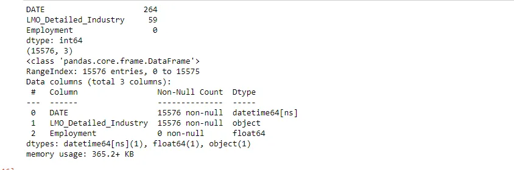

We do the same for the LMO Detailed Industries file and assign it to the variable name called 'lmo'. We realised there were some unwanted characters in this dataset like &. This needs to be removed.

```python
# read the LMO Detailed Industries by NAICS file
lmo= pd.read_excel('LMO_Detailed_Industries_by_NAICS.xlsx')
print(lmo.shape)
print(lmo.head())
print(lmo.info())
```

We write a code that replaces the unwanted characters and matches the NAICS code column that had 2 or 3 codes associated with their industry names separately. We then strip leading or trailing white spaces in the NAICS column to make the column uniform and allow python to interpret the columns accurately.

```python
# Cleaning the lmo dataset
lmo['NAICS']=lmo['NAICS'].astype('str').str.replace('&',',').str.split(',') # replaces & with comma and splits the row into a list
lmo= lmo.explode('NAICS') # Transform each element of a list-like to a row, replicating index values
lmo['NAICS']=lmo.NAICS.str.strip() # remove leading or trailing whitespaces in the NAICS values and make them uniform.
lmo.info()
lmo.tail(50) # print the last 10 rows
```

This is the result of the dataset by printing out the last 10 rows:

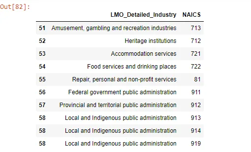

**Load And Merge CSV files**

We define a function that loads and merges the CSV files according to their industry aggregates. First, we create a list of all CSV files in terms of industry aggregates.

```python
data2_files=['RTRA_Employ_2NAICS_97_99.csv',
             'RTRA_Employ_2NAICS_00_05.csv',
             'RTRA_Employ_2NAICS_06_10.csv',
             'RTRA_Employ_2NAICS_11_15.csv',
             'RTRA_Employ_2NAICS_16_20.csv']

data3_files=['RTRA_Employ_3NAICS_97_99.csv',
             'RTRA_Employ_3NAICS_00_05.csv',
             'RTRA_Employ_3NAICS_06_10.csv'
             ,
             'RTRA_Employ_3NAICS_11_15.csv',
             'RTRA_Employ_3NAICS_16_20.csv']

data4_files=['RTRA_Employ_4NAICS_97_99.csv',
             'RTRA_Employ_4NAICS_00_05.csv',
             'RTRA_Employ_4NAICS_06_10.csv',
             'RTRA_Employ_4NAICS_11_15.csv',
             'RTRA_Employ_4NAICS_16_20.csv']

def merge_csv_files(files):
    """  Loads and merges the list of csv files into a single dataframe, parses the year and month column
        as a new datetime object column and subsets dates from 1997 to 2018
         Args:
              list of local CSV file names.
          Returns:
          A merged dataframe
    """
    a=[pd.read_csv(file, parse_dates={'DATE':['SYEAR','SMTH']}) for file in files ] # a for loop list comprehension to read the datasets
    df=pd.concat(a, ignore_index =True) # concatenate the loaded files
    df= df[(df['DATE'] <'2019')] # subsets dates less than the year 2019
    return df
```

### Two-Digit **Industries**

We load the two-digit industry by parsing the merge_csv_file function on the list of two-digit files

```python
# apply the merged_csv_files on the 2 digit industries files
data_2=merge_csv_files(data2_files)
print(data_2.shape)
print(data_2.head())
print(data_2.describe())
print(data_2.info())
```

From the result, we realized that the code names and industry names are joined together in one column. We will have to clean and process the data by separating industry names from industry codes. We achieve that by using the code below:

```python
# Separate industry description from industry code
df1 = pd.DataFrame(data_2['NAICS'].str.split('[').tolist(), columns=["NAICS_name", "CODE"]) # subset the  digit dataset NAICS column and split into a list with two new  columns
df2 =pd.DataFrame(df1["CODE"].astype(str).str.replace(']', '', regex= True).str.split('-'))
data_2['NAICS']= df2
data_2
```

Using the pandas explode method to transform each element of a list-like to a row while replicating their index values:

```python
# Using the pandas explode method to transform each element of a list-like to a row while replicating their index values
data_2=data_2.explode('NAICS')
print(data_2.shape)
data_2.info()
```

Merge the lmo industry details to the 2 digit industry dataset since they both share the NAICS columns in common and assign it to a new variable called dat2. This is because we need to classify the two-digit industries under the LMO detailed Industries template. We will do the same for the three and four digit industries.

```python
# merge and assign the result to a new varible
dat2=lmo.merge(data_2,on='NAICS', how='right').reset_index(drop= True)
print(dat2)
dat2.info()
```

### Three-Digit Industries
We load the three-digit industry dataset using the same function we defined above.

```python
# apply the merged_csv_files on the 3 digit industries files
data_3= merge_csv_files(data3_files)
print(data_3.shape)
print(data_3.head())
print(data_3.describe()) # prints descriptive statistics about the dataset
print(data_3.info())
data_3
```

We clean it using the codes below;

```python
#Separating the industry name from industry code
df3 = pd.DataFrame(data_3['NAICS'].str.split('[').tolist(), columns=["NAICS_name", "CODE"])
df3 =pd.DataFrame(df3["CODE"].astype('str').str.replace(']','', regex=True))
data_3['NAICS']= df3
data_3['NAICS']= data_3.NAICS.str.strip()
data_3.info()
data_3.head()
```

We merge it with lmo industry and assigned it to a new variable called dat3.

```python
# merge and assign the result to a new varible
dat3=lmo.merge(data_3, on='NAICS', how='right').reset_index(drop=True)
print(dat3.nunique())
dat3.info()
dat3
```

### Four Digit Industries
Load the datasets like the others,

```python
# apply the merged_csv_files on the 4 digit industries files
data_4=merge_csv_files(data4_files)
print(data_4.shape)
print(data_4.head())
print(data_4.describe())
data_4.info()
```

We merge it with lmo industry and assigned it to a new variable called dat4.

```python
data_4['NAICS'] = data_4['NAICS'].astype('str') # change the data type of NAICS column to a string in order to merge on lmo datasets.
dat4=lmo.merge(data_4,on='NAICS',how='right').reset_index(drop=True)
print(dat4.nunique())
dat4.info().
```

### Combine Industries
We join all three industry datasets and assign them to the variable name combined industry. We print the unique values in each column and summary information of the joined dataset.

```python
# merge all three industy datasets by concatenating them.
combined_industries=pd.concat([dat2,dat3,dat4], ignore_index= True)
combined_industries.info()
combined_industries.nunique()
```

The unique values of the combined dataset match that of the output dataset. But the number of columns do not match. This means there must be duplicates in the combined dataset. We drop duplicates and compare the results to the output dataset.

```python
combined_industries.dropna(inplace=True) # drop all null rows without reassignment
combined_industries.drop_duplicates(subset=['DATE','LMO_Detailed_Industry'], inplace = True, ignore_index=True) # drop duplicates of DATE and LMO details columns
print(combined_industries.nunique())
combined_industries.info()
combined_industries.head()
```

These results correspond with that of the output dataset we loaded above. Unlike the output dataset, the combined industries dataset has no null values in its employment column.

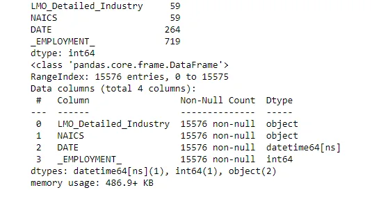

#### Sorting employment summary by Date and Lmo industry
We want to make our combined industries dataset appear the same as the output dataset since they both possess similar information. We assign a new variable industry_summary that subsets the combined_industries by Date, lmo detailed and employment columns. Use the sort values method to sort the date and lmo detailed industry column in ascending order. The sort values method by default sorts in ascending order. We will assign the result to a new variable called industry summaries.

```python
industry_summary=                 combined_industries[['DATE','LMO_Detailed_Industry','_EMPLOYMENT_']].sort_values(by=['DATE','LMO_Detailed_Industry'])
industry_summary
```

##### *Merging the output dataset to industry summary*
We merge the two datasets on the date and lmo detailed industry columns. We initiate a left join so we can keep all the columns in the output column.

```python
output_summaries= pd.merge(output,industry_summary, on=['DATE','LMO_Detailed_Industry'], how='left')
output_summaries
```

The result:

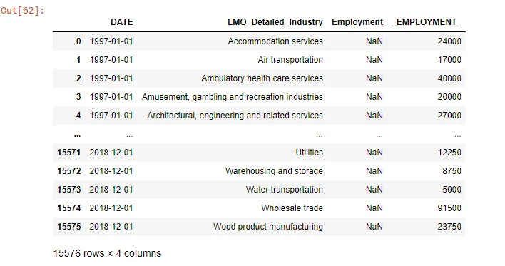

Use the code below to append the empty output dataset Employment column with the industry dataset Employment column. Then we drop the unwanted employment to make our data clean and precise.

```python
output_summaries['Employment']=output_summaries['_EMPLOYMENT_'] #assign the output employment column to the industry summaries employment
output_summaries.drop('_EMPLOYMENT_', axis=1,inplace=True) # drop the _EMPLOYMENT column
output_summaries.set_index('DATE', inplace= True)
output_summaries
```

Finally, after a much-needed data preprocessing, we now have perfect data we can use to extract insights from:

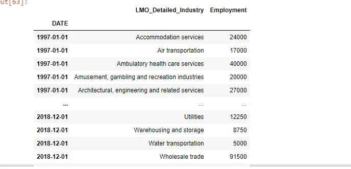

## Exploratory Data Analysis
We will group the output summaries dataset sum the total employment for each industry and assign it to the variable employment summary. Using the employment summary data, we will like to determine the following:

1. What are the top 10 industries by employment?
2. What are the bottom 10 industries by employment?
3. The average yearly employment from 1997 to 2018?

We begin the exploratory data analysis by grouping the sum of the total employment by the industry name.

```python
# Using groupby method to subset total employment of each industry.
employment_summary= output_summaries.groupby('LMO_Detailed_Industry')['Employment'].sum().sort_values(ascending=False)
employment_summary.head()
```

We plot our results using and show the result with a horizontal bar chart that displays the employment size of the various industries from the lowest to the highest.

```python
# Plotting the employment summary to visualize our data.
fig, ax = plt.subplots(figsize=(20,30))
employment_summary.plot(kind='barh',fontsize=16) #plot and set the fontsize parameter to 16 to make it visible
plt.show()
```

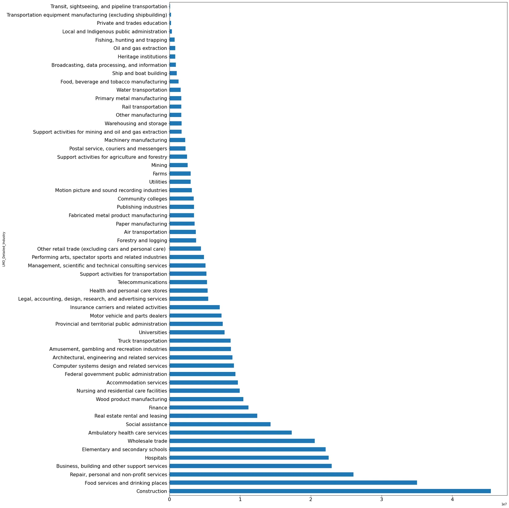

***What are the top 10 industries by employment?***

Use the code below to subset for the top 10 industries by employment size. Then we display the plot

```python
# Top 10 industries by employment
top_10_industries= employment_summary[0:10] # subset the top 10 industries
sns.barplot(y=top_10_industries.index,x=top_10_industries.values)# plot the index against the values

plt.title('TOP TEN INDUSTRIES BY EMPLOYMENT')

plt.show()
print('The top 10 industries are: \n', top_10_industries.index)
```

Result: We find that the top 10 industries are Construction; Food services and drinking places; Repair, personal and non-profit services; Business, building and other support services; Hospitals; Elementary and secondary schools; 'Wholesale trade; Ambulatory health care services; Social assistance and 'Real estate rental and leasing. Construction has the largest employment size. It is worth noticing that the top 10 is dominated by industries that provide basic human needs such as food, shelter and healthcare.


***What are the bottom 10 industries by employment?***

We use the code below to subset for the bottom 10 industries

```python
# bottom 10 industries by employment
bottom_10_industries=employment_summary.tail(10).sort_values() # subset to get the last 10 and sort from lowerst.
print
print(bottom_10_industries.head())
sns.barplot(y=bottom_10_industries.index,x=bottom_10_industries.values) #plot the output
plt.title('BOTTOM TEN INDUSTRIES BY EMPLOYMENT')
plt.show()
print('The bottom 10 industries are: \n', bottom_10_industries.index)
```

Result: The bottom industries are Transit, sightseeing, and pipeline transportation; Transportation equipment manufacturing (excluding shipbuilding); Private and trades education; Local and Indigenous public administration; Fishing, hunting and trapping; Oil and gas extraction; Heritage institutions; Broadcasting, data processing, and information; Ship and boat building and Food, beverage and tobacco manufacturing. Transit, sightseeing, and pipeline transportation industry has the lowest employment capacity.


***The average yearly employment from 1997 to 2018?***

Use the below code to group by the year and find the mean from 1997 to 2018. Here we use the DateTime resample method to group by the years.

```python
# The average yearly employment from 1997 to 2018
Employment_yearly_average = output_summaries.resample('Y').mean() # Use resample method to group the datetime index column by year and find the mean of it
print(Employment_yearly_average.head()) #print the head of the result
Employment_yearly_average.plot(title='THE AVERAGE EMPLOYMENT IN YEARS FROM 1997 TO 2018') # plot the results to show the average trend of employment over the years
plt.show()
```

Result: On average, the employment levels across all industries have been on a steady rise. However, there was a significant dip between 2008 and 2009. It is worth noting that this coincides with the aftermath of the 2007-2008 financial crisis, where a lot of people lost their jobs.

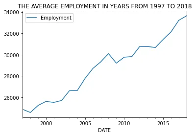

## QUESTIONS TO ANSWER USING TIME SERIES ANALYSIS
1. How has employment in Construction evolved and how does this compares to the total employment across all industries?
2. How has employment in Computer System Design and related services evolved?
3. How has the employment of Hospital staff evolved?
4. How has employment in Finance Industry evolved and how does it compare to Real Estate Rental and Leasing?
5. How has employment in Motion Picture and Sound Recording Industries evolved?

**How has employment in Construction evolved and how does this compares to the total employment across all industries?**

Use the code below to analyse the evolution of the construction sector over the years.

```python
construction = output_summaries[output_summaries['LMO_Detailed_Industry'] == 'Construction'] # subset only construction  industry
construction.head()
```

```python
#plot the evolution of Cnstruction employment.
construction= construction.resample('Y').sum()
print(construction.head())
construction.plot(title='Employment In Construction Evolution Over Time')
plt.show()
```

Display the plot:

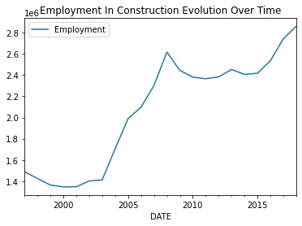

Use the code below to analyse the evolution of the construction sector compared to the total employment across all industries.

```python
# How Construction employment evolution compare to the total employment across all industries
total_employment_numbers = output_summaries.resample('Y').sum()
total_employment_numbers.head()
```

```python
 Combine two line plots on the same figure using the ax.twinx()
fig, ax = plt.subplots()
ax.plot(construction.index, construction.Employment, color='blue') #plot construction and set color to blue to differentiate
ax.set_ylabel('Construction Employment', color='blue')
ax2 = ax.twinx()
ax2.plot(total_employment_numbers.index,total_employment_numbers.Employment, color='red')# plot and set color to red
ax2.set_ylabel('Total Employment Numbers', color='red')
plt.title('Evolution Of Construction Employment In Comparison To Total Industries',pad=20) #set title and pad parameter to 20 to distant the plot from the heading.

plt.show()
```

Display the plot:

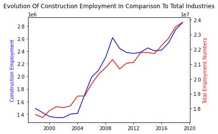

We notice from the analysis that the number of employment in the construction sector experienced a reduction towards the end of the 20th century to 2001. Then employment rate started increasing at a significant rate from 1401500 in 2002 to 2616750 in 2008. It suffered a remarkable dip between 2008 to 2015. After 2015, Construction employment numbers have begun to increase at a significant rate.

The total employment across all industries between 1997 to 2018 appears to have a similar trend to that of Construction. They both start with a reduction in the number of workers towards the end of the 20th century. Total employment, however, experienced steady growth from,2000 to 2008, unlike Construction employment only experience a higher employment growth rate in the mid-2000 (2004 to 2008). They both surged in 2008 then suffered a significant dip from 2009 to 2015. As of 2018, they are both steadily adding more workers to their industries.

**How has employment in Computer System Design and related services evolved?**

We use the code below to subset Computer System Design and related services.

```python
# Subset Computer System Design and related service industry and assigm it to the variable computer_industry.
computer_industry= output_summaries[output_summaries['LMO_Detailed_Industry'] =='Computer systems design and related services']
computer_industry=computer_industry.resample('Y').sum() #resample by year and sum
print(computer_industry.head())
computer_industry.plot(title='Evolution of Computer Industry Employment Over Time') #plot the output
plt.show()
```

Display the plot:

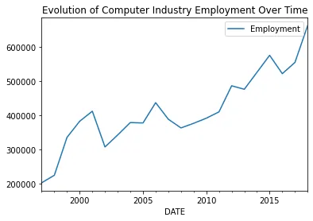

Employment in the Computer System Design and related service industry experienced growth from 202250 in 1997 to 412000 in 2001. We should keep in mind this period is associated with the rise of the internet which was commercialized in 1995. The industry had its steepest decline in 2002 when total employment fell off from 412000 the previous year to 307250.

**How has the employment of Hospital staff evolved?**

We use the code below to subset the employment of Hospital staff evolution.

```python
hospital= output_summaries[output_summaries['LMO_Detailed_Industry'] =='Hospitals']
hospital= hospital.resample('Y').sum()
print(hospital.head(25))
hospital.plot(title='Evolution of hospital Employment Over Time')
plt.show()
```

Display the plot:

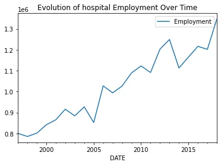

Employment in the hospital industry experienced the largest decline in 2014 when employment fell from 1249000 the previous year to 1112750. Hospital employment was largely unaffected by the drop in average employment we visualized using the mean of employment across all the industries. The hospital industry recorded a rise in employment from 1026750 in 2008 to 1122500 in 2010.

**How has employment in Finance Industry evolved and how does it compare to Real Estate Rental and Leasing?**

We use the codes to subsets the two datasets, join them and plot the results.

```python
finance= output_summaries[output_summaries['LMO_Detailed_Industry'] =='Finance'] #subset the finance industry and assign it to finance variable

real_estate= output_summaries[output_summaries['LMO_Detailed_Industry'] =='Real estate rental and leasing'] # subset real estate industry and assign real_estate vRIble

print(finance.head())
print(real_estate.head())
```

```python
# join the two data sets and assign it to a variable fin_estate
fin_estate=pd.concat([finance,real_estate])
fin_estate=fin_estate.groupby([fin_estate.index.year,'LMO_Detailed_Industry'])['Employment'].sum().reset_index() #group by the datetime index year attribute and LMO detailed Industry
fin_estate.head()
```

```python
# plot the result with seaborn relational plot to plot a line plot
sns.relplot(x='DATE', y='Employment', hue='LMO_Detailed_Industry', data=fin_estate, kind='line')
plt.xticks(rotation=90) # rotate the x axis so they do not overlap on each other
plt.show()
```

Result:

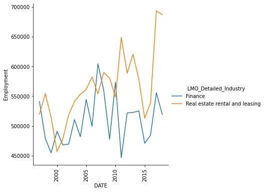

We discover that employment in the finance sector was on a continuous decline from 1997 to 1999. From the early 2000s to the mid-2000s, the employment rate was inconsistent. It endured some highs and lows. It peaked at 559750 in 2008. It suffer two major dips, one in 2009 and the other in 2011. The biggest decline was in 2011 when employment reduced from 573500 the previous to 446750.

On the other hand, employment in the real estate, rental and leasing sector, started with a slow rise in employment from 1997 to 1998. It suffered a reduction in the year 2000. It followed up with a steady rise during the early to mid-2000s ( 2001 to 2006). It endured a reduction from 590000 in 2008 to 548750 in 2010. It experienced a major decline in 2015, dropping from 578500 to 513250.

Comparing the two trends in employment, it appears that the finance sector has an unstable employment rate. There seems to be an employee turnover where people lose jobs more. Job security does not appear to be guaranteed. The finance sector also seemed to have suffered the worst decline in employment post the 2008 financial crisis compared to the real estate, rental and leasing sector.

**How has employment in Motion Picture and Sound Recording Industries evolved?**

We use the code below by subsetting the employment in Motion Picture and Sound Recording Industries evolved and plotting the results.

```python
entertainment= output_summaries[output_summaries['LMO_Detailed_Industry'] =='Motion picture and sound recording industries']
entertainment= entertainment.resample('Y').sum()
print(entertainment.head())
entertainment.plot(title='Evolution of Motion Picture and Sound Recording Industries Employment Over Time')
plt.show()
```

Result:

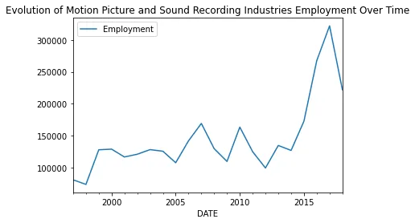

Motion Picture and Sound Recording sector experienced steady growth in employment from 116750 in 2001 to 128250 in 2003. It experience a significant reduction in 2 years from 163500 in 2010 to 99500 in 2012. Employment peaked at 322000 in 2017 and then it experienced the biggest reduction to 222000 in 2018.

## CONCLUSION
I hope this analysis provides the reader with insightful documentation of how employment trends and patterns in industries under the North American Industry Classification System.

The entire code and outputs were written in a jupyter notebook for this analysis can be accessed on my [Github repository](https://github.com/Storerun/NAICS_time_series_analysis).

This blog is a Data Insight Scholarship Project Assignment. You can find more information on Data Insight Data Science Program [here](https://www.datainsightonline.com/).
