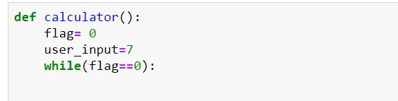
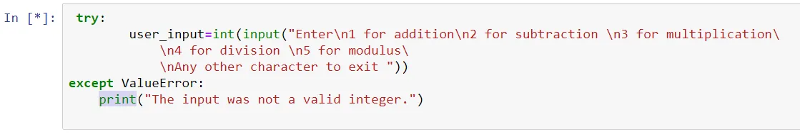
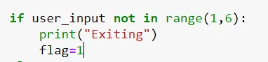
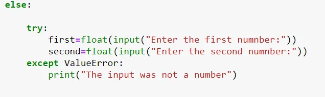
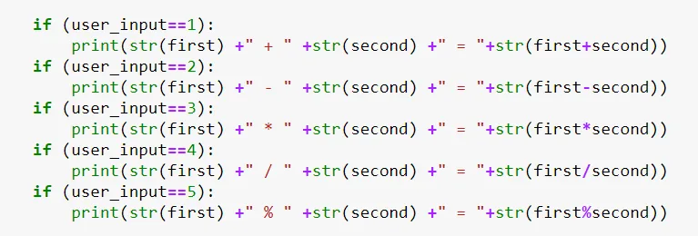
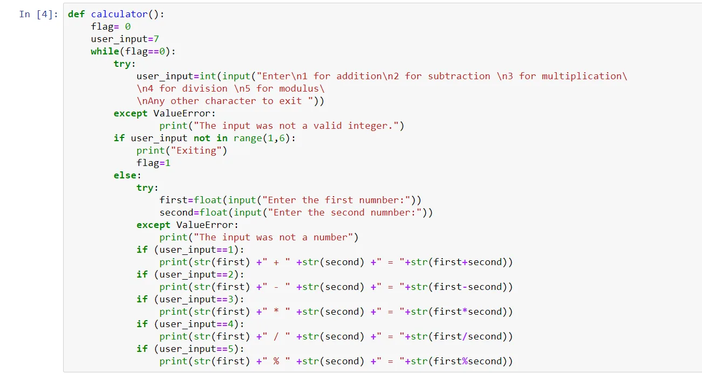
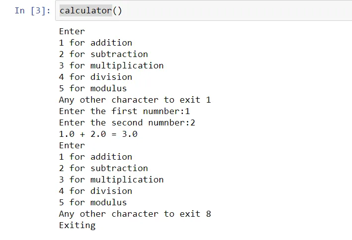

A simple calculator made using if else condition that performs 5 basic mathematic operation between two numbers( addition, subtraction, multiplication, division and modulus operation).

Firstly calculator function is defined with flag initialized as zero and user input a 7. This flag value allows user to exit while loop and the function itself.

Then the user is allowed to choose which operation they want to perform which is shown as in the code snippet below. Try catch block is added to ensure that no only integer is entered by the user.

If the user input is not in the desired range we exit from the loop and the function as flag is set to 1 . Also if the an non integer is input the user input value will be default 7 which leads to user input being out of range.

Else the two numbers are to be input by user on which the desired mathematical operation is to be performed . The try catch block is added to ensure floating point numbers are input by user.

Finally based on the user input choice desired mathematical operation is performed through if conditions.

In this way a simple calculator application is defined an executed by calling the calculator function.

The entire code is and an output instance are as follow:

