In this blog we will apply some basic statistical univariate and bivariate techniques to visualize and gain insights on the iris dataset.

### 1.About Dataset

The Iris flower data set or Fisher's Iris data set is a multivariate data set introduced by the British statistician and biologist Ronald Fisher in his 1936 paper .The data set consists of 50 samples from each of three species of Iris (Iris setosa, Iris virginica and Iris versicolor). Four features were measured from each sample: the length and the width of the sepals and petals, in centimeters.

### 2.Loading the Dataset

We import the necessary libraries and read the data in csv format as follow:

```python
import pandas as pd
import seaborn as sns
import matplotlib.pyplot as plt
import warnings
warnings.filterwarnings("ignore")
import numpy as np
iris_data = pd.read_csv("iris.csv")
iris_data.head()
```

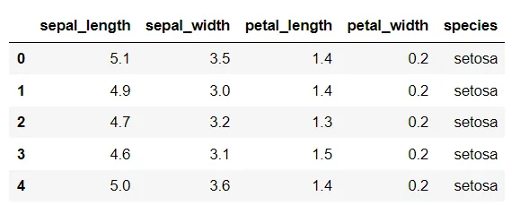

```python
print(iris_data.shape)
# Output
(150, 5)
```

### 3.Univariate Analysis

By univariate analysis we simply mean using one among the above four features for further insights.

### 3.1Histogram

It is an approximate representation of the distribution of numerical data. The data is grouped into continuous number ranges and each range corresponds to a vertical bar.

Here we draw the histogram plot using seaborn's distplot function we select specific species and their petal length using the loc function as show in the code snippet below:

```python
sns.distplot( iris_data.loc[iris_data['species'] == 'setosa']['petal_length'] , color="skyblue", label="setosa")
sns.distplot( iris_data.loc[iris_data['species'] == 'versicolor']['petal_length'] , color="orange", label="versicolor")
sns.distplot( iris_data.loc[iris_data['species'] == 'virginica']['petal_length'] , color="green", label="virginica")
plt.legend()
plt.title('Histogram of various types of iris flower based on petal length')
```

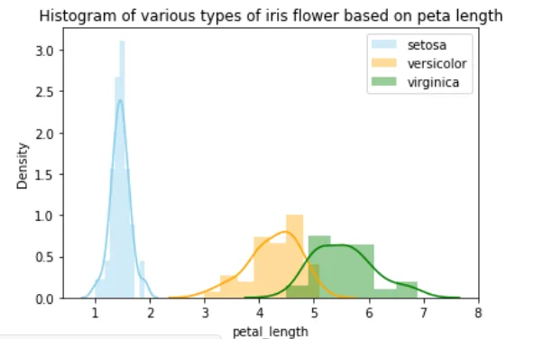

Similarly we the plot histogram of other features ( petal width ,sepal width sepal length) using distplot function. The plots are as follow

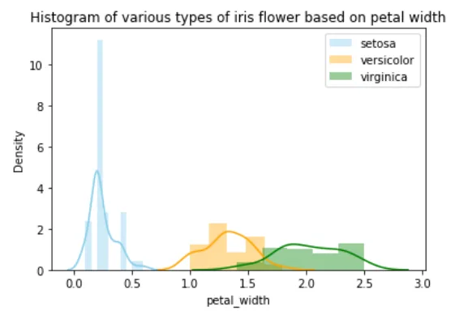

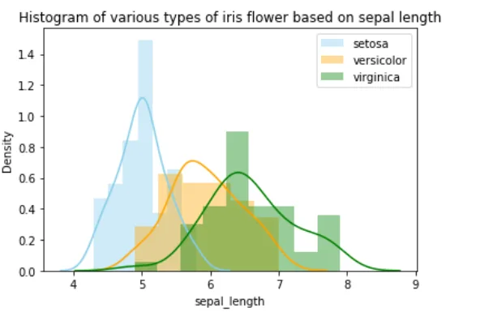

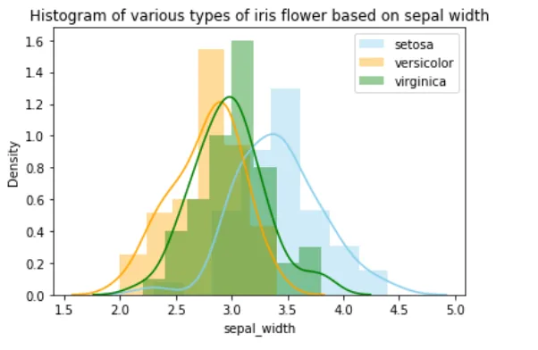

Here from the above figures we can observe that setosa can be easily separated from other iris flowers using petal length and petal width features. As for virginica and versicolor both show certain overlap across all features.

Due to this we will only be performing further univariate analysis on features petal length and petal width.

### 3.2 Box plot

A boxplot is a standardized way of displaying the dat aset based on a five-number summary: the minimum, the maximum, the sample median, and the first and third quartiles.

Here we use seaborn's built in boxplot function to draw the box plot based on selected features (petal length and petal width) based on their species as follows:

```python
sns.boxplot(x='species',y='petal_length', data=iris_data)
plt.show()
```

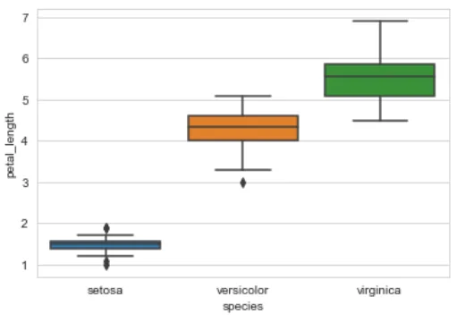

```python
sns.boxplot(x='species',y='petal_width', data=iris_data)
plt.show()
```

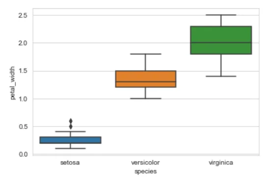

Here the length of boxes show the petal length and sepal length variation for each type of iris flower.

### 3.3 Violin Plot

A violin plot is a method of plotting numeric data. It is similar to a box plot, with the addition of a rotated kernel density plot on each side.

Here we use seaborn's built in violin plot function to draw the violin plot based on selected features (petal length and petal width) based on their species a follows:

```python
sns.violinplot(x="species", y="petal_length", data=iris_data)
plt.show()
```

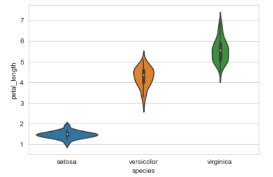

```python
sns.violinplot(x="species", y="petal_width", data=iris_data)
plt.show()
```

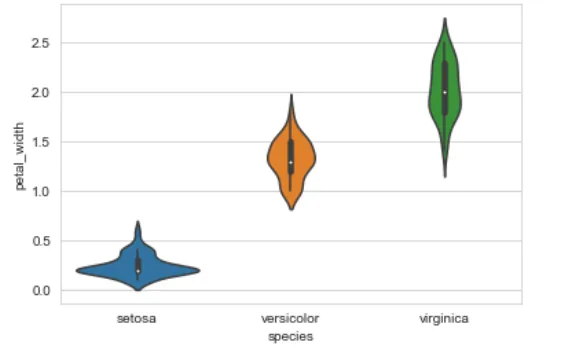

Here similar to boxplot ,length of boxes show the petal length and sepal length variation for each type of iris flower while the width represents their distribution.

### 4 Bivariate Analysis:

As the name suggests here we consider two features and their combined impact and insights.

4.1 Scatter plot

In a scatter plot one feature is represented by the standard x-axis while other feature is represented using the standard y-axis.

We plot the scatter plot with sepal length as x-axis and sepal width as y-axis very straightforward using seaborn scatterplot method

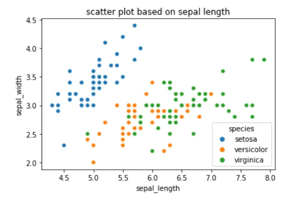

Here we can observe the setosa flower is easily linearly separable while versicolor and virginica have some overlap.

### 4.2 Pair Plot

Rather than drawing scatter plot for each possible attribute combination we can directly use the seaborn's pair plot method. In this method all possible scatter plot combination are included along with diagonal element being the distribution plot for each distinct feature.

The code snippet and output for pair plot are as follow:

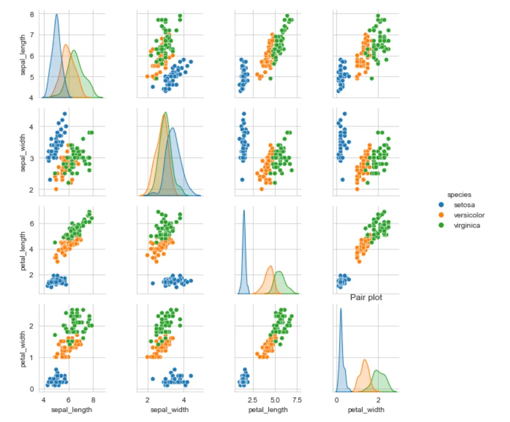

5 Conclusion

Hence we visualized the iris data using various univariate and bivariate technique's using seaborn library. We can conclude that even a simple if else condition based model can provide considerable amount of accuracy. The link to git-hub code is [here](https://github.com/rubash9849/data_inisghts/blob/main/Iris.ipynb)
