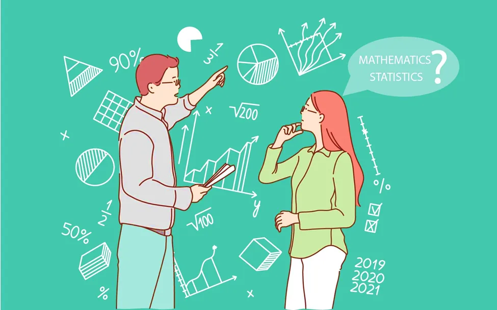
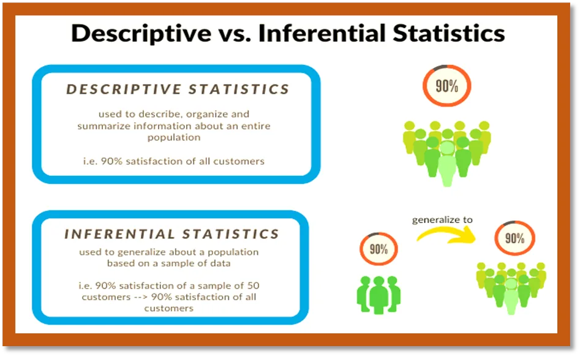
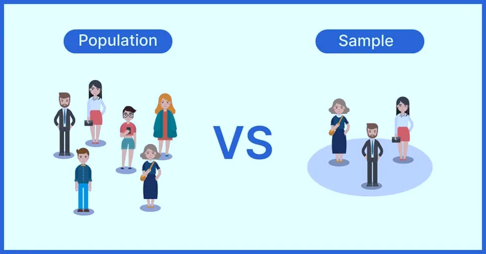
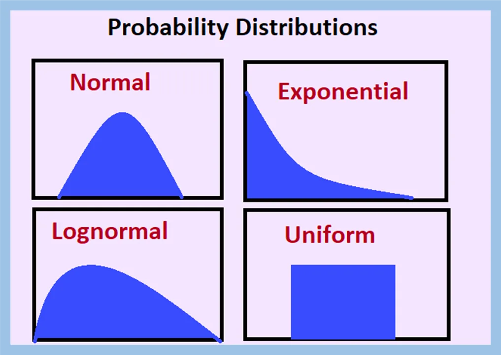
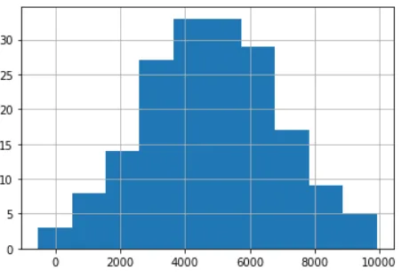
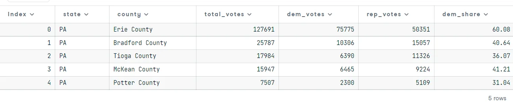
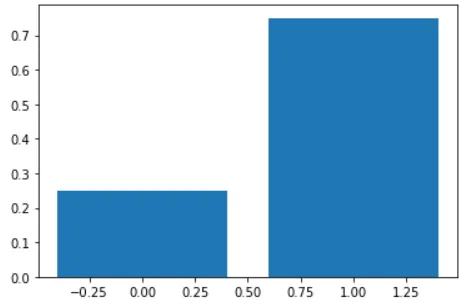
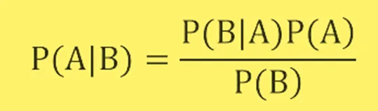

**What is Statistics?**

**Statistics**: a study and manipulation of data to gather ideas, analyze, visualize and extract information to come to denouement from data. Statistics is used in many fields, such as social science, business intelligence, share market, humanities, governments, manufacturing, and psychology. It presents data in a more meaningful and understandable way.

**Why Statistics?**

Statistics is the science of gaining knowledge from data. Statistical knowledge enables you to collect data in the correct manner, conduct appropriate analyses, and efficaciously announce the findings. Statistics is an important part of how we make scientific discoveries, make data-driven decisions, and make predictions. Statistics aims to gain a much deeper understanding of a subject. There are two key reasons why studying statistics is important in today's society. First and foremost, statisticians serve as guides for making sense of data and having to navigate common issues that can lead to incorrect conclusions. Second, despite the growing significance of data-driven decisions and opinions, it's critical that you can skeptically evaluate the quality of evaluation that many of us present to you.

**Type of statistics**

Descriptive statistics, which describe the properties of sample and population data, and inferential statistics, which use those properties to test hypotheses and draw conclusions, are the two major areas of statistics.



###### Photo: Types of Statistics

10 Statistical concepts to be discussed in this article are,

1. **Population and Sample**
2. **Probability Distribution**
3. **Discrete Probability Distributions**
4. **Continuous Distributions**
5. **Binomial Distribution**
6. **Normal Distribution**
7. **Poisson Distribution**
8. **The measure of Central Tendency**
9. **Bernoulli Distribution**
10. **Bayes' Theorem**

Let's start!

**1. Population and Sample**

In statistics, the population is a collection of all elements or items of interest. Populations are frequently large, making them unsuitable for data collection and analysis. That is why statisticians typically attempt to draw conclusions about a population by selecting and analyzing a sufficient to establish that population.



###### Photo: Population vs Sample

This tiny proportion of a population is referred to as a sample. Ideally, the sample should retain the essential statistical characteristics of the population to a meaningful degree. As a result, you'll be able to draw inferences about the population based on the sample.

**2. Probability Distribution**

The concept of a probability distribution is identical to that of a frequency distribution. Every form of distribution is defined as a set of quantification classes or class intervals that are mutually exclusive and exhaustive. As a result, a probability distribution is an idealization of how things might be if we had all the information. It specifies what we might expect to see in frequency distributions if a given condition is true.



###### Photo: Types of Probability Distribution

So, we can state that Any statement of a function associating each of a set of mutually exclusive and exhaustive classes or class intervals with its probability is called a probability distribution.

A probability distribution is divided into two categories. They are-

· Discrete probability distribution

· Continuous probability distribution

**3. Discrete Probability Distributions**

A discrete [random variable](https://www.statisticalaid.com/random-variable-and-its-types-with-properties/) assumes each of its values or numbers with a certain probability. Probability distribution with discrete random variables is called a discrete probability distribution.

There are some discrete probability distributions that are a very important part of statistics are following-

· [Bernoulli Distribution](https://www.statisticalaid.com/bernoulli-distribution-definition-example-properties-and-applications/)

· [Binomial Distribution](https://www.statisticalaid.com/binomial-distribution-definition-density-function-properties-and-application/)

· [Poisson Distribution](https://www.statisticalaid.com/poisson-distribution-definition-properties-and-applications-with-real-life-example/)

· [Negative Binomial Distribution](https://www.statisticalaid.com/negative-binomial-distribution-definition-formula-properties-with-applications/)

· [Geometric Distribution](https://www.statisticalaid.com/geometric-distribution-definition-properties-and-applications/)

· [Hypergeometric Distribution](https://www.statisticalaid.com/hypergeometric-distribution-definition-properties-and-applications/)

· Multinomial Distribution

· [Power Series Distribution](https://www.statisticalaid.com/power-series-distribution-definition-formula-with-applications/)

· Discrete Uniform Distribution

**4. Continuous Distributions**

When a probability distribution contains a continuous [random variable](https://www.statisticalaid.com/random-variable-and-its-types-with-properties/) then the distribution is called a continuous probability distribution.

Some important continuous probability distributions are following-

· [Uniform Distribution](https://www.statisticalaid.com/uniform-distribution-definition-formula-and-applications/)

· [Normal Distribution](https://www.statisticalaid.com/normal-distribution-definition-exampleproperties-applications-and-special-cases/)

· [Gamma Distribution](https://www.statisticalaid.com/gamma-distribution-definition-formula-and-applications/)

· Triangular Distribution

· Beta Distribution

· [Exponential Distribution](https://www.statisticalaid.com/exponential-distribution-definition-formula-with-applications/)

· Logistic Distribution

· Weibul Distribution

· Cauchy Distribution

**5. Binomial Distribution**

The binomial distribution exemplifies the likelihood of success in a series of independent trials. The concept of a set of trials, each with two possible outcomes with definite probabilities, is important for understanding the binomial distribution. Here, 1 means success and 0 means failure. Let’s consider a scenario.

```python
Assume that Tithi usually works on 5 deals per week, and overall, she wins 30% of deals she works on. Each deal has a binary outcome: it's either lost, or won, so I can model her sales deals with a binomial distribution. In this example, I'll help Tithi simulate a year's worth of her deals so she can better understand her performance.
```

```python
# Import numpy
import numpy as np

# Import binom from scipy.stats
from scipy.stats import binom

# Set random seed to 10
np.random.seed(10)

# Simulate a single deal
print(binom.rvs(1, 0.3, size=1))
```

```python
Output: [1]
```

Output is 1, so we can understand that Tithi will be succeeded in a single deal.

```python
# Simulate 1 week of 5 deals
print(binom.rvs(5, 0.3, size=1))
```

```python
Output: [0]
```

Output is 0, it's bad news for her.

```python
# Simulate 52 weeks of 5 deals
deals = binom.rvs(5, 0.3, size=52)

# Print mean deals won per week
print(np.mean(deals))
```

```python
1.4038461538461537
```

The output is not looking good. 140% chance out of 100%!!!! Sounds unrealistic. We can use standard deviation to solve the outlier but I am not going that far.

```python
#Probability of closing 5 out of 5 deals
prob_3 = binom.pmf(5, 5, 0.3)

print(prob_3)
```

```python
output: 0.002429999999999999
```

```python
# Probability of closing <= 1 deal out of 5 deals
prob_less_than_or_equal_1 = binom.cdf(1, 5, 0.3)

print(prob_less_than_or_equal_1)
```

```python
output: 0.5282199999999999
```

```python
# Probability of closing > 1 deal out of 5 deals
prob_greater_than_1 = 1 - binom.cdf(1, 5, 0.3)

print(prob_greater_than_1)
```

```python
output: 0.4717800000000001
```

Great!! Tithi has about a 47% chance of closing more than one deal in a week.

**6. Normal Distribution**

The normal distribution is also referred to as the Gaussian distribution. It's amongst the most vital probability distributions, and it's used to model a wide range of real-world scenarios. The probability density function is depicted in the figure below. The graph resembles a bell curve. It has symmetry. The mean and standard deviation of a normal distribution are used to describe it. A normal distribution with a mean of 0 and a standard deviation of 1 is shown below.

Now, I am uploading a dataset from the Data Camp course name, **amir_deals.csv** to check the amount of deals that amir has worked on.

```python
#import pandas to read file
import pandas as pd
```

```python
#read csv file
deals = pd.read_csv('/content/amir_deals.csv')
```

```python
#import matplotlib to visualize the data
import matplotlib.pyplot as plt

# Histogram of amount with 10 bins and show plot
deals['amount'].hist(bins=10)
plt.show()
```



the curve states that the sales **amount** follows the **Normal distribution**. Now that I've visualized the data, I know that I can approximate the probabilities of different amounts using the normal distribution.

```python
from scipy.stats import norm
# Probability of deal < 7500
prob_less_7500 = norm.cdf(7500, 5000, 2000)

print(prob_less_7500)
```

```python
output: 0.8943502263331446
```

```python
# Probability of deal > 1000
prob_over_1000 = 1 - norm.cdf(1000, 5000, 2000)

print(prob_over_1000)
```

```python
output: 0.9772498680518208
```

```python
# Probability of deal between 3000 and 7000
prob_3000_to_7000 = norm.cdf(7000, 5000, 2000) - norm.cdf(3000, 5000, 2000)

print(prob_3000_to_7000)
```

```python
output: 0.6826894921370859
```

```python
# Calculate amount that 25% of deals will be less than
pct_25 = norm.ppf(0.25, 5000, 2000)

print(pct_25)
```

```python
output: 3651.0204996078364
```

Wow!! Nice normal distribution usage! We know that we can count on Amir 75% (1-0.25) of the time to make a sale worth at least $3651.02. This information could be useful in making company-wide sales projections.

**7. Poisson Distribution**

Poisson distribution is the probability of some random event happening for a fixed time interval.

Poisson processes:

1. Events appear to occur at a predictable rate, but they occur entirely at random.

Examples:

1. A number of phone calls received in a call center for a week.
2. A number of people arriving at a Bank per hour.

Note that, time is not a matter here.

Imagine that, your company uses sales software to keep track of new sales leads. It organizes them into a queue so that anyone can follow up on one when they have a bit of free time. Since the number of lead responses is a countable outcome over a period of time, this scenario corresponds to a Poisson distribution. On average, Tithi responds to 5 leads each day. In this exercise, I'll calculate the probabilities of Tithi responding to different numbers of leads.

```python
# Import poisson from scipy.stats
from scipy.stats import poisson

# Probability of 6 responses
prob_6 = poisson.pmf(6, 5)

print(prob_6)
```

```python
output: 0.1462228081398754
```

Tithi's coworker responds to an average of 6.5 leads per day. What is the probability that she answers 6 leads in a day?

```python
# Probability of 6 responses
prob_coworker = poisson.pmf(6, 6.5)

print(prob_coworker)
```

```python
output: 0.1574829389673803
```

```python
# Probability of 2 or fewer responses
prob_2_or_less = poisson.cdf(2, 4)

print(prob_2_or_less)
```

```python
output: 0.23810330555354436
```

```python
# Probability of > 10 responses
prob_over_10 = 1 - poisson.cdf(10, 4)

print(prob_over_10)
```

```python
output: 0.0028397661205137315
```

That's a nice poison probability. Note that if you provide poisson.pmf() or poisson.cdf() with a non-integer, it throws an error since the Poisson distribution only applies to integers.

8. **The measure of Central Tendency**

**Mean**: It is the central value which is commonly known as arithmetic average.

**Mode**: It refers to the value that appears most often in a data set.

**Median**: It is the middle value of the ordered set that divides it in exactly half.

For example, I am considering a voting dataset from the DataCamp course. Our dataset look like below,

```python
swing_states = pd.read_csv('datasets/2008_swing_states.csv')

swing_states.head() # Display the first five rows
```



```python
# mean
import numpy as np
mean = np.mean(swing_states['total_votes'])
print("Mean:", mean)

# median
median = np.median(swing_states['total_votes'])
print("Median:", median)

# mode
mode = swing_states['total_votes'].value_counts()
print("Mode:", mode)
```

```python
Output: Mean: 90424.51351351352
Median: 32491.0
Mode: 18802 2
8023 1
13114 1
32571 1
14652 1
..
21173 1
219830 1
22510 1
25787 1
65022 1
Name: total_votes, Length: 221, dtype: int64
```

**9. Bernoulli Distribution**

Bernoulli distribution is a discrete probability distribution for a Bernoulli trial, which is a random experiment with only two outcomes (typically "Success" or "Failure"). When flipping a coin, for instance, the likelihood of obtaining heads (a "success") is 0.5. The likelihood of "failure" is 1 – P. (1 minus the probability of success, which also equals 0.5 for a coin toss). For n = 1, it is a special case of the binomial distribution. To put it another way, it is a binomial distribution with a single trial (e.g. a single coin toss).

```python
from scipy.stats import bernoulli
#generate 100000 data points from bernoulli distribution for p=0.75
bern= bernoulli(0.75)
bern
```

```python
output: <scipy.stats._distn_infrastructure.rv_frozen at 0x7f8c6957ee90>
```

```python
x=[0,1]
plt.bar(x,bern.pmf(x))
plt.show()
```



**10. Bayes' Theorem**

The Bayes' theorem (also known as the Bayes' rule) is a mathematical formula used to calculate the conditional probability of events in statistics and probability theory.

The Bayes' theorem, in essence, describes the likelihood of an outcome previously learned of the circumstances that may be relevant to this case.

**The formula for Bayes’ Theorem**

The Bayes’ theorem is written in the following formula:



Where:

- P(A|B) – the probability of event A occurring, given event B has occurred
- P(B|A) – the probability of event B occurring, given event A has occurred
- P(A) – the probability of event A
- P(B) – the probability of event B

It is important to note that events A and B are distinct (i.e., the probability of the outcome of event A does not depend on the probability of the outcome of event B).

I am not writing any further because this article is going on for so long. My code for this article can be found [here](https://github.com/rubayat-tithi/Statistical_concept_distribution).

**Conclusion**

Statistics itself is a huge area of study. In this article, I have discussed a few of these topics. There are so many topics to cover to become a Data Scientist or Statistician.

Thank you for reading! Happy learning.

References**:**

1. [Statistics](https://libraryguides.centennialcollege.ca/c.php?g=717168&p=5123066#:~:text=Statistical%20knowledge%20helps%20you%20use,on%20data%2C%20and%20make%20predictions.)
2. [Probability Distribution](https://www.statisticalaid.com/probability-distributions-in-statistics/)
3. [Bernoulli Distribution](https://www.statisticshowto.com/bernoulli-distribution/)
4. [Statistical Thinking in Python (Part 1)](https://app.datacamp.com/learn/courses/statistical-thinking-in-python-part-1)
5. [Introduction to Statistics in Python](https://app.datacamp.com/learn/courses/introduction-to-statistics-in-python)
