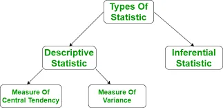
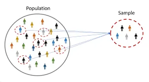
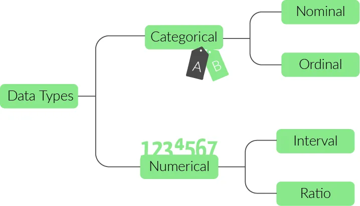
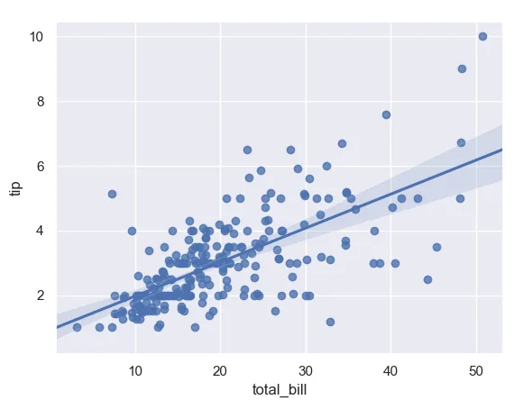
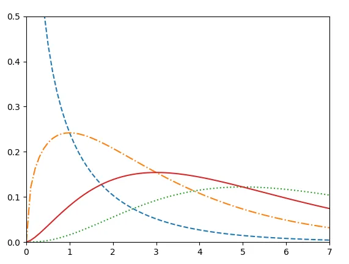
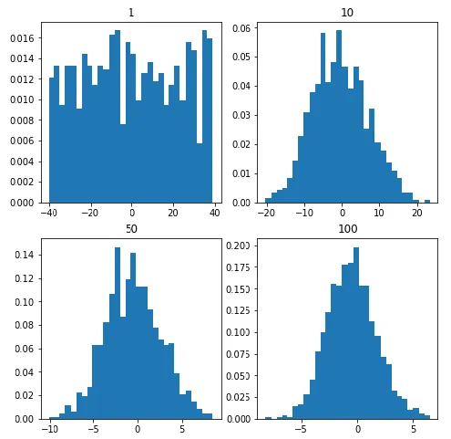

## What Is Statistics?
Statistics is a branch of applied mathematics that involves the collection,

description, analysis, and inference of conclusions from quantitative data. The mathematical theories behind statistics rely heavily on differential and integral calculus, linear algebra, and probability theory. Statisticians, people who do statistics, are particularly concerned with determining how to draw reliable conclusions about large groups and general events from the behavior and other observable characteristics of small samples. These small samples represent a portion of the large group or a limited number of instances of a general phenomenon.

We will discuss some common statistical tools and procedures including the following:

1. Descriptive vs. Inferential Statistics
2. Population and Samples
3. Data Types
4. Measures of Central Tendency
5. Measures of Dispersion
6. Central Limit Theorem
7. Linear Regression
8. Confidence Intervals
9. Chi-square Test
10. One Way analysis of Variance

**Descriptive vs. Inferential Statistics**

Descriptive statistics mostly focus on the central tendency, variability, and distribution of sample data. Central tendency means the estimate of the characteristics, a typical element of a sample or population, and includes descriptive statistics such as mean, median, and mode. Variability refers to a set of statistics that show how much difference there is among the elements of a sample or population along the characteristics measured, and includes metrics such as range, variance, and standard deviation.

Inferential statistics are used to make generalizations about large groups, such as estimating average demand for a product by surveying a sample of consumers' buying habits or to attempt to predict future events, such as projecting the future return of a security or asset class based on returns in a sample period.

## Population and Samples
In statistics, the **population** is a set of all elements or items that you’re interested in. Populations are often vast, which makes them inappropriate for collecting and analyzing data. That’s why statisticians usually try to make some conclusions about a population by choosing and examining a representative subset of that population.

This subset of a population is called a **sample**. Ideally, the sample should preserve the essential statistical features of the population to a satisfactory extent. That way, you’ll be able to use the sample to glean conclusions about the population.



## Data Types
Data Types are an important concept in statistics, which needs to be understood, to correctly apply statistical measurements to your data and therefore to correctly conclude certain assumptions about it. This blog post will introduce you to the different data types you need to know in order to do proper exploratory data analysis (EDA), which is one of the most underestimated parts of a machine learning project.

### CATEGORICAL DATA

Categorical data represents characteristics. Therefore it can represent things like a person’s gender, language etc. Categorical data can also take on numerical values (Example: 1 for female and 0 for male). Note that those numbers don’t have mathematical meaning.

### NOMINAL DATA

Nominal values represent discrete units and are used to label variables, that have no quantitative value. Just think of them as „labels“. Note that nominal data that has no order.

### ORDINAL DATA

Ordinal values represent discrete and ordered units. It is therefore nearly the same as nominal data, except that it’s ordering matters.

## Numerical Data
### 1. DISCRETE DATA

We speak of discrete data if its values are distinct and separate. In other words: We speak of discrete data if the data can only take on certain values. This type of data can’t be measured but it can be counted. It basically represents information that can be categorized into a classification. An example is the number of heads in 100 coin flips.

### 2. CONTINUOUS DATA

Continuous Data represents measurements and therefore their values can’t be counted but they can be measured. An example would be the height of a person, which you can describe by using intervals on the real number line.

**Interval Data**

Interval values represent ordered units that have the same difference. Therefore we speak of interval data when we have a variable that contains numeric values that are ordered and where we know the exact differences between the values.

**Ratio Data**

Ratio values are also ordered units that have the same difference. Ratio values are the same as interval values, with the difference that they do have an absolute zero. Good examples are height, weight, length etc.



## Measures of Central Tendency
The **measures of central tendency** show the central or middle values of datasets. There are several definitions of what’s considered to be the center of a dataset. In this tutorial, you’ll learn how to identify and calculate these measures of central tendency:

- Mean
- Median
- Mode

#### Mean

The **sample mean**, also called the **sample arithmetic mean** or simply the **average**, is the arithmetic average of all the items in a dataset. The mean of a dataset 𝑥 is mathematically expressed as Σᵢ𝑥ᵢ/𝑛, where 𝑖 = 1, 2, …, 𝑛. In other words, it’s the sum of all the elements 𝑥ᵢ divided by the number of items in the dataset 𝑥.

```python
from statistics import mean
# tuple of positive integer numbers
data1 = (11, 3, 4, 5, 7, 9, 2)

# tuple of a negative set of integers
data2 = (-1, -2, -4, -7, -12, -19)

# tuple of mixed range of numbers
data3 = (-1, -13, -6, 4, 5, 19, 9)
 print("Mean of data set 1 is % s" % (mean(data1)))
print("Mean of data set 2 is % s" % (mean(data2)))
print("Mean of data set 3 is % s" % (mean(data3)))
```

**output:**

```python
Mean of data set 1 is 5.857142857142857
Mean of data set 2 is -7.5
Mean of data set 3 is 2.4285714285714284
```

#### Median

The **sample median** is the middle element of a sorted dataset. The dataset can be sorted in increasing or decreasing order. If the number of elements 𝑛 of the dataset is odd, then the median is the value at the middle position: 0.5(𝑛 + 1). If 𝑛 is even, then the median is the arithmetic mean of the two values in the middle, that is, the items at the positions 0.5𝑛 and 0.5𝑛 + 1.

```python
import statistics

# unsorted list of random integers
data1 = [2, -2, 3, 6, 9, 4, 5, -1]


# Printing median of the
# random data-set
print("Median of data-set is : % s "
        % (statistics.median(data1)))
```

```python
Median of data-set is : 3.5
```

#### Mode

The **sample mode** is the value in the dataset that occurs most frequently. If there isn’t a single such value, then the set is **multimodal** since it has multiple modal values. For example, in the set that contains the points 2, 3, 2, 8, and 12, the number 2 is the mode because it occurs twice, unlike the other items that occur only once.

```python
import statistics
set1 =[1, 2, 3, 3, 4, 4, 4, 5, 5, 6]
print("Mode of given data set is % s" % (statistics.mode(set1)))
```

output:

```python
Mode of given data set is 4
```

## Measures of Variability
The measures of central tendency aren’t sufficient to describe data. You’ll also need the **measures of variability** that quantify the spread of data points. In this section, you’ll learn how to identify and calculate the following variability measures:

- Variance
- Standard deviation
- Skewness
- Percentiles
- Ranges

#### Variance

The **sample variance** quantifies the spread of the data. It shows numerically how far the data points are from the mean. You can express the sample variance of the dataset 𝑥 with 𝑛 elements mathematically as 𝑠² = Σᵢ(𝑥ᵢ − mean(𝑥))² / (𝑛 − 1), where 𝑖 = 1, 2, …, 𝑛 and mean(𝑥) is the sample mean of 𝑥.

#### Standard Deviation

is the positive square root of the sample variance.

#### Skewness

The **sample skewness** measures the asymmetry of a data sample.

#### Percentiles

The **sample 𝑝 percentile** is the element in the dataset such that 𝑝% of the elements in the dataset are less than or equal to that value. Also, (100 − 𝑝)% of the elements are greater than or equal to that value. If there are two such elements in the dataset, then the sample 𝑝 percentile is their arithmetic mean. Each dataset has three **quartiles**, which are the percentiles that divide the dataset into four parts:

- **The first quartile** is the sample 25th percentile. It divides roughly 25% of the smallest items from the rest of the dataset.
- **The second quartile** is the sample 50th percentile or the **median**. Approximately 25% of the items lie between the first and second quartiles and another 25% between the second and third quartiles.
- **The third quartile** is the sample 75th percentile. It divides roughly 25% of the largest items from the rest of the dataset.

#### Ranges

The **range of data** is the difference between the maximum and minimum elements in the dataset.

The **interquartile range** is the difference between the first and third quartiles. Once you calculate the quartiles.

```python
import statistics as st
 nums=[1,2,3,5,7,9]
  st.variance(nums)
  st.pvariance(nums)
  st.stdev(nums)
```

## Linear Regression
Linear regression attempts to model the relationship between two variables by fitting a linear equation to observed data. One variable is considered to be an explanatory variable, and the other is considered to be a dependent variable. For example, a modeler might want to relate the weights of individuals to their heights using a linear regression model.

```python
 import seaborn as sn
 import matplotlib.pyplot as plt
 sn.set(color_codes=True)
 tips=sn.load_dataset('tips')
 ax=sn.regplot(x='total_bill',y='tip',data=tips)
 plt.show()
```



## Setting a Confidence Interval
To set the confidence interval, we use the ci parameter. The confidence interval is a range of values that make it probable that a parameter’s value lies within it.

```python
ax=sn.regplot(x=x,y=y,ci=68)
plt.show()
```


## The Chi-Square Test
A chi-square statistic is one way to show a relationship between two categorical variables. In statistics, there are two types of variables: numerical (countable) variables and non-numerical (categorical) variables. The chi-squared statistic is a single number that tells you how much difference exists between your observed counts and the counts you would expect if there were no relationship at all in the population.

```python
 from scipy import stats
 import numpy as np
 import matplotlib.pyplot as plt
 x=np.linspace(0,10,100)
 fig,ax=plt.subplots(1,1)
 linestyles=['--','-.',':','-']
 degrees_of_freedom=[1,3,7,5]
 for df,ls in zip(degrees_of_freedom,linestyles):
                ax.plot(x,stats.chi2.pdf(x,df),linestyle=ls)
plt.ylim(0,0.5)
plt.show()
```



## **Central Limit Theorem** The definition:

*The sample mean will approximately be normally distributed for large sample sizes, regardless of the distribution from which we are sampling.*

```python
import numpy
import matplotlib.pyplot as plt

# number of sample
num = [1, 10, 50, 100]
# list of sample means
means = []

# Generating 1, 10, 30, 100 random numbers from -40 to 40
# taking their mean and appending it to list means.
for j in num:
	# Generating seed so that we can get same result
	# every time the loop is run...
	numpy.random.seed(1)
	x = [numpy.mean(
		numpy.random.randint(
			-40, 40, j)) for _i in range(1000)]
	means.append(x)
k = 0

# plotting all the means in one figure
fig, ax = plt.subplots(2, 2, figsize =(8, 8))
for i in range(0, 2):
	for j in range(0, 2):
		# Histogram for each x stored in means
		ax[i, j].hist(means[k], 10, density = True)
		ax[i, j].set_title(label = num[k])
		k = k + 1
plt.show()
```

output:



## One-way analysis of variance
In statistics, **one-way analysis of variance** (abbreviated **one-way ANOVA**) is a technique that can be used to compare whether two sample's means are significantly different or not (using the F distribution). This technique can be used only for numerical response data, the "Y", usually one variable, and numerical or (usually) categorical input data, the "X", always one variable, hence "one-way".

```python
#enter exam scores for each group
group1 = [85, 86, 88, 75, 78, 94, 98, 79, 71, 80]
group2 = [91, 92, 93, 85, 87, 84, 82, 88, 95, 96]
group3 = [79, 78, 88, 94, 92, 85, 83, 85, 82, 81]

from scipy.stats import f_oneway

#perform one-way ANOVA
f_oneway(group1, group2, group3)

(statistic=2.3575, pvalue=0.1138)
```

Resources**:**

https://www.statology.org/one-way-anova-python/

[https://data-flair.trainihttps://data-flair.training/blogs/python-probability-distributions/ng/blogs/python-probability-distributions/](https://data-flair.trainihttps)

https://www.geeksforgeeks.org/
