## Population vs Sample

Suppose someone wants to know some measurements such as height or weight or blood pressure of the whole population. But there are more than 7 billion people in the world and it is almost impossible to measure all the people. So, we have to measure a small subset of the population; maybe 1000 or 10000 or 100000. In this example, all people in the world are the population and the small subset that we will measure is the sample.

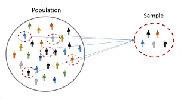

The population is a set of all possible outcomes and the sample is a set of populations.

The true measure of the population is called **PARAMETERS** and the estimated measure from the sample is called **STATISTICS**.

Why sampling?

To measure the population is expensive, time-consuming, or impossible and in some cases, it is not even required. Proper sampling can get a good estimation of the entire population. But, poor sampling can get a wrong estimate (biased sampling). There are many types of sampling techniques such as random sampling, systematic sampling, cluster sampling, stratified sampling, and so on.

1. Random sampling

- Every member of the population has an equal chance of getting selected.
- Tag serial number to each member
- Generate a random number from assigned serials
- The sample is formed according to the generated random number for each member

2. Systematic sampling

- Selecting every n_th member from the population as a sample

3. Cluster sampling

- Divide the population into groups or clusters
- Use random sampling from each group or clusters
- Effective if each group or cluster have approximately the same size

4. Stratified sampling

- Divide population into separate groups called strata
- Groups are formed based on similarities such as age, gender, education, etc
- Effective as the sample can give same variety as in the entire population

## Types of Statistics

Basically, there are two types of statistics: descriptive and inferential.

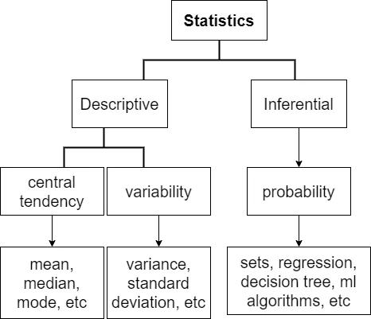

## Descriptive statistics

- Describe the characteristic of a dataset
- Central tendency - the center of the dataset commonly measured by mean, median, and mode
- Variability - describe the range of a variable of a dataset
- How two or more variables are related to each other (correlation, covariance)
- Simplify large amounts of data (which data is relevant or not)

## Inferential Statistics

- Try to draw a conclusion or make inference from the dataset
- Make decisions under unknown circumstances
- Sample dataset should reflect the same characteristics as the population to make an accurate assumption, conclusions, and inference
- Measurements are regression, decision tree and other machine learning algorithms such as support vector machine, random forest, gradient boosted trees, etc.

## Types of Data

There are two types of data: categorical and numerical.

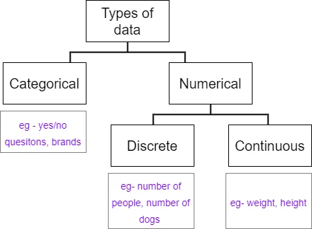

To explain the discrete type under numerical, they can be called ‘**INTEGER**’ in programming without decimal numbers, and for continuous data type, they can be called ‘**FLOAT**’.

According to the level of measurement, data can be classified into qualitative and quantitative.

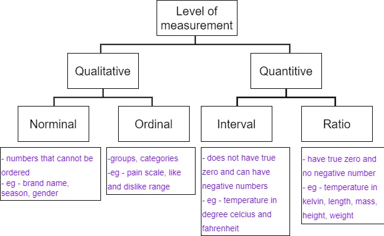

## Measure of Central Tendency

Most common measures of central tendency are mean (arithmetic), median and mode.

Here you can check [the code to create graphs](https://rpubs.com/ThihaNg/869306).

## Mean

- By adding up all the components and then dividing by the number of components or simple average of the dataset
- Easily affected by the outliers

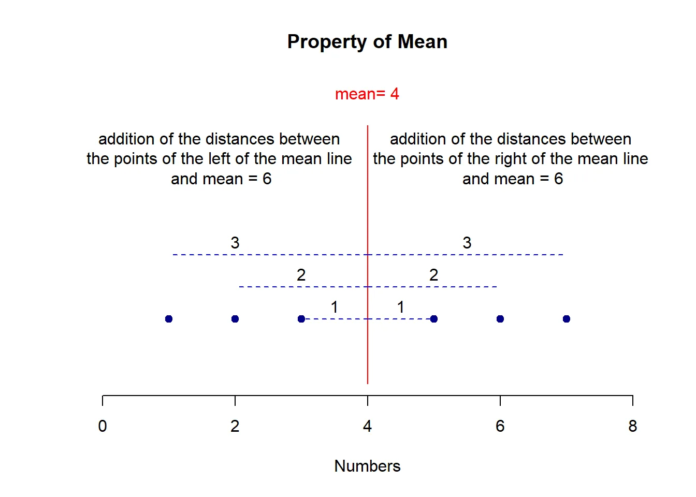

## Median

- The midpointThe graph of the ordered dataset
- Not affected by the outliers

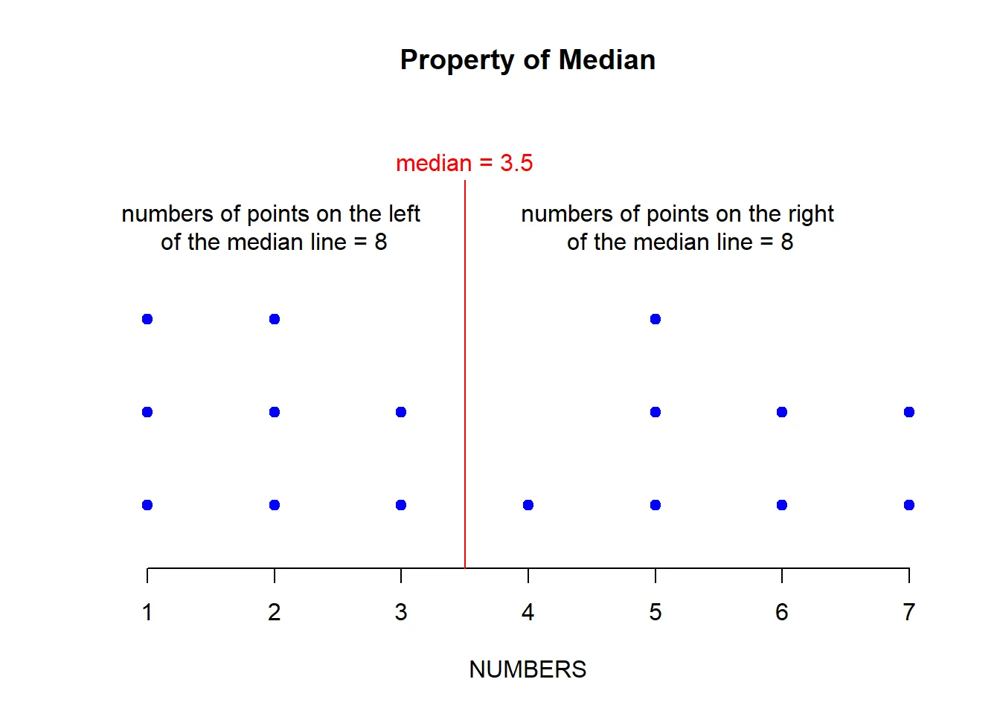

## Skewness

We can also estimate the type of data distribution by looking at the mean and median values.

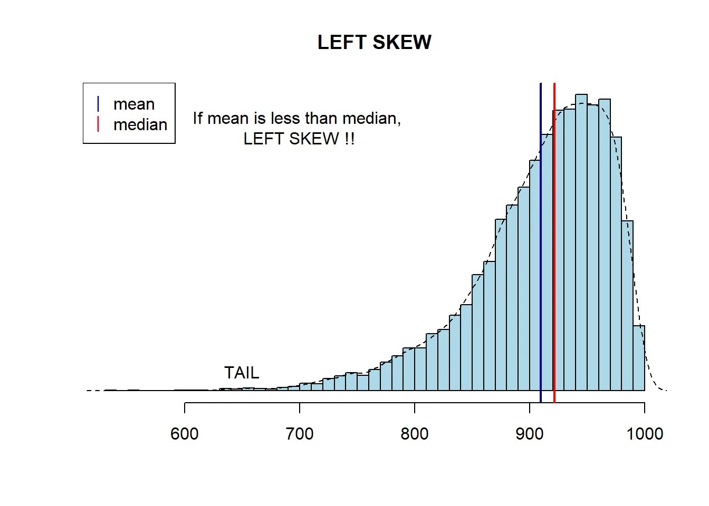

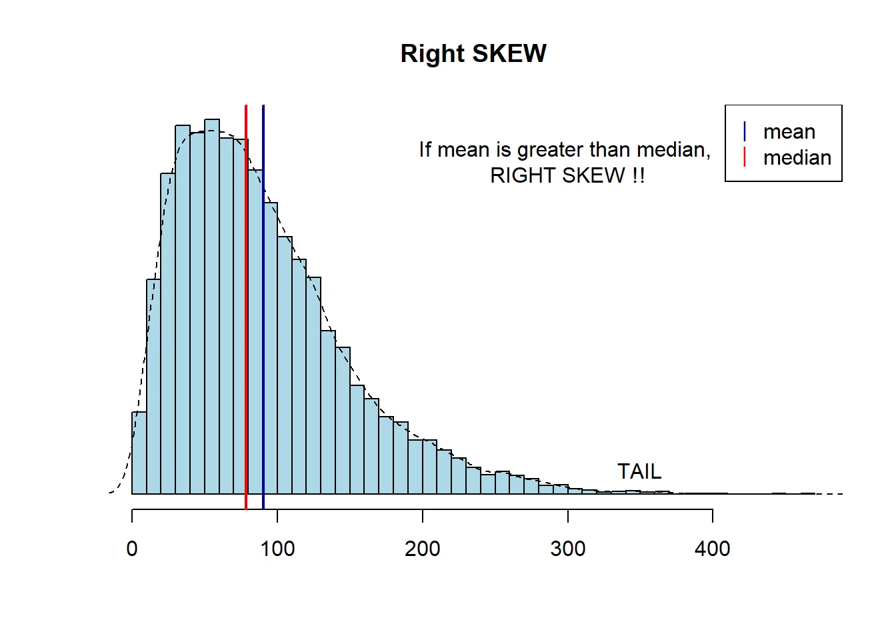

## Data Distribution

A distribution shows the possible values a random variable can take and how frequently they occur. Based on the type of data, distribution can be classified into discrete and continuous.

|  |  |
| --- | --- |
| ​**Discrete** | **Continuous** |
| Have a finite number of outcomes | Have infinitely many consecutive possible values |
| Can use individual value to determine the probability | Cannot use an individual value to determine the probability |
| Graph consists of bars lined up one after another | Graph consists of a smooth curve |
| Eg- uniform, bernoulli, binomial, poisson, etc | Eg- normal, student-T, Chi-Squared, Exponential, Logistic, etc |

## Normal Distribution

- Its graph is a bell-shaped curve, symmetric, and has thin tails
- Characteristics

  - Mean, median, mode are equal
  - Symmetrical around the mean
  - Dense in the center, less dense near the tail
  - The total area under the curve is one
  - The Left and right sides of the distribution extend indefinitely and never touch the horizontal axis
  - Defined by the mean and standard deviation

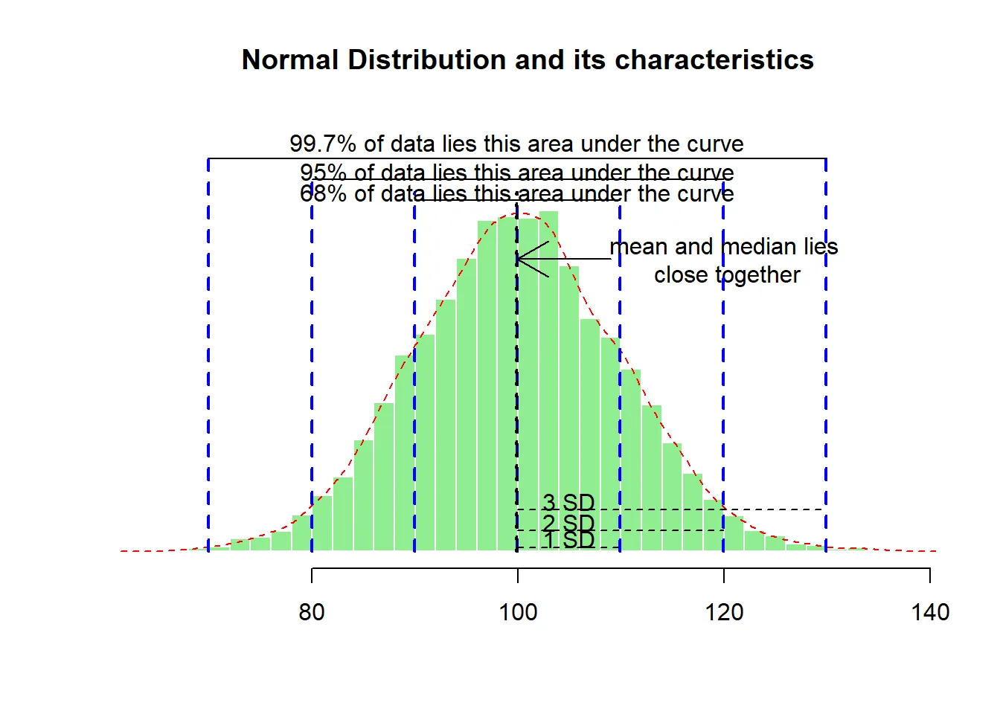

## Poisson distribution

- The probability of a certain number of events will occur over a specific period of time
- If we know the average value of any number of outcomes over a specific unit measurement such as time interval, the probability of becoming an event can be calculated at each time interval.
- Its formula is simple.

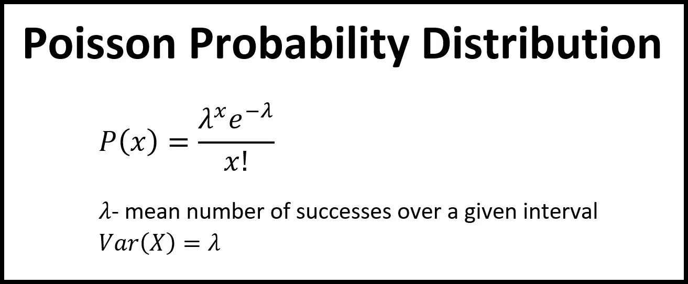

Eg- at a particular traffic junction, there are on average 3 accidents occurred in a week. What is the probability of 5 accidents in a week or 2 accidents in a week?

‘X’ is the number of accidents we want to calculate, lambda is the average number of accidents and e is the Euler number. Just plug in and calculate.

Below is the graph of the Poisson distribution.

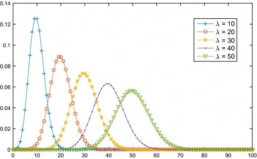

## Central limit theorem

- A very important concept in statistics
- There are 3 main facts you need to remember about the central limit theorem.
- CTL said that

1. The mean of the sample means is approximately equal to the mean of that population.
2. The standard deviation of the sample means can be obtained by the standard deviation of the population divided by the square root of the sample size and known as standard error
3. Whatever the distribution of the population, the sample distribution of the sample means will have a normal distribution.

Here I created a [web application that stimulates the central limit theorem](https://i39vi4-thiha-naung.shinyapps.io/Central-Limit-Theorem-for-developing-data-product-course/) if you want to try.

The following images are stimulated by 100000 population data with sample sizes 10, 100, and 100.

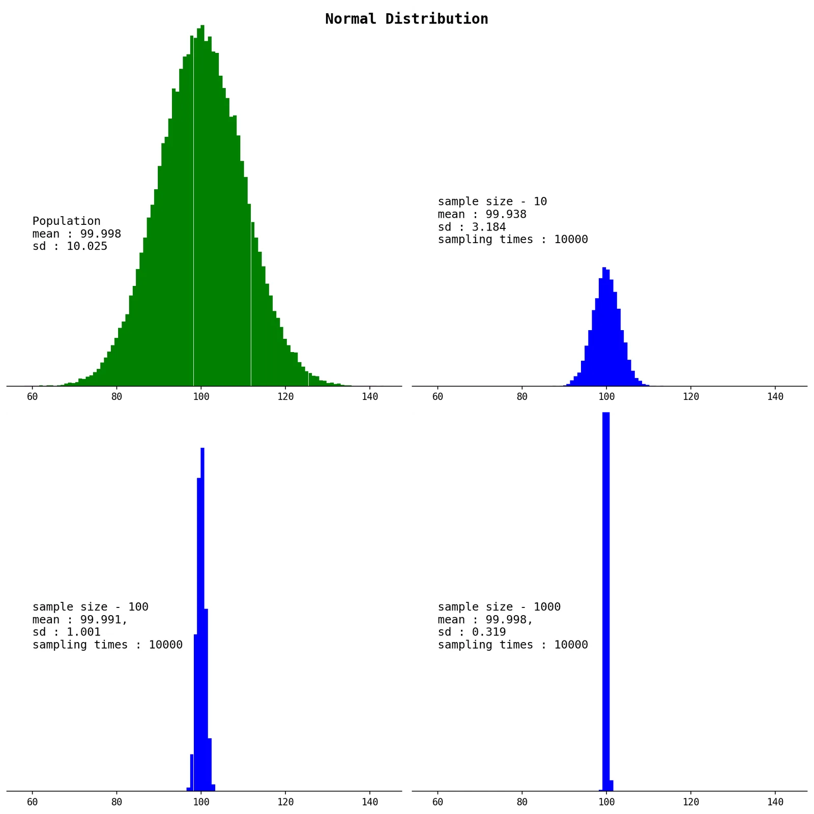

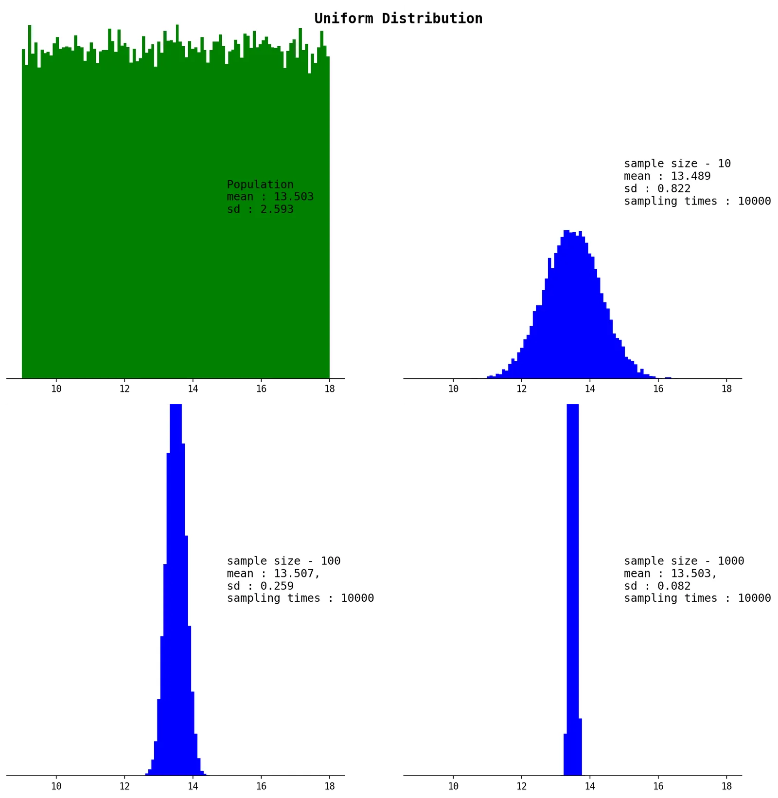

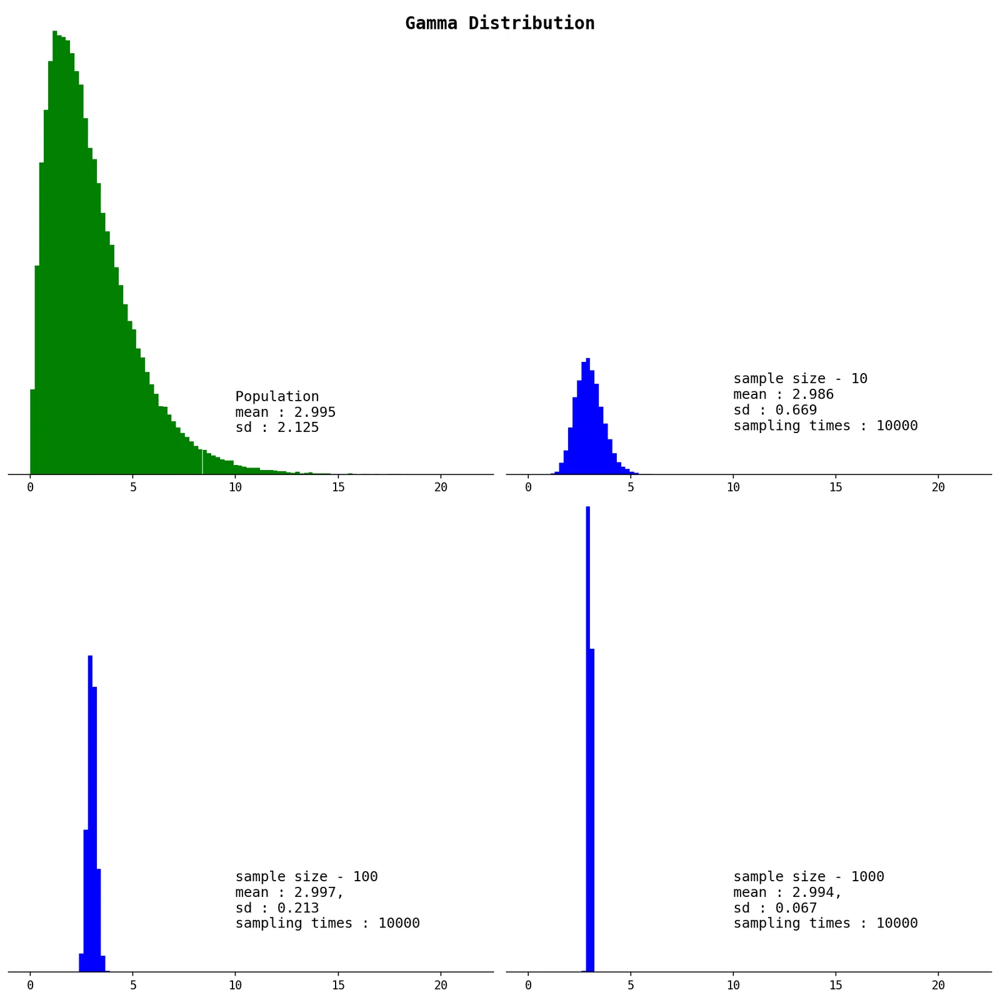

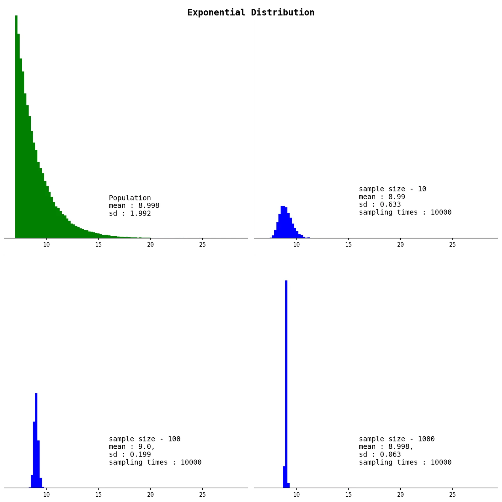

You can see that even a sample size of 10 can approximate the mean of the population. Here you can check out the [original code that creates that stimulation](https://github.com/thihanaung-thnn/mathematics/blob/main/sampling_distributions.ipynb).

## Confidence Interval

Sampling error is the difference between a population parameter and sample statistics used to estimate it. Eg - the difference between the population mean and sample mean.

A confidence interval gives a range instead of the exact value and is expressed as a percentage (confidence levels) eg- 90%, 95%, 99%

Let's recall the above 2 concepts. From the graph of the normal distribution and its characteristics, 68% of the data lies inside one standard deviation, 95% of the data lies inside two standard deviations and 99% lies in three standard deviations. The central limit theorem said whatever the distribution of the population, the sample distribution of the sample means will have a normal distribution. The standard error of the sample can be obtained by the standard deviation of the population divided by the square root of the sample size.

With these concepts, we can calculate the confidence interval.

Eg- to calculate a 95% confidence interval, first calculate the sample statistics eg- sample mean. Then calculate the standard error. If population standard deviation is not known, just use the sample standard deviation. Then, 95% of the confidence interval means 95% of data will be estimated to exist and multiply the standard error with 2 (more accurately 1.96). The result is called the margin of error. Then subtracting the sample mean by this result will get the lower bound and adding will get the upper bound of the 95% confidence interval. For 99% CI, the standard error needs to multiply by 3 and so, 99% CI will get a wider range.

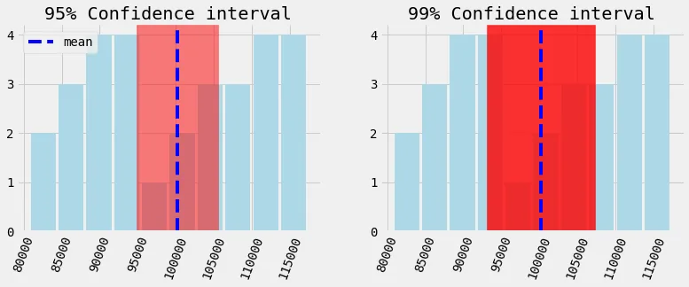

Here you can check out [the notebook](https://github.com/thihanaung-thnn/data_insight/blob/main/notebooks/CI_and_Hypothesis_testing.ipynb).

## Hypothesis Testing

Hypothesis means an idea that can be tested and it is different from a normal idea or statement.

|  |  |
| --- | --- |
| **Idea/ Statement** | **Hypothesis** |
| Asians are short | Asians are shorter than Westerners. |
| Apples are expensive. | Apples are more expensive than oranges. |
| People living in this city are rich. | Average income of a person living in that city is approximately 2000 dollars per month. |

In statistical terms, dependent variables are called **effects**, in machine learning, they are denoted as y and independent variables are called **cause**, and denoted as X.

## Different types of hypothesis tests

Simple hypothesis

- One dependent and one independent variable
- Eg- drinking alcohol cause liver failure

Complex hypothesis

- more than one dependent or independent variable
- Eg- people who do regular exercise and control their diet can live healthier and longer

Empirical hypothesis

- Known as observation and experiments
- Eg- vitamin E is better than vitamin A for treating hair growth

Statistical hypothesis

- Examination of a proportion of a population
- Eg- the calculating lifespan of endangered animals is impossible to get data from the whole population and take a sample and calculate statistics on it.

During hypothesis testing, the following terms are important.

Null hypothesis(H0)

- Accepted as true but test it to see whether it is true or not
- Everything which was believed until now that we are contesting with our test
- The concept is like that. Innocent until proven guilty and we assume innocence until we have enough evidence to prove that a suspect is guilty

Alternative hypothesis(H1)

- Opposite of H0 that is used to prove that H0 is wrong

## Level of significance and types of tests

- The probability of rejecting a null hypothesis that is true; the probability of making this error;
- Common significance levels (alpha) are 0.1, 0.05, and 0.01 (opposite of 99%, 95% and 90%)

## P-value

- The smallest level of significance at which we can still reject the null hypothesis given the observed sample statistics
- Often 0.05 is used as a cut-off line.
- Important facts to remember is

  - If our p-value is higher than 0.05, we fail to reject the null hypothesis.
  - If the p-value is lower than 0.05, we can reject the null hypothesis. It cannot be definitely said that we can accept the alternative hypothesis.

All above are just notes. I will stop here as it becomes a long post.
