In this blog post we will discuss some common concepts and techniques frequently used by a data scientist which are as follows:

- Population and Sample
- Measure of Central Tendency
- Measure of Central Dispersion
- Covariance and Correlation
- Normal Distribution
- Central Limit Theorem
- Quantile Quantile plot

Initially we import all the required libraries as follow:

```python
import numpy as np
from statistics import mode
from scipy.stats import norm
import scipy
import random
```

### Population and Sample

A population is the entire group that you want to draw conclusions about. While a sample is a unbiased subset of the population that best represents the whole data.

Sampling is done as it is rarely possible to collect data from the population.

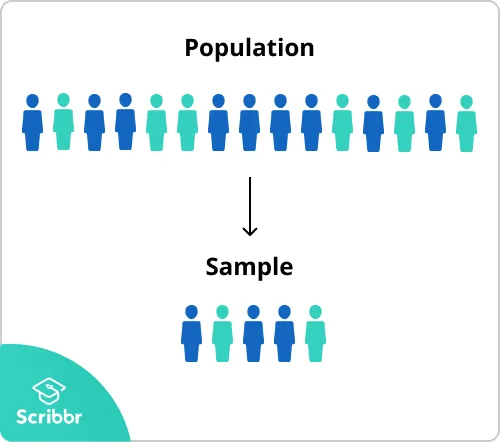

We generate a population as folows and sample with and without replacement.

```python
population=np.arange(0,100,2)
print(population)
#Output
[ 0  2  4  6  8 10 12 14 16 18 20 22 24 26 28 30 32 34 36 38 40 42 44 46 48 50 52 54 56 58 60 62 64 66 68 70 72 74 76 78 80 82 84 86 88 90 92 94 96 98]
```

```python
#sampling randomly with replacement
sample=np.random.choice(population,10)
print(sample)
#Output
[34 52 24 34 56 70 32 16 32 12]
```

```python
#sampling randomly without replacement
sample=np.random.choice(population,10,replace=False)
#Output
[44 28 70 48 74 68 82 66 54 38]
```

Here we can observe that when sampling is done with replacement samples are repeated.

### Measure of Central Tendency

A measure of central tendency is a single value that attempts to describe a set of data by identifying the central position within that set of data. Some popular measures of central tendency are mean median and mode

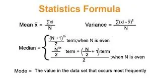

```python
population=[1,2,2,2,5,6]
mean=np.mean(population)
median=np.median(population)
mode=mode(population)
print(mean,median,mode)
#Output
3.0 2.0 2
```

### Measure of Dispersion

Measure Of Central Tendency is alone inadequate to describe the data.

The measures of dispersion help to interpret the variability of data. Most commonly used measure of Dispersions are Standard Deviation, Range and IQR.

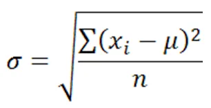

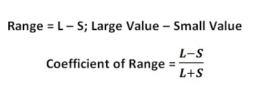

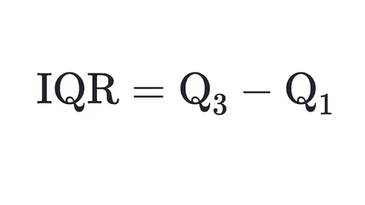

We use numpy based functions (std and percentile) to calculate standard deviation and inter quantile range. As for range function was defined to calculate the maximum and minimum value and finally the range itself

```python
standard_deviation=np.std(population)
print(standard_deviation)
#Output
1.8257418583505538
```

```python
q1 ,q3= np.percentile(population, [25,75])
iqr = q3 - q1
print(iqr)
#Output
2.25
```

```python
def find_range(value_list):
maximum=max(value_list)
minimum=min(value_list)
rangee=maximum-minimum
return rangee
print(find_range(population))
#Output
5
```

### Covariance and Correlation

Covariance is a measure of the relationship between two random variables. It measures to what extend the variables change together.

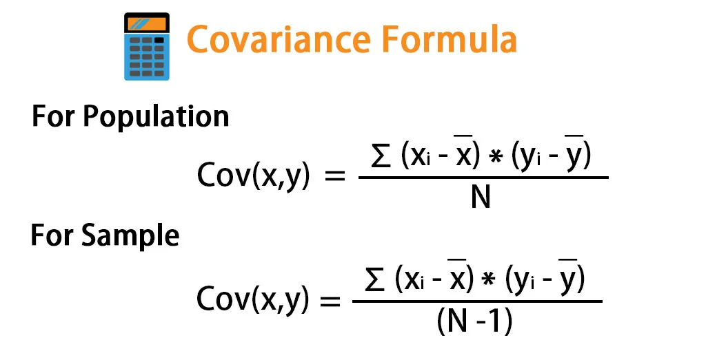

Positive covariance indicates that two variables tend to move in the same direction while negative covariance indicates they move in different direction.

A major drawback of covariance is that it is scale variant so to overcome this Karl Pearson's coefficient is introduced. We make it scale invariant by dividing the covariance by the standard deviation

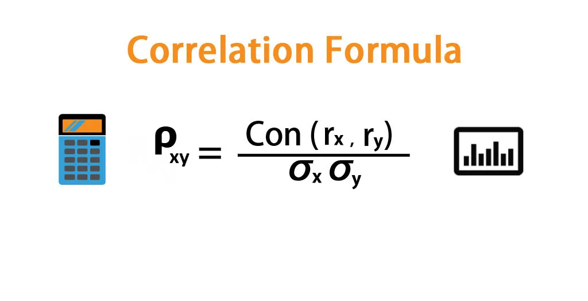

The code snippet to calculate the correlation and covariance between to variables are as follow:

```python
def find_cov_corr(x,y):
   mean_x = sum(x) / len(x)
   cov_sum=0
   mean_x = sum(x) / len(x)
   mean_y = sum(y) / len(y)
   for i in range(0,len(x)):
     cov_sum +=(x[i]-mean_x) * (y[i]-mean_y)
   covariance=cov_sum/len(x)
   correl=covariance/(np.std(x)*np.std(y))
   print('correlation is',correl)
   print('covariance is',covariance)
x_coordinates = [1, 2, 3, 4, 5]
y_coordinates = [2, 2, 3, 4, 5]
find_cov_corr(x_coordinates,y_coordinates)
#Output
correlation is 0.9701
covariance is 1.6
```

### Normal Distribution

It is also known as the Gaussian distribution and is a continuous probability distribution that is symmetric about the mean. Graphically its of bell shape. It is the most common type of distribution. It is characterized using two parameters the mean and the standard deviation.

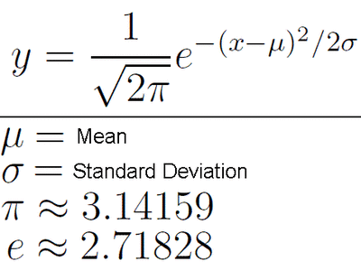

We create a sample of length 1000 which follows normal distribution (mean= 40 standard deviation= 15 )using numpy as follow:

```python
 mu, sigma = 40,15
 s = np.random.normal(mu, sigma, 1000)
 plt.hist(s)
 plt.show()
```

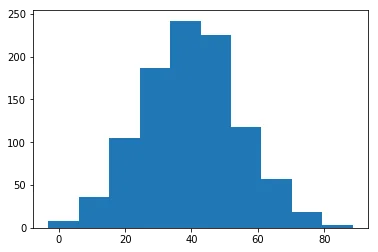

Let the above be the weight distribution of people of a town with mean=40 and standard deviation= 15 . We can answer analytical questions such as

probability of a person in the town whose weight is less than 30 using the cdf function.

```python
# Probability of person being < 30 kgs
prob_less_30 = norm.cdf(30,mu,sigma)
print(prob_less_30)
#Output
0.0477903522728147
```

Probability of a person being greater than 50 kgs

```python
#Probability of person being > 50 kg
prob_over_50 =1-norm.cdf(50,mu, sigma)
print(prob_over_1000)
#Output
0.8413447460685429
```

Probability of the person being between 20 to 40 kgs

```python
 #Probability of person being between 20 to 40
 prob_20_to_40 = norm.cdf(40,mu, sigma)-norm.cdf(20,mu,
 sigma)
 print(prob_20_to_40)
 #Output
 0.14883992530281173
```

### Central Limit Theorem

The central limit theorem (CLT) states that the distribution of sample means approximates a normal distribution as the sample size gets larger, regardless of the population's distribution.

Here let us generate a random uniform distribution as follow:

```python
import matplotlib.pyplot as plt
numpy.random.seed(1)
data=np.random.rand(1000)
plt.hist(data)
plt.show()
```

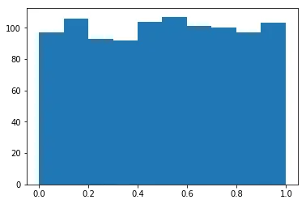

Now as per CLT we calculate sample mean with various sample size and as the size increases we can observe the mean's distribution follows normal like distribution

```python
 import random
 sample_size = [10, 50, 100,200,400,600]
 means=[]
 for i in range(0,len(sample_size)):
    dyy=[]
        for j in range(0,sample_size[i])
           temp=random.choices(data, k=150)
           dyy.append(np.mean(temp))
    means.append(dyy)
```

```python
#plotting the histogram graph's
ncols = 3
nrows =2
fig, axes = plt.subplots(nrows=nrows, ncols=ncols, figsize=(20, 10))
k=0
for i in range(nrows):
    for j in range(ncols):
      ax = axes[i][j]
      ax.hist(means[k])
      ax.set_title(label = 'Number of samples='
      +str(sample_size[k]))
      k=k+1
      plt.show()
```

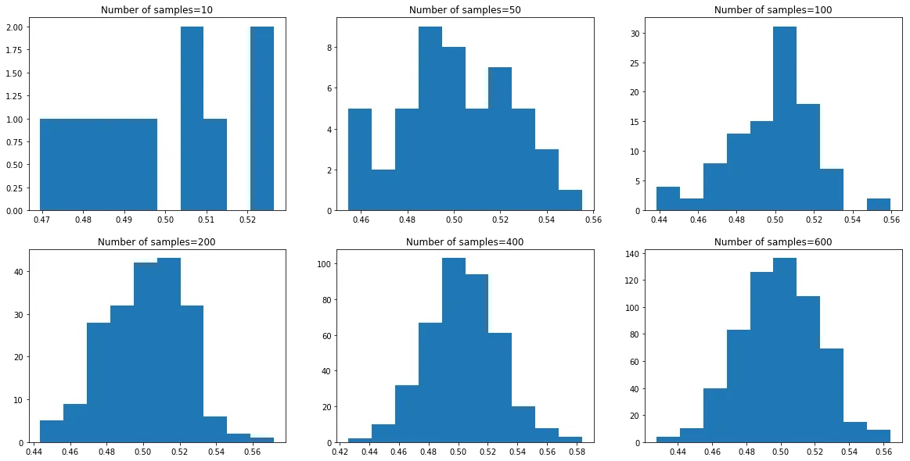

### Q-Q plot

The quantile-quantile (q-q) plot is a graphical technique for determining if two data sets come from populations with a common distribution.

A q-q plot is a plot of the quantiles of the first data set against the quantiles of the second data set

If the scatter plot drawn from the quantiles of datasets follows a 45 degree straight line we conclude that they have same distribution else they dont.

Firstly we create a uniformly distributed data set and draw a q-q plot with a normally distributed list as follow

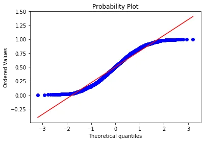

Then we create a normally distributed data set and draw a q-q plot with a normally distributed list as follow

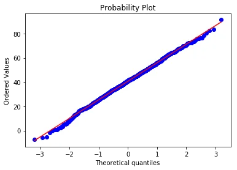

We can verify q-q plot does work as mentioned above.

### Conclusion

Hence we discussed about some popular statistical concepts essential for data science. The code snippet is as [follows](https://github.com/rubash9849/data_inisghts/blob/main/Stats.ipynb)
