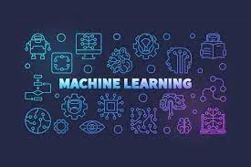
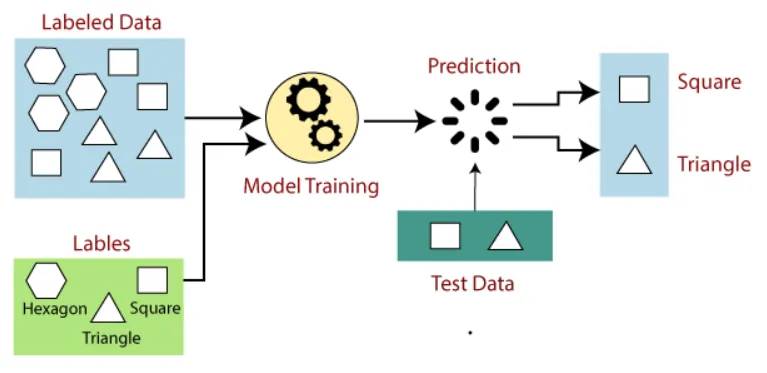
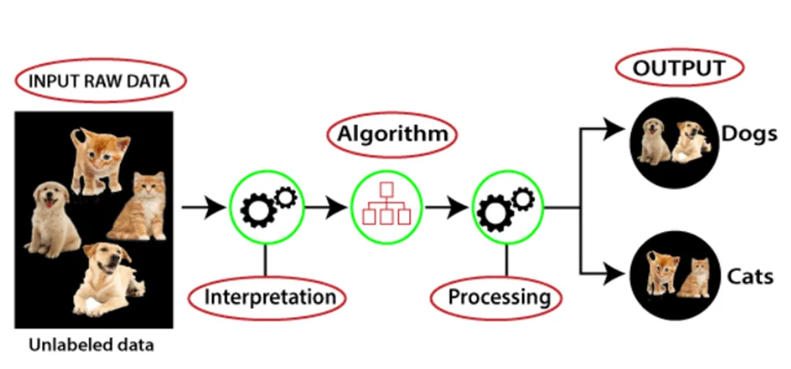

### Machine learning
Machine learning is a branch of artificial intelligence based on the idea that systems can learn from data, identify patterns and make decisions with minimal human intervention. There are four types of machine learning techniques.

1. Supervised learning,

2. Unsupervised learning

3. Semi-supervised learning

4. Reinforcement learning.

The type of algorithm data scientists choose to use depends on what type of data they want to predict. But for this time, we are going to discuss supervised learning and unsupervised learning.

Supervised machine learning

Supervised learning is the type of machine learning in which machines are trained using well "labeled" training data, and on basis of that data, machines predict the output. The labeled data means some input data is already tagged with the correct output. The training data provided to the machines work as the supervisor that teaches the machines to predict the output correctly. It applies the same concept as a student learns under the supervision of the teacher.
The image below shows the process of the supervised machine learning technique.

Suppose we have a dataset of different types of shapes which includes square, rectangle, triangle, and Polygon. Now the first step is that we need to train the model for each shape.
If the given shape has four sides, and all the sides are equal, then it will be labeled as a Square.
If the given shape has three sides, then it will be labeled as a triangle.
If the given shape has six equal sides then it will be labeled as a hexagon.
After training, we test our model using the test set, and the task of the model is to identify the shape.
As the machine is already trained on all types of shapes, and when it finds a new shape, it classifies the shape on the basis of a number of sides and predicts the output.

Supervised machine learning is further classified into two categories.
1. Regression
Regression algorithms are used if there is a relationship between the input variable and the output variable. It is used for the prediction of continuous variables, such as Weather forecasting, Market Trends, etc.

2. Classification

Classification algorithms are used when the output variable is categorical, which means there are different classes such as Yes-No, Male-Female, True-false, etc. There are different algorithms that are used to solve classification problems like Random Forest, Decision Trees, Logistic Regression, Support Vector Machines.

Unsupervised Machine Learning

Unsupervised machine learning is a machine learning technique where models are trained using an unlabeled dataset and are allowed to act on that data without any supervision. Unsupervised learning is to find the underlying structure of the dataset, group that data according to similarities, and represent that dataset in a compressed format. Unsupervised learning is helpful for finding useful insights from the data.

Unsupervised learning works on unlabeled and uncategorized data which is much similar as a human learns to think by their own experiences.

Here, we have taken unlabeled input data like images of dogs and cats, which means it is not categorized and corresponding outputs are also not given. Now, this unlabeled input data is fed to the machine learning model in order to train it. Firstly, it will interpret the raw data to find the hidden patterns from the data and then will apply suitable algorithms such as k-means clustering, Decision tree, etc. Once it applies the suitable algorithm, the algorithm divides the data objects into groups according to the similarities and differences between the objects.

Unsupervised machine learning technique is classified into two categories.

1. Clustering

Clustering is a method of grouping the objects into clusters such that objects with the most similarities remain in a group and have fewer or no similarities with the objects of another group. Cluster analysis finds the commonalities between the data objects and categorizes them as per the presence and absence of those commonalities.

2. Association

An association rule is an unsupervised learning method that is used for finding the relationships between variables in a large database. It determines the set of items that occurs together in the dataset. Association rule makes marketing strategy more effective. Such as people who buy X items (suppose a bread) are also tend to purchase Y (Butter/Jam) items. A typical example of the Association rule is Market Basket Analysis.

Below is the list of some popular unsupervised learning algorithms:

- K-means clustering
- KNN (k-nearest neighbors)
- Hierarchal clustering
- Anomaly detection
- Neural Networks
- Principle Component Analysis
