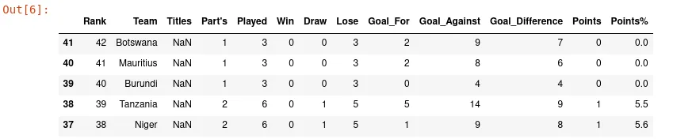
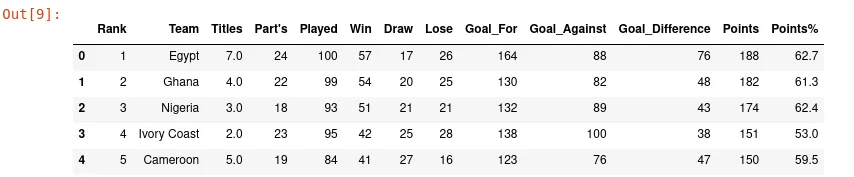
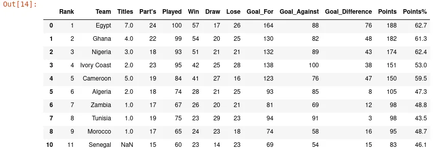
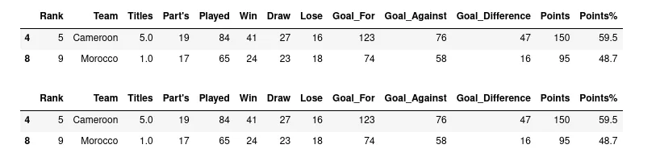
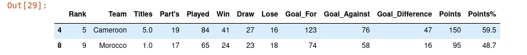
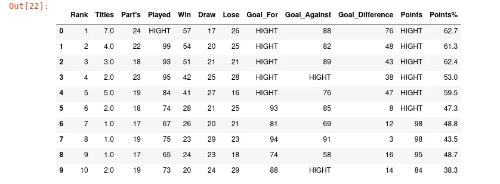
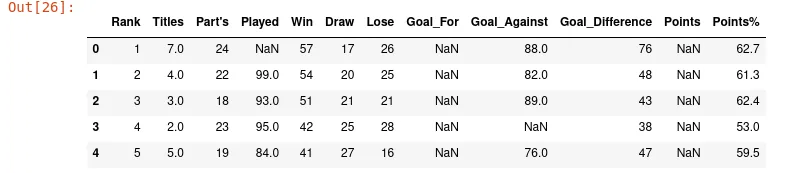
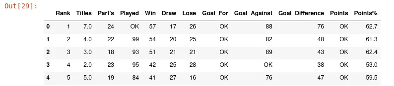

Pandas is a famous library with a ton of methods. The methods we cover in this article are not often used by data scientists but can be very useful in certain situations. You must add these methods into your pandas skills to definitely become a pandas ninja.

In this article, we'll work with [Africa Cup of Nations](https://www.kaggle.com/mohammedessam97/africa-cup-of-nations) dataset upload on Kaggle by [Mohammad Essam](https://www.kaggle.com/mohammedessam97), especially with **Participated Teams General Statistics** dataset**.**

```python
import pandas as pd
df_teams_statistics = pd.read_csv('Participated Teams General Statistics.csv')
```

Throughout this article with this dataset, we'll explore **nlargest()**, **nsmallest()**, **query()** and **where()** methods.

## 1. DataFrame.nlargest() and DataFrame.nsmallest()

DataFrame.nlargest() is a pandas method that ordered DataFrame in descending order and takes the first n rows. The signature of this method is:

```python
DataFrame.nlargest(n, columns, keep='first')
```

where

- **columns** is a list of columns to use to sort DataFrame in descending order
- **keep** indicate the occurrences of duplicate rows to conserve. This parameter takes value in the set **first, last, all**
- **n** indicate the number of rows to take after sorting the DataFrame.

```python
df_teams_statistics.nlargest(5, columns='Rank')
```



The image shows us clearly that **nlargest()** method sort DataFrame in descending order and take the first five elements. You can add **keep** parameter to tell nlargest() method how to do in front of duplicate rows. The default value for **keep** is **first.**

To sort our DataFrame in ascending order and get the first n rows, pandas provide another method to do that: **DataFrame.nsmallest().**  The signature of this method is:

```python
DataFrame.nsmallest(n, columns, keep='first')
```

This method takes the same parameter as nlargest() but works in an inverse way.

```python
df_teams_statistics.nsmallest(5, columns='Rank')
```



The result DataFrame in this case is ordered in ascending order based on columns we specify.

In this section, we talk about **nlargest and nsmallest** which are pretty useful and easy when working with pandas. In the next section, we'll talk about **DataFrame.query().**

## 2. DataFrame.query

This method is a pandas shortcut for filtering DataFrame. It allows us to query DataFrame columns with a boolean expression. The signature of this method is:

```python
DataFrame.query(expr, inplace=False, **kwargs)
```

where

- **expr** is a string to evaluate
- **inplace**  indicate if we'll work on a copy of DataFrame or not

```python
df_teams_statistics.query("Win > 20")
```



The previous line of code return all entries where the number of matches played is greater than 20. We can combine multiple conditions in the same expression.

```python
display(df_teams_statistics.query("Win > 20 & Lose < 20"))
display(df_teams_statistics.query("Win > 20 and Lose < 20"))
```



We have various boolean operator to use to combine different condition in our expression.

- **and** with equivalent **&**
- **or** with his equivalent **|**
- **not** with his equivalent ~

We can find all African countries which have never win a African Cup of Nation like this:

```python
display(df_teams_statistics.query('~(Titles >= 1)'))
display(df_teams_statistics.query('not(Titles >= 1)'))
```

where

- **Titles > 1** return all African countries which have at least win one African Cup of Nations
- **~(Titles > 1)** or **not(Titles > 1)** return the inverse of the previous result.

To query all African countries with a number of W**in** greater than 20 and the number of lost less than 20, we write this condition:

```python
df_teams_statistics.query("Win > 20 and Lose < 20")
```



One can combine conditions as he wants to archive a goal. In this section, we give an overview of the query method. Check [pandas documentation](https://pandas.pydata.org/docs/reference/api/pandas.DataFrame.query.html) for further explanation.

## 3. DataFrame.where
DataFrame.where() is another method offered by pandas that are not regularly used but can be useful in certain cases. This method replaces values for which our condition is evaluated to **False.** In other words, it replaces all values that do not satisfy one or more criteria by the one we give or with NaN by default. The signature of this method is :

```python
DataFrame.where(cond, other=nan, inplace=False, axis=None, level=None, errors='raise', try_cast=NoDefault.no_default)
```

where

- **cond**  is the condition to be satisfy by each entries. This condition can a boolean Series/DataFrame, array-like, or callable
- **other** specify the value to give to each cell where the evaluation of condition is **False**

To know more about other parameters , check [documentation](https://pandas.pydata.org/docs/reference/api/pandas.DataFrame.where.html).

For the following example, we will drop column **Team** to only have a DataFrame with numerical values.

```python
df_teams_statistics.drop(columns='Team', inplace=True)
```

Now, we can make some example with **DataFrame.where()**  method.

```python
df_teams_statistics.where(df_teams_statistics < 100,'HIGHT').head(10)
```



In this example, we replace all entries in DataFrame with a value greater than **100**  with the string **HIGHT.** As we say, DataFrame.where() fill all entries evaluate to **False** with the value **HIGHT** we provide.

If we don't set **other** parameter**,**  the **False** entries will be replaced by **NaN.**

```python
df_teams_statistics.where(df_teams_statistics < 100).head()
```



We can achieve the same as previous using a callback function in the first parameter of where method.

```python
df_teams_statistics.where(lambda x: x< 100, "OK").head()
```



## Conclusion
With this blog post, we give an overview of how nlargest(), nsmallest(), query and where methods work. For more examples, you can check pandas documentation for each method. The source code used for this article is downloading [here](https://github.com/tderick/datainsightonelineprogram/tree/main/pandas%20technique%20for%20datascience%20blog%204). This article is written in part of the data insight online program.

**Other links:** This article is one of the series of articles on pandas techniques for data manipulation. The following link opens directly the the other ones.

1.[Usage of apply function, plotting and iteration with Pandas](https://www.datainsightonline.com/post/usage-of-apply-function-plotting-and-iteration-with-pandas)

2.[Working with Missing Data in Pandas](https://www.datainsightonline.com/post/working-with-missing-data-in-pandas-dataframe)

3. [Working with duplicated data in Pandas DataFrame](https://www.datainsightonline.com/post/working-with-duplicated-data-in-pandas-dataframe)
