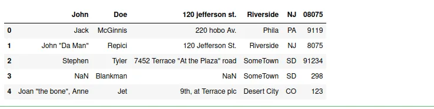
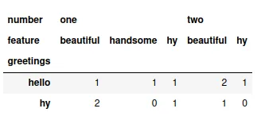
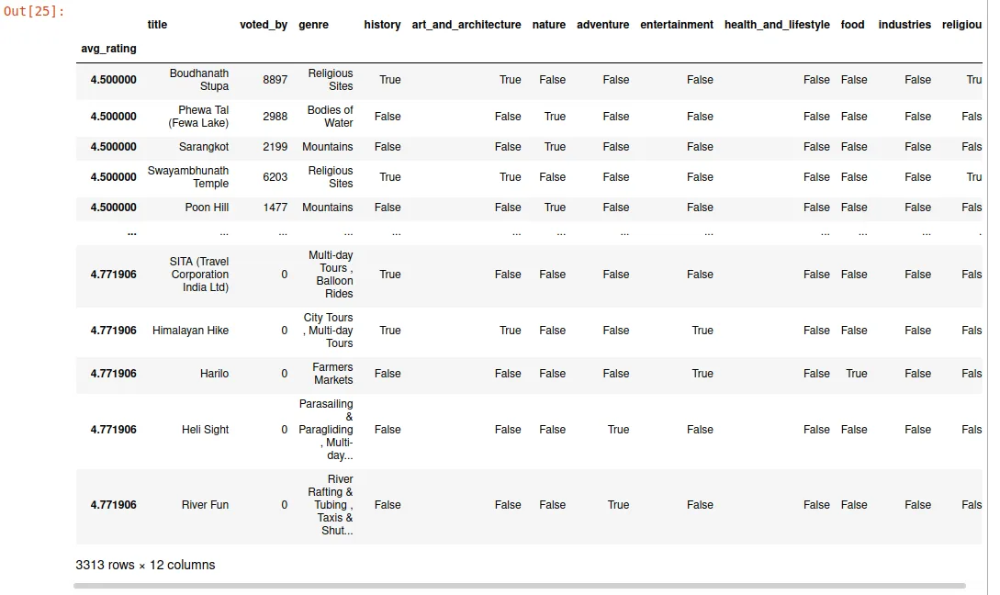
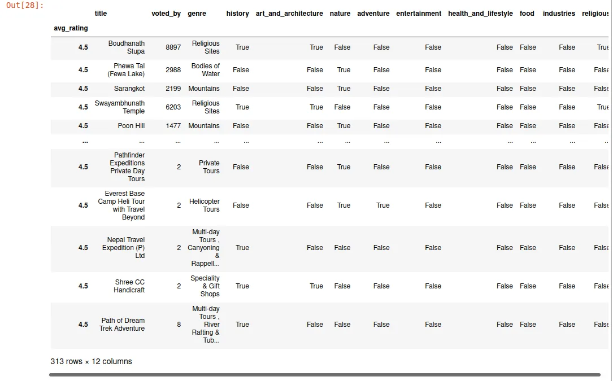

Data is everywhere and not in proper order. Many insights can be taken by proper analysing of data. Here we read some 5 techniques of pandas library.

1. Reading CSV files
2. Crosstab
3. Subsetting with .loc
4. Cleaning empty data

1. **Reading CSV fies**: To play with the data, we need to import data from many format files, one of the prevalent is csv file. Also some data in the dataframe can be seen by dt.head() command shown as below.

```python
import pandas as pd
data = pd.read_csv('https://people.sc.fsu.edu/~jburkardt/data/csv/addresses.csv')
data.head()
```



**2. Crosstab:** This tool helps to summarize the large datasets by making a crosstab table with row as identifier and the frequency of occurrence of any thing in the columns.

```python
#importing packages
import pandas as pd
import numpy

# creating some arrays
a = numpy.array(["hello", "hello", "hello", "hello",
                 "hy", "hy", "hy", "hy",
                 "hello", "hello"],
                dtype=object)

b = numpy.array(["one", "one", "one", "two",
                 "one", "one", "one", "two",
                 "two", "two"],
                dtype=object)

c = numpy.array(["handsome","beautiful",
                 "hy", "hy", "beautiful",
                 "beautiful", "hy", "beautiful",
                 "beautiful", "beautiful"],
                dtype=object)

# form the cross tab
pd.crosstab(a, [b, c], rownames=['greetings'], colnames=['number', 'feature'])
```



Here, 'hello', 'one' and 'beautiful' simulataneously occur only one time in same index. Similarly, other values are interpreted.

3. **Subsetting with .loc**: It accepts index values. When a single argument is passed, it will take a subset of rows.

```python
sample = pd.read_csv('sample.csv',index_col='avg_rating')
sample.head()
```



```python
here = sample.loc[4.5]
here
```



**4. Cleaning empty cells:** While extracting data, many cells are empty. This may hamper our result. So we should avoid those cells or fill with some value.
