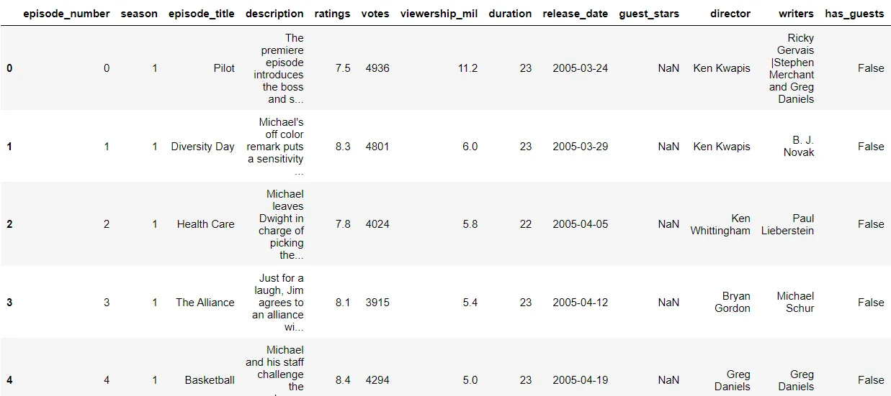
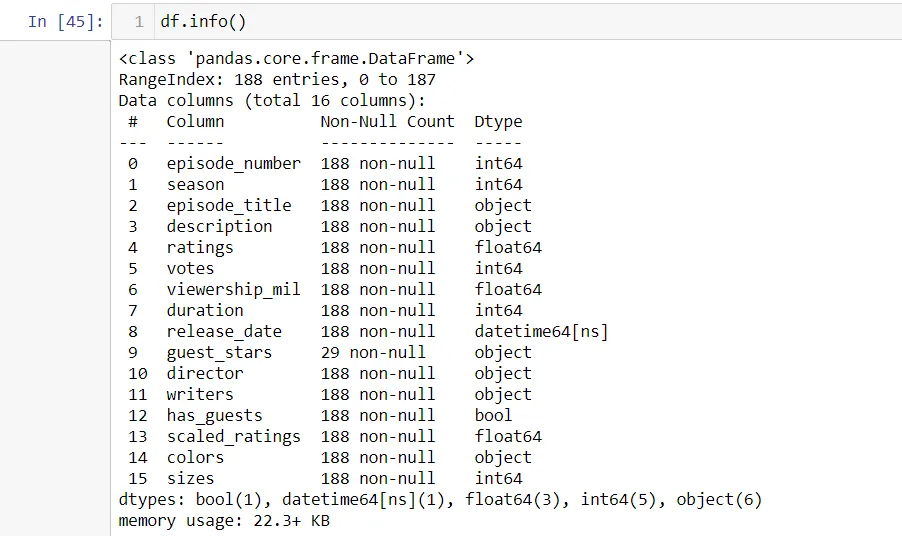
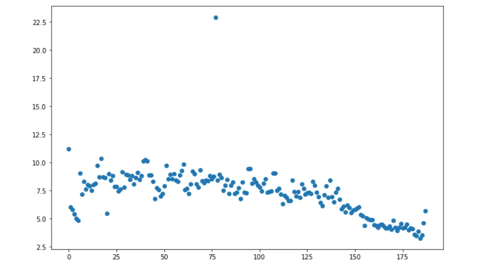
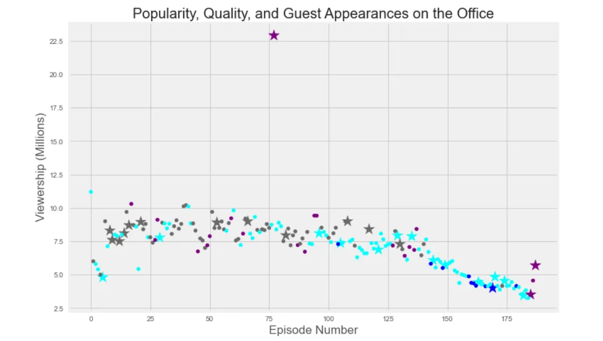

A small introduction is due, As the title depicts it's a beginner's analysis and it's part of Data Insight's [Data Scientist Program](https://www.datainsightonline.com/data-scientist-program) hosted on the [Datacamp](https://www.datacamp.com/) website, This is an unguided project so you're almost free to do what you want with your project as it provides a less structured experience compared to the guided ones but here I went ahead and did as the code-along video outlined, We will be using two of the most popular Python libraries: **Pandas** which is an incredible library for working with tabular data and **Matplotlib** to do our visualizations.

**The Office!** What started as a British mockumentary series about office culture in 2001 has since spawned ten other variants across the world, including an Israeli version (2010-13), a Hindi version (2019-), and even a French Canadian variant (2006-2007). Of all these iterations (including the original), the American series has been the longest-running, spanning 201 episodes over nine seasons.

In this notebook, we will take a look at a dataset of The Office episodes, and try to understand how the popularity and quality of the series varied over time. To do so, we will use the following dataset: datasets/office_episodes.csv, which was downloaded from Kaggle [here](https://www.kaggle.com/nehaprabhavalkar/the-office-dataset).

This dataset contains information on a variety of characteristics of each episode.

The purpose of the project is that we want to see how guest stars affected the views of the show through out the episodes and produce a visual that represents that.

First, We are going to import the libraries that we are going to be working with, then we'll read our CSV dataset using pandas' powerful read_csv function then we'll show the first 5 rows of the data.

```python
import matplotlib.pyplot as plt
import pandas as pd
df = pd.read_csv("datasets/office_episodes.csv")
df.head()
```



After inspecting the data frame using:

```python
df.info()
df.columns
df.shape
```

we find out that it has these 188 rows and 16 columns.

Here's a description of each column:

Each column's data type:



So we start with a simple visualization just to check how things are going and to see how the views and each episode relate:

```python
plt.rcParams['figure.figsize'] = [11, 7]
fig = plt.figure()
plt.scatter(x=df.episode_number, y=df.viewership_mil)
plt.show()
```



So we can see over time the first few episodes didn't have the highest viewership but the show did pick up popularity through the seasons and then in later seasons declined but how about we make this plot a little lively and give it some colors.

We started by looping over the scaled_ratings column and filter its values into a list of colors like this:

```python
cols = []
for i, row in df.iterrows():
    if row['scaled_ratings'] < 0.25:
        cols.append("blue")
    elif row['scaled_ratings'] < 0.5:
        cols.append("cyan")
    elif row['scaled_ratings'] < 0.75:
        cols.append("dimgray")
    else:
        cols.append("purple")
```

We have ratings that are less 0.25 in a blue color.

Ratings that are between 0.25 and 0.5 in a cyan color.

Ratings that are between 0.5 and 0.75 in a gray color.

And the everything else that doesn't fit our filters in a purple color.

The list should look something like this: ['purple', 'dimgray', 'cyan', 'cyan', 'purple', 'blue']

Then just to make things more interesting we can change the markers for each episode that had a guest star in them just like we did with the ratings but this time with the has_guest column:

```python
sizes=[]
for i, row in df.iterrows():
    if row["has_guests"] == False:
        sizes.append(25)
    else:
        sizes.append(250)
```

Basically what we are doing is filtering the episodes that had guest stars in them and making their size appear bigger on the graph later comes changing the marker part when we are ready to show our plot.

Now it's time to incorporate the sizes and colors lists into our visualization.

We do that by making two columns called colors and sizes.

```python
df["colors"] = cols
df["sizes"] = sizes

no_guests = df[df["has_guests"] == False]
with_guests = df[df["has_guests"] == True]
```

So that when we split by guest star appearances we would still have all our size and colors information available for when we generate our plot, then we split our guest and non-guest episodes into two data frames by filtering the has_guest column.

Now we are ready for our plot which we will resize it and style it a bit using "fivethirtyeight" style.

Then we'll give our plot a title and label our x and y axis and we're all set.

```python
plt.rcParams['figure.figsize'] = [11, 7]
fig = plt.figure()
plt.style.use("fivethirtyeight")

_ = plt.scatter(x=with_guests.episode_number,
                y=with_guests.viewership_mil,
                c=with_guests.colors,
                s=with_guests.sizes,
                marker='*'
               )
_ = plt.scatter(x=no_guests.episode_number,
                y=no_guests.viewership_mil,
                c=no_guests.colors,
                s=no_guests.sizes
                )
_ = plt.xlabel("Episode Number")
_ = plt.ylabel("Viewership (Millions)")
_ = plt.title("Popularity, Quality, and Guest Appearances on the Office")

plt.show()
```



## In Conclusion

What we did with this project is:

- We read in a csv file as a DataFrame.
- Inspected the resulting DataFrame.
- Used a combination of lists and for loops to generate a series of colors and sizes for our final plot.
- Used customization like plot titles, labels, styles and markers.

Here's a link to my github if you wanted to check the full notebook [here](https://github.com/Magdiyy/Data-Insight-Scholarship/blob/main/Investigating%20Guest%20Stars%20in%20The%20Office.ipynb).
