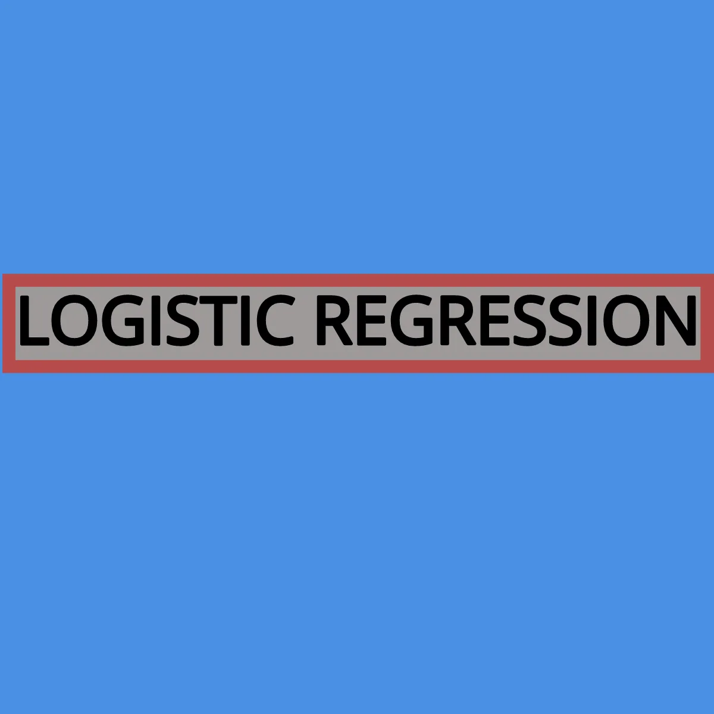
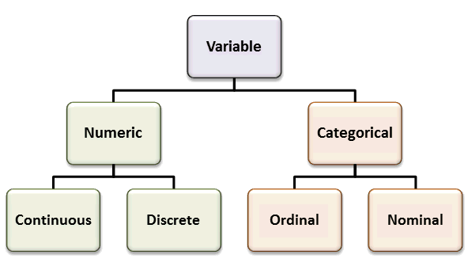
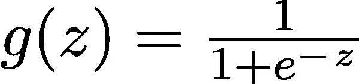
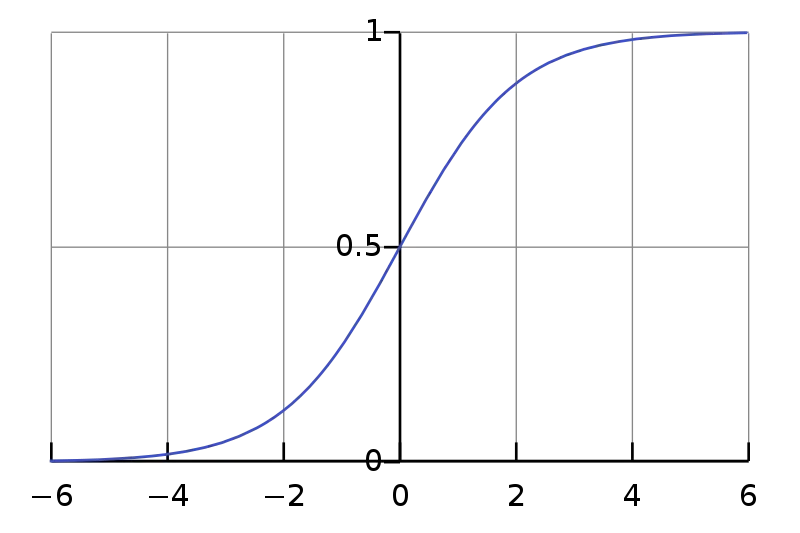
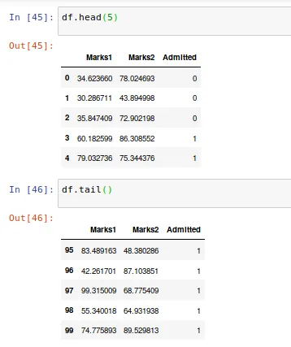
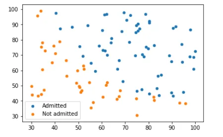
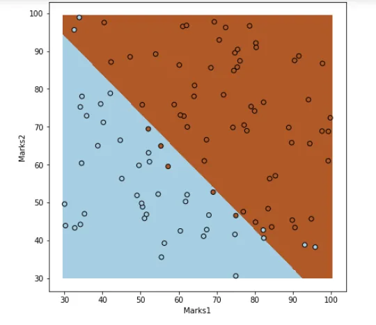

**Logistic Regression** is a machine learning classification algorithm that is used to predict the probability of a categorical dependent variable. So what is categorical dependent variable? Let's see the table below.

*Heirarchy of Variable*

**Categorical dependent variables** are ordinal and nominal variables. **Ordinal variables** have inherent ordering. For example, how satisfied are you with your new teacher? The answer can be in form: Very Likely, Likely, Moderately, Less Likely, and Unlikely. In contrary, nominal variables are categorical variables with values which have no ordering, such as gender or occupation. So, when we are predicting these types of categorical variables with binary outcomes, we need **Logistic Regression**.

Logistic Regression model, in its fundamental form, uses logistic function to model a dependent variable. In other words, the function is called **sigmoid** function.

*Sigmoid Function*

As we can see that the value of y ranges from 0 to 1 (binary values). The value of y is 0.5 at x=0. We can use 0.5 as the probability threshold to determine the classes.

There are some assumptions held by Logistic Regression. These include:

- The dependent variable must be categorical.
- The independent features/ variables must be independent as to avoid *multicollinearity*.

Okay, so we got some basic idea about what is Logistic regression and what it does.

Now, let's head to building a classifier model in Python using Logistic Regression.

**DATASET**

The dataset that I will be using consists of marks of two exams for 100 applicants. The first two columns contain the marks of two exams of 100 applicants. Similarly, the third column contains the binary value : 1 which means the applicant was admitted to the university whereas 0 means the applicant didn't get the admission. Hence, our main purpose is to build a classifier that can predict whether an application will be admitted to the university or not.

**IMPORTING THE REQUIRED LIBRARIES**

*import pandas as pd*

*import numpy as np*

*import matplotlib.pyplot as plt*

*from sklearn.linear_model import Logistic Regression*

*from sklearn.metrics import accuracy_score*

## WORKING PART
df = pd.read_csv('marks.csv')

Let's load the head and tail of dataframe.

Let's see the scatterplot of the Marks1 and Marks2 based on Admitted.

*X=df. iloc[:,:-1] # Values of Marks1 and Marks2*

*Y=df.iloc[:,2] # Values of Admitted*

Now, we segregate the ones who got admitted and who didn't for comparison.

*admitted= df.loc[Y==1]*

*not_admitted=df.loc[Y==0]*

Remember that **loc** gets rows (or columns) with particular labels from the index, and **iloc** gets row (or columns) at particular positions in the index( so it only takes integers).

Now, let's plot the information.

*plt.scatter(admitted.iloc[:,0],admitted.iloc[:,1],label='Admitted')*

*plt.scatter(not_admitted.iloc[:,0],not_admitted.iloc[:,1],label='Admitted']*

*plt.legend()*

Hmm. Seems interesting. Up till this point, I guess we have clear understanding of data and the problem. Now, let's go ahead to build the classifier model.

**INSTANTIATING AND FITTING THE MODEL**

*logreg=LogisticRegression(C=1e5,solver='lbfgs',multi_class='multinomial')*

*logreg. fit(X,Y)*

Let's understand the parameters of LogisticRegression.

**C:** inverse of regularisation strength. Regularisation is the process of adding information in order to solve an ill-posed problem or to avoid overfitting. It must be a number. 1e5= 10 power 5.

**solver:** It is the algorithm to be used in the optimization problem. 'lbfgs' is used when handling multinomial loss of multiclass problems.

**multi_class:** creating an instance of Logistic Regression. For ‘multinomial’ the loss minimised is the multinomial loss fit across the entire probability distribution, even when the data is binary.

After instantiating Logistic Regression, we fit it.

## CREATING A DECISION CLASSIFIER PLOT
*x_min,x_max= X.iloc[:,0].min() -0.5, X.iloc[:,0].max()+0.5* [#Finding](https://www.datainsightonline.com/blog/hashtags/Finding) the min and max value from the first variable. Generally +- 0.5 is done since it is good to assume that we can have confidence level in that range.

*y_min,y_max=X.iloc[:,1].min() -0.5, X.iloc[:,1].max() + 0.5*

*h=0.02 [#step](https://www.datainsightonline.com/blog/hashtags/step) size in the mesh*

*xx,yy=np.meshgrid(np.arange(x_min,x_max,h),np.arange(y_min,y_max,h))*

*Z=logreg.predict(np.c_[xx.ravel(),yy.ravel()]) [#np](https://www.datainsightonline.com/blog/hashtags/np).ravel(X) brings shape of X to (n,1)*

*Z=Z.reshape(xx.shape) [#reshaping](https://www.datainsightonline.com/blog/hashtags/reshaping) Z with the shape of xx*

#**Plotting**

*plt.figure(1,figsize=(7,7))*

*plt.pcolormesh(xx,yy,Z,cmap=plt.cm.Paired) [#Putting](https://www.datainsightonline.com/blog/hashtags/Putting) the colour into the result plot*

*plt.scatter(admitted.iloc[:, 0], admitted.iloc[:, 1], s=10, label='Admitted')*

*plt.scatter(not_admitted.iloc[:, 0], not_admitted.iloc[:, 1], s=10, label='Not Admitted')*

*plt.legend()*

*plt.show()*

*Decision Line Boundary*

From the figure above, we can see that there are two categorical variables separated by an arbitrary line. The arbitrary line is called decision boundary line. Now, let's check the accuracy of our model.

**CHECKING THE ACCURACY OF THE MODEL**

*predictions= logreg.predict(X)*

*accuracy_score(predictions,Y)*

***Output: 0.89***

Hence, our implemented model is 89% accurate.

That's it. We have implemented our logistic regression in Python for beginners. We developed a model, and then checked the accuracy of the model which is, kind of , okay.

Thanks for reading. Please leave your valuable feedback and suggestions in the comment section. :)
