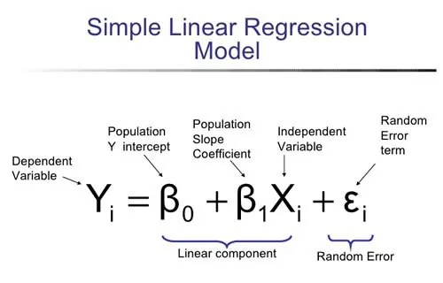
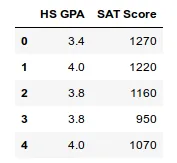
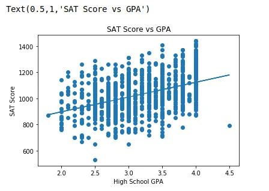

**Linear Regression** is the linear approximation of the relationship between two or more variables. First, let's understand what is a variable. A variable is an element, feature, or factor that is liable to vary or change. Here, we have generally two types of variables: x and y. We generally take x as an independent variable and y as a dependent variable. What this means is that the values of x are chosen while the values of y are a function of the values of x. The aim of linear regression is to discover this mapping function.

**Linear Regression is broadly categorized into three types:**

- Simple Linear Regression
- Multiple Linear Regression
- Polynomial Linear Regression

Here, we are going to talk about Simple Linear Regression and implement a simple linear model using Python.

**Simple Linear Regression** is the linear approximation between two variables. We have one variable as x and another as y. Depending upon x, we will find the value of y where 'x' and 'y' can be anything. For example: finding house price (y) based on area(x), finding the number of survived fish (y) based on water temperature (x) and many more. It can be represented by the following linear equation.



Let's not focus on random error term, also referred to as residual error, as represented in the equation. The residual value is the difference between the actual value and the predicted value by a linear regression model. I will talk more about it later in other blogs. For now, the basic formula is:

```python
                   y = m*x + c
```

Now, let's directly delve into implementing simple linear regression. The dataset I will be using consists of two columns: High School GPA and SAT Score. At the end of this blog, we will have the linear model of relationship between high school GPA and SAT score. In other words, we will be predicting SAT score(y-variable) based on high school GPA (x-variable) of students.

**Modules Implemented**

1. Scikit learn (for Linear Regression)
2. Pandas (to load and manipulate the data)
3. Matplotlib (to visualize the linear model)

**Importing the standard libraries**

```python
import pandas as pd
import matplotlib.pyplot as plt
from sklearn.linear_model import LinearRegression
```

**Importing the dataset**

```python
df = pd.read_csv('gpa.csv')
```

Let's check the first 5 rows of the dataset

```python
df.head()
```



df.shape gives the value of rows and columns in the dataframe.

(1000,2) means the dataset has 1000 rows and 2 columns.

Now, let's separate the columns into X and Y variables.

```python
X= df['HS GPA']
Y= df['SAT Score']
```

Now, it's time to perform Linear Regression. But before performing it, we have to reshape the value of X. Since our data has a single feature, we need to use reshape function to provide 2D array instead of 1D array. This is required by the scikit-learn algorithm. The limit is -1 to 1 which creates values to list of lists.

```python
X= X.reshape(-1,1)
```

For example, if the values are [1,2,3,4], it will be converted into [[1],[2],[3],[4]] such that it will be easy to perform Linear Regression as the model treats each value as a list.

Now it's time to initialize LinearRegression, fit it, and predict Y.

```python
regr= LinearRegression()
regr.fit(X,Y)
Y_pred=regr.predict(X)
```

Finally, we have created our Linear Regression model. Now, it's time to visualize it. First, we will create a scatter plot between X and Y, and then a linear (straight line) that is the linear function which maps Y and X.

```python
plt.scatter(X,Y)
plt.plot(X,y_pred)
plt.xlabel(' High School GPA')
plt.ylabel(' SAT Score')
plt.title(' SAT Score vs GPA')
```



Cool!! Now, it's time to find out the y-intercept (C) and the gradient (M) with just two lines of code.

**To find y_intercept :**

```python
 print(regr.intercept_)
```

Output: 670.80926132821298

**To find gradient :**

```python
print(regr.coef_)
```

Output: array([ 113.14440761])

Combining this into making a linear function, we get

```python
Y = 670.809 * X   +  113.144
```

In other words,

```python
SAT Score= 670.809 * HS GPA  + 113.144
```

That's it. Our simple linear regression model in Python.

If the required python libraries and packages aren't installed in your system, click [here](https://packaging.python.org/tutorials/installing-packages/) to learn about it.

Thank you for reading. Please leave your valuable feedback and suggestions in the comment section. :)
