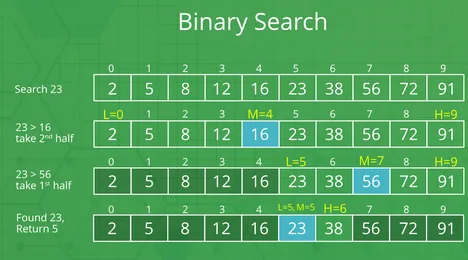
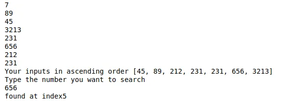

Binary Search is an algorithm to search a specified value in given sorted array.



Above figure illustrates the process for binary search. At first the middle value of given array is taken and the value at middle index in the array is compared with to be search value. Then if it is greater than to be searched value, we consider the left half and ignore rest. The reverse process goes for lesser case i.e., we consider the right half. We go on continuing this process until we find out the required value.

At first, we take the number of elements in an array

```python
#input the number of elements
total = int(input())
```

Then we take the values of array and sort it.

```python
#get the values for array
sorted_arr = []
for i in range(0,total):
    sorted_arr.append(int(input()))

#sort the array
sorted_arr.sort()
print('Your inputs in ascending order',sorted_arr)
```

We take input of which value is to be searched.

```python
#get the value to be searched
print('Type the number you want to search')
to_search = int(input())
```

For first case, we initialize our value

```python
#initialization
start = 0
end = total-1
mid = start+int((end-start+1)/2)
```

Here, start and end value enclose an array index and mid gives the index of middle value between start and end value.

Then we make a variable for while loop controller.

```python
#controller for while script
run = True
```

We compare the middle value and continue the loop further until we find the value.

```python
#compare the middle value with required value to be searched
def check(mid):
    global start,end,run
    if sorted_arr[mid]==to_search:
        print('found at index '+str(mid))
        run = False
    elif sorted_arr[mid]>to_search:
        end = mid-1
    else:
        start = mid+1
while(run):
    go = check(mid)
    mid = start+int((end-start+1)/2)
```

Final Output:



Github: <https://github.com/ranjan435/data-insight-2021/blob/main/bmi.ipynb>
