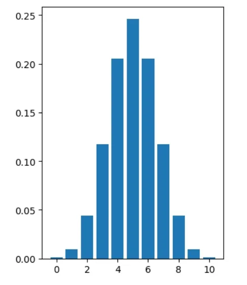

‘**flipping a coin**’ is a very famous sentence when we mention the **binomial distribution**. The binomial distribution is considered one of the most important distributions. That summarizes the likelihood that a value will take one of two independent values which means that they are mutually exclusive. In this article, we will talk about the binomial distribution and also explore it in code.

The binomial distribution is considered a common discrete distribution as it counts only two states(success or failure).

If we start by flipping a coin, this has two possible outcomes, heads or tails each with a probability of 50%. As we see the result of this is a binary outcome. A single success or failure test called the Bernoulli trial and series of outcomes are called the Bernoulli process.

Let’s see some examples for binomial distribution:

- Flipping a coin experiment as we said before

- Number of males and females in an organization

- The survey consists of YES/ NO questions

And more…

The binomial distribution has some properties, let’s see some of them:

- There are two possible outcomes (true or false)

- The probability of success of failure varies for each trial

- Every trial is an independent trial, which means that the outcome of one trial does not affect the outcome of another trial.

- There is n number of independent trials.

As we saw that binomial distribution is different from the normal distribution because it is considered discrete distribution. But in case, the sample size for the binomial distribution is very large, then the distribution curve for the binomial distribution is similar to the normal distribution curve like that:



Let’s use some code, And we can simulate the previous by importing binom from scipy like that:

```python
#binom.rvs(# of coins, probability of heads/success, size=# of trials)
```

```python
binom.rvs(1,0.5,size=1)
```

```python
array([1])
```

```python
binom.rvs(2,0.5,size=10)
```

```python
array([1, 1, 1, 2, 2, 2, 1, 1, 2, 2])
```

```python
binom.rvs(1, 0.5, size=8)
```

```python
array([1, 1, 1, 0, 0, 1, 1, 0])
```

In the last example, we flipped 1 coin with a 50% chance of success 8 times.

```python
# flipping 1 coin with 80% chance for heads 8 times
binom.rvs(1, 0.8, size=8)
```

```python
array([1, 1, 1, 1, 0, 1, 1, 1])
```

in the last one, we used an unfair coin as one side is heavier than the other, as result more heads appeared this time.

**The parameters**

The binomial distribution is described by two parameters, n and p. n represents the total number of trials being performed, and p is the probability of success.

From that we can get two things:

=> Expected value=np

=> Variance=npq

n=number of trials

p=probability of success

q=probability of failure (1-p)

we want to get some probabilities, for instance, getting a certain number of heads, so let's see that:

```python
# The probability of getting 7 heads from 10 trials
binom.pmf(7,10,0.5)
```

```python
0.11718750000000014
```

Also, we can use the cumulative distribution function to get a certain number of heads or fewer like that:

```python
# The probability of getting 7 or fewer heads
binom.cdf(7,10,0.5)
```

```python
0.9453125
```

Resource used: [here](https://byjus.com/maths/binomial-distribution/)

GitHub repo: [here](https://github.com/Abdelrahman7000/statistical_concepts_for_data_science/tree/main/Bionomial%20distribution)

That was part of Data Insight's Data Scientist program
