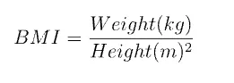

Body Mass Index (BMI) is a commonly used indicator that gives information about how healthy your body is. It is given as a ratio between your weight and height. There is a simple formula to calculate BMI.

The formula is,

According to the below code, firstly I create the function of BMI, which returns the BMI according to the given mass and height parameters. So After the main function, I get the user inputs and check the validation of those inputs, as well as give the proper output.

[#3](https://www.datainsightonline.com/blog/hashtags/3). Body Mass Index calculator

[#find](https://www.datainsightonline.com/blog/hashtags/find) the body mass index -
def BMI(mass, height):
 return mass / (height \*\* 2)

if __name__ == '__main__':
 try:
 [#get](https://www.datainsightonline.com/blog/hashtags/get) the input from users
 mass = float(input("Enter your mass(kg): "))
 height = float(input("Enter your height(m): "))

 print("BMI : {}".format(BMI(mass, height)))

 except:
 print("Error: Please enter the number")

There are some test cases here,

if you are using proper values to your weight and height, it will give the correct answer as BMI.

otherwise, if you are not using numbers for your weight, it will give an error.

if you are not using numbers for your height, it will give an errors

[Github repo](https://github.com/arunanuwantha97/Datacamp-Assignment/blob/main/bmi.ipynb)
