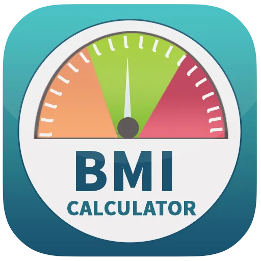

Body Mass Index (BMI) is a way to determine if your weight is healthy for your height. One's BMI value can the person or help health care providers lessen health risks arising due to his/her weight. BMI is the measurement used to determine body fat of a person.

Body Mass Index is calculated by dividing a person's body mass by the square of the body height. It has the units kg/m^2.

This article includes a python code calculate BMI.

The first part of the code requires the user to enter his/her weight in kilograms(kg) and height in metres(m).

weight = float(input('Enter your weight(in kilograms): '))

height = float(input('Enter your height(in metres): '))

After the values are been entered, it calculates the BMI value using the values the user provided and displays the BMI value.

bmi = weight / (height \*\* 2)

print('Your body mass index is ', bmi, 'kg/m^2')

The program also tells the you about which weight classification your BMI value fall under, using the standard BMI classification chart.

if bmi < 18.5 :

print('This is considered underweight')

elif 18.5 <= bmi < 25:

print('This considered healthy')

elif 25 <= bmi < 30:

print('This is considered overweight')

else:

print('This is considered obese')

Using this program one can get to know their BMI value.
