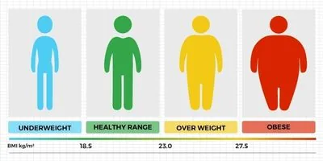

Body mass index (BMI) is the measure of the body fats based on height and weight of a person. High BMI can indicate high body fatness and low BMI indicates the person being underweight.

BMI is calculated using the formula weight in kgs divided by the squared of the person's height in meters.

Here is the python code of BMI calculation of a person.

```python
#This code lets the users to calculate their BMI
print('Enter the information')

#Ask the user to enter their height and weight
height = float (input('height in meters : '))
weight = float (input('weight in kgs : '))

#formula to calculate the BMI and the value is stored in bmi variable
bmi = weight / height ** 2
print('Your bmi is ' + str(bmi))

#conditional statement to check, to which category the BMI stand at.
if bmi < 18.5:
    print('underweight')
elif bmi < 30:
    print('normal')
else:
    print('obse')
```

Here is the explanation of the first part of the code.

First, it ask's the user to enter the height and weight in meter and kgs respectively using the input() function, which is converted to float value and stored as height and weight variable.

```python
#This code lets the users to calculate their BMI
print('Enter the informations')

#Ask the user to enter their height and weight
height = float (input('height in meters : '))
weight = float (input('weight in kgs : '))
```

The second part of the code does the BMI calculation using the BMI formula weight in kgs divided by height in meter square and stores the result in bmi variable and prints the bmi.

```python
#formula to calculate the BMI and the value is stored in bmi variable
bmi = weight / height ** 2
print('Your bmi is ' + str(bmi))
```

The last part of the code is used to evaluate how healthy is the person as per the bmi result using the if, elif and else statement.

```python
#conditional statement to check, to which category the BMI stand at.
if bmi < 18.5:
    print('underweight')
elif bmi < 30:
    print('normal')
else:
    print('obse')
```
