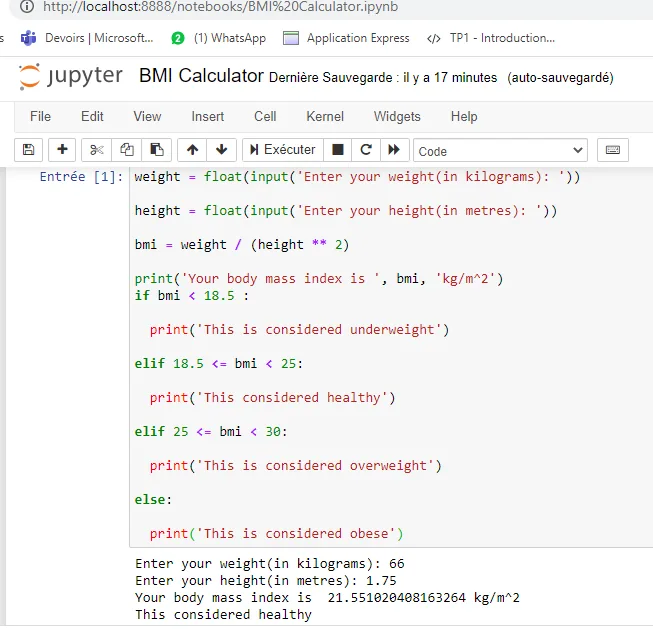

this program called BMI Calculator will take in the height and weight of the individual and will calculate the BMI of the person.

Body mass index (BMI) is a measure of body fat based on height and weight.

Based on the BMI of the individual, it will print a statement stating the overall health of the person.

