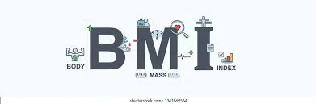
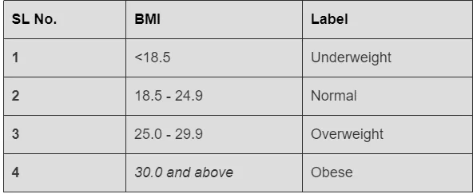
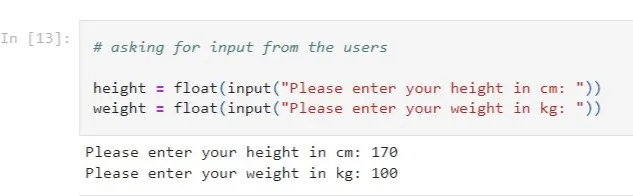
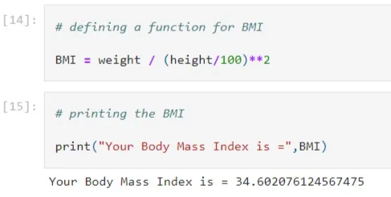
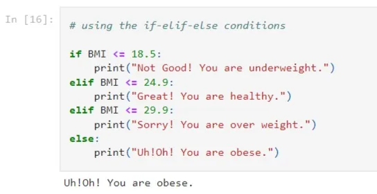

In this article, we will learn how to create a Body Mass Index(BMI) calculator using python. Before that, we need to understand the term Body Mass Index(BMI).

**Understanding Body Mass Index**

Body Mass Index, in short BMI, is the measurement of a person's height and weight. Generally, we use BMI to label a person's health by measuring their height and weight. There are four categories in the BMI labeling such as underweight, healthy, overweight, and obese. Fitness trainers and doctors use this calculator to help promote healthy life and eating.

**Understanding the Calculation**

According to the above table, if a person's BMI is below 18.5 then that person is underweight. A Body Mass Index between 18.5 - 24.9 is normal and so on.

**Creating the App**

We will start by taking the height and weight of a person.

Now, let's calculate the BMI using a function named BMI and print it using a print statement.

We are getting the BMI number here. Let's check if the person is healthy overweight or obese. For that, we will use the condition expression from python.

And now we have successfully made a BMI Calculator using Python.
