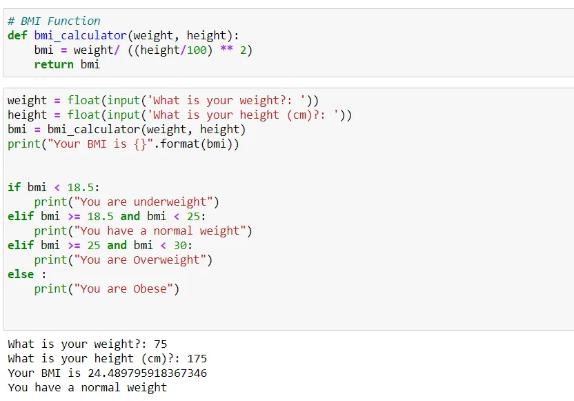

The following is a simple BMI Calculator code that determines the BMI of a user. The code requires one to input the weight (Kgs) and height in centimeters. Using an If statement, a BMI class is given.

Observed below, the user is considered to have a normal weight since the BMI is between 25 and 30 (exclusive).

