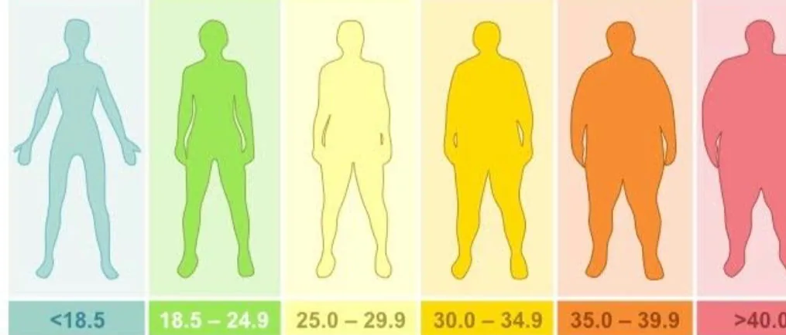

- 

A BMI Calculator will take in the height and weight of the individual and will calculate the BMI of the person.

**Body mass index (BMI) is a measure of body fat based on height and weight.**

Based on the BMI of the individual, it will print a statement stating the overall health of the person.

Let's start coding our project!

## Let's Code

Alright, so the first thing we need to do is to ask the user their height & weight. This can be easily achieved through **input()** function

> height = float(input("Enter your height in cm: "))weight = float(input("Enter your weight in kg: "))

We will convert the input string to float so that we can perform calculations with it.

Next up, we have to calculate the BMI.

**The formula to calculate BMI is $weight (kg)/{height (m)}^2$.** Let's implement this formula in python.

> BMI = weight / (height/100)\*\*2

Here we will be dividing the **height** by 100 to convert the **centimetres** into **meters**.

Now let's print out the BMI.

> print(f"You BMI is {BMI}")

Now we have to print a statement to state the current health of the user based on their **BMI**
