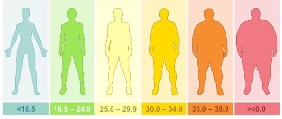
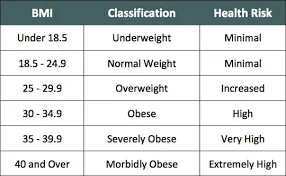
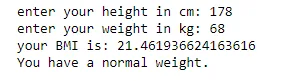

Body Mass Index is a simple calculation using a person's height and weight. The formula is **BMI = kg/m2** where kg is a person's weight in kilograms and m2 is their height in metres squared. A BMI of 25.0 or more is overweight, while the healthy range is 18.5 to 24.9.

We start by askingthe user to introduce his height and weight, and to do that we use the input() function. We convert the string input to float so we can do the calculations.

```python
#the first thing we need to do is to ask the user their height & weight
height = float(input("enter your height in cm: "))
weight = float(input("enter your weight in kg: "))
```

next we calculate the bmi and print it: we devided the height by 100 to convert it into meters.

```python
#next we have to calculate the BMI, we devide the height by 100 so it can be inmeters to ease up calculation
BMI = weight /(height/100)**2
#now we print the BMI
print(f"your BMI is: {BMI}")
```

Now we have to print a statement to state the current health of the user based on their **BMI**.

BMI Classification:



We will be using **if** conditionals for classification.

```python
#Now we have to print a statement to state the current health of the user based on their BMI
if BMI <= 18.4 :
    print("You are underweight.")
elif BMI <= 24.9 :
    print ("You have a normal weight.")
elif BMI <= 29.9 :
    print ("You are overweight.")
elif BMI <= 34.9 :
    print("You are severly overweight.")
elif BMI <= 39.9 :
    print("You are obese")
else :
    print("You are severly obese")
```

So, once the user introduces his height and weight, the BMI will be calculated and displayed. Then,  the weight category of the user will be displayed based on the calculated BMI range.

This will be our output.



You can find the link to the github repository

[Here](https://github.com/asmakrl/datacampstd/blob/bccf22856f0908ae97a1cdc15c4f594c3fd7d897/BMI%20Calculator.ipynb)
