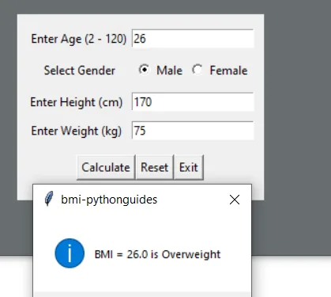

**Body Mass Index(BMI)** is a simple calculation using a person’s height and weight.

The formula is **BMI = kg/m2** where kg is a person’s weight in kilograms and m2 is their height in meters squared. A BMI of 25.0 or more is overweight, while the healthy range is 18.5 to 24.9.



The user needs to fill in some information like age, gender, height & weight. Out of this information height & weight is used to calculate the BMI. Then the BMI passes through conditions.

Each condition has a remark (underweight, Normal, overweight, etc). The result is displayed using a message box as shown above.

The above code was used to come up with BMi ranges .

**BMI Categories:**

- **Underweight** = <18.5
- **Normal weight** = 18.5–24.9
- **Overweight** = 25–29.9
- **Obesity** = BMI of 30 or greater

Below is how the code was formulated

*[#Import](https://www.datainsightonline.com/blog/hashtags/Import) tkinter,an interface that will be used to calculate BMI*

**from** **tkinter** **import**\***from** **tkinter** **import** messagebox

```python
# Defining parameters
def reset_entry():age_tf.delete(0,'end')height_tf.delete(0,'end')weight_tf.delete(0,'end')
def calculate_bmi():kg = int(weight_tf.get())m = int(height_tf.get())/100bmi = kg/(m*m)bmi = round(bmi, 1)bmi_index(bmi)
def bmi_index(bmi):if bmi < 18.5:messagebox.showinfo('bmi-pythonguides', f'BMI = {bmi} is Underweight')
 elif (bmi > 18.5) and (bmi < 24.9):messagebox.showinfo('bmi-pythonguides', f'BMI = {bmi} is Normal')
 elif (bmi > 24.9) and (bmi < 29.9):messagebox.showinfo('bmi-pythonguides', f'BMI = {bmi} is Overweight')
 elif (bmi > 29.9):messagebox.showinfo('bmi-pythonguides', f'BMI = {bmi} is Obesity')
 else:messagebox.showerror('bmi-pythonguides', 'something went wrong!')
```
