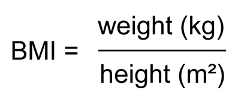

Tracking health is an important aspect of our lives. One of the important indicators that can tell us about our health is none other than the famous Body Mass Index. It is possible given our weight and height to know how healthy our body weight is.

It is calculated as follows:



The formula presented above takes variables in Kg and meters (metric system). Although the code presented below takes into account both metric and imperial systems, we'll only need that formula as we convert the inputs to the metric system (if given in Lb and ft'in) on the go.

**In the first part,** we give the user the choice to use either the metric system or the Imperial system. If the user inputs "m" the code will use the metric system else in the case of "i" it will use the imperial system.

```python
print('Welcome to your Body Mass Index calculation app')
i_m = True #Imperial or metric system use'
metric = input('Would you prefer the Metric system [m](meters and Kg) or the Imperial system [i] (lb and ft\'in) [m]/i\n')
if len(metric) == 0:
    metric = 'm'
if metric == 'm':
    print('You have chosen the metric system')
    i_m = True
else:
    print('You have chosen the Imperial system')
    i_m = False
```

To make sure we get correct inputs we loop our "input" command in a while loop and keep asking for input as long as the conversions aren't working as expected (text input or random characters).

**In the case of the metric system we use the following code:**

- Get height in meters, make sure it's a number
- Get weight in meters, make sure it's a number
- Once both are validated, proceed to calculate BMI

```python
weight = None
height = None

if i_m == True:
    correct_input = False
    while(correct_input == False):
        try:
            height = float(input('Please provide your height (in meters)\n'))
            print('Okay, your height {:.2f} meters has been saved'.format(height))
            correct_input = True
        except:
            print('Make sure your height is number (Example: 1.5)')
    correct_input = False
    while(correct_input == False):
        try:
            weight = float(input('Please provide your weight (in Kg)\n'))
            print('Okay, your height {:.2f} kg has been saved'.format(weight))
            correct_input = True
        except:
            print('Make sure your height is number (Example: 72.3)')
```

**In the case of the imperial system:**

- We get the height in inches in the format "ft.in", split it, and convert it to meters
- We get the weight in Pounds, make sure it's a number and convert it to Kg
- Once both are validated, we proceed to calculate the BMI

```python
else:
    correct_input = False
    while(correct_input == False):
        try:
            height = input('Please provide your height (ft.in )\n')
            ft = int(height.split('.')[0])
            i = int(height.split('.')[1])
            print('Okay, your height {}ft\'{}in has been saved'.format(ft,i))
            height = ft * 0.3048 + i * 0.0254
            correct_input = True
        except:
            print('Make sure your height is number (Example: 1.5)')
    correct_input = False
    while(correct_input == False):
        try:
            weight = float(input('Please provide your weight (in lb)\n'))
            print('Okay, your height {:.2f} Pounds has been saved'.format(weight))
            weight /= 2.205
            correct_input = True
        except:
            print('Make sure your height is number (Example: 155.2)')
```

**Finally,** we output the BMI to the user and the range it falls into.

```python
if BMI < 18.5:
    print('Your Body Mass Index is {:.2f} which means you are underweight.'.format(BMI))
elif 18.5 <= BMI <= 24.9:
    print('Your Body Mass Index is {:.2f} which is in the healthiest range.'.format(BMI))
elif 25 <= BMI <= 29.9:
    print('Your Body Mass Index is {:.2f} this falls under the overweight range.'.format(BMI))
else:
    print('Your Body Mass Index is {:.2f} this falls under the obese category.'.format(BMI))
```

**A few notes:**

- The " {:.2f}" in the print function makes sure that floats are printed with only 2 decimal points
- We convert from ft'in to meters using the following formula:

  - Height = feets \* 0.3048 + inches \* 0.0254

Thank you for your time and attention while reading this post.

The link to the code [here](https://github.com/zqngetsu96/DataInsight_Assignments_and_projects/blob/main/Assignment%201/BMI_Calculator.ipynb).
