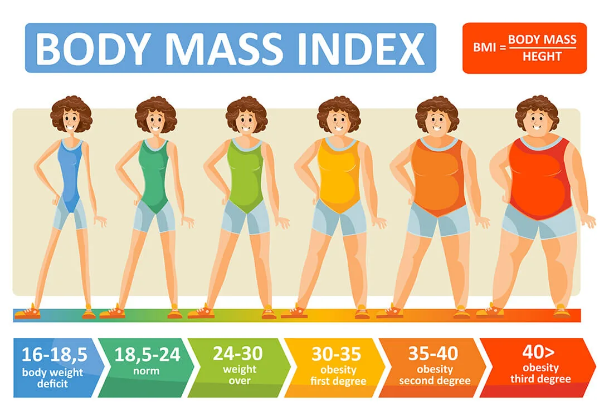

### What is the Body Mass Index?
Body mass index (BMI) is a measure of body fat based on height and weight that applies to adult men and women. Based off the the value of the index, a person can be categorized into one of the following:

- Underweight = <18.5
- Normal weight = 18.5–24.9
- Overweight = 25–29.9
- Obesity = BMI of 30 or greater

The general formula is as follows

where weight is in kilograms and height is in metres. Therefore, BMI's unit is in kilograms per metre squared.

### How to create your own BMI calculator

In this blog I will show you how you can easily write simple code in python that calculates user's BMI.

##### Input:

- Weight in kilograms
- Height in metres

##### Output:

- Body Mass Index
- Category

So let's get started!

**First, let's prompt the user to enter their data**

```python
weight = float(input("Weight in kilograms: "))
height = float(input("Height in metres: "))
```

Notice how we cast the output to  ***float***  as the input method returns a string.

**Next, we will calculate the BMI using our formula.** We will surround it with a ***try...except*** block in case the user hasn't entered valid values. We used abs() method in case the user accidentally inputted negative numbers.

```python
bmi = 0
try:
    bmi = abs(weight / height ** 2)
except:
    print("Please enter a valid weight and height before proceeding!")
```

**Finally**, we can display to the user as a bonus their BMI category according to their input using a simple  ***if...elif...else***  structure.

```python
if bmi <= 18.5:
    print("You are underweight. Are you sure you're eating enough nutrient-rich and filling meals?")
elif bmi < 25:
    print("Congratulations! You're normal weight. Keep up your healthy diet :)")
elif bmi < 30:
    print("You are overweight. Try maintaining a balanced diet.")
else:
    print("You are obese. Obesity has many detrimental health implications.")
```

Do you think the commentary was unnecessary? Maybe. But in the end everyone knows their own health best ;)

##### Full Code

```python
weight = float(input("Weight in kilograms: "))
height = float(input("Height in metres: "))
bmi = 0
try:
    bmi = abs(weight / height ** 2)
except:
    print("Please enter a valid weight and height before proceeding!")
    if bmi <= 18.5:
    print("You are underweight. Are you sure you're eating enough nutrient-rich and filling meals?")
elif bmi < 25:
    print("Congratulations! You're normal weight. Keep up your healthy diet :)")
elif bmi < 30:
    print("You are overweight. Try maintaining a balanced diet.")
else:
    print("You are obese. Obesity has many detrimental health implications.")
```

Short and sweet.

To learn more about the Body Mass Index, visit World Health Organization's [website](https://www.euro.who.int/en/health-topics/disease-prevention/nutrition/a-healthy-lifestyle/body-mass-index-bmi).
