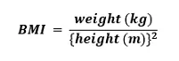

Create a Body Mass Index (BMI) Calculator with the help of the Python programming language (OOP). But we get started creating one; let us briefly discuss what Body Mass Index (BMI) is.

#### Understanding the Body Mass Index (BMI)

**BMI,** short for **Body Mass Index,** is a measure of relative weight based on the mass and height of an individual. We generally use the Body Mass Index in order to categorize people on the basis of their **height** and **weight.** These categories are **severely underweight**, **underweight, normal, overweight, moderately obese**,*and* **severely obese.** Moreover, it is also adopted by various countries in order to promote healthy eating.

#### Understanding the working of BMI Calculator

A BMI Calculator accepts the **weight and height** of an individual and calculates the Body Mass Index (BMI) of that person.

The following table shows how the classification of BMI is done in order to identify the health status of a person.

|  |  |  |
| --- | --- | --- |
| **S. No.** | **BMI** | **Weight Status** |
| 1 | 15.0 and Below | Severely Underweight |
| 2 | 16.1 - 18.5 | Underweight |
| 3 | 18.6 - 25.0 | Normal |
| 4 | 25.1 - 30.0 | Overweight |
| 5 | 30.1 - 35.0 | Moderately Obese |
| 6 | 35.1 and above | Severely Obese |

Now, let us begin coding the project.

### Creating BMI Calculator using Python (OOP)

As the first step, we will create a New Python program file and name it **BMI_Calculator.py.** Within this file, we will begin by creating a Class. We can easily accomplish this using the **class** before the class name to declare it.

**File: BMI_Calculator.py**

class calculation:

Then after the declaration, We will define a method to calculate BMI.

class calculation:

 # defining method
 def BMIcalculator(self, Height, Mass):

 # compute BMI
 BMI = (Mass)/(Height\*Height)

 # classify
 for t1, t2 in [(16, 'severely underweight'),
 (18.5, 'underweight'),
 (25, 'normal'), (30, 'overweight'),
 (35, 'moderately obese'),
 (float('inf'), 'severely obese')]:
 print(t1)
 if BMI <= t1:
 print('Your BMI is', BMI, 'and the person is :', t2)
 break

**Explanation:**

In the above snippet of code, we have defined a method that accepts 2 arguments **height** and **weight.**

Next, we will calculate the Body Mass Index.

We will use the following formula in order to calculate BMI.

*Note: Weight or Mass*

Let us implement the above formula in the Python program.

BMI = (Mass)/(Height\*Height)

**Explanation:**

In the above snippet of code, we have defined a function for BMI using the above formula.

Now, we will print the statement stating the present health of the user based on their BMI. This block of code will be quite simplified for better understanding.

We will use the **if-else** conditions for classification inside **For loop**.

For loop has a statement that iterates over the list of tuples.

# classify
 for t1, t2 in [(16, 'severely underweight'),
 (18.5, 'underweight'),
 (25, 'normal'), (30, 'overweight'),
 (35, 'moderately obese'),
 (float('inf'), 'severely obese')]:

**Explanation:**

In the above snippet of code, we declare a for loop to iterate over a list of tuples and store values in two variables t1 and t2.

t1: has a value of **BMI** such as 16, 18.5, etc to categorize based on these values.

t2: has a value of **Weight Status** such as **underweight, normal, etc** to decide which of these categorize he/she is.

Note: One can use **float('inf')** as an integer to represent it as infinity. for more details go [here](https://www.geeksforgeeks.org/python-infinity/)

Now inside a for loop, we declare an **if-elif-else** statement to check if the BMI of the person lies within one of the categories.

if BMI <= t1:
 print('Your BMI is', BMI, 'and the person is :', t2)
 break

In the above snippet of code, we have used the value of the variable **BMI** in the **if-elif-else** statement to check if the BMI of the person lies within one of the categories.
