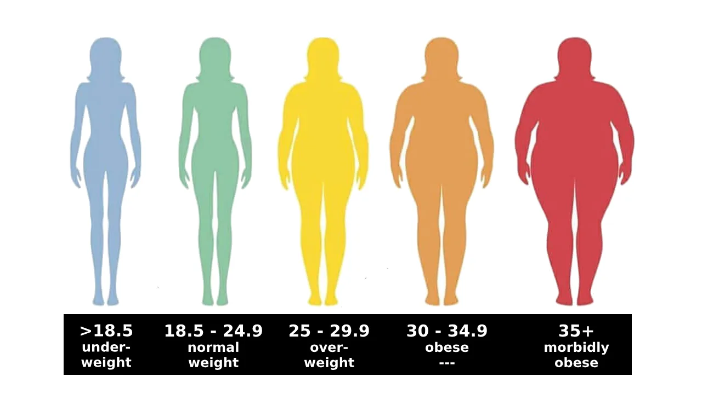

Body mass index (BMI) is actually an estimate of body fat based on height and weight. In this blog I am going to take a reference of BMI for adults. BMI calculation, itself doesn't determine an exact result, how obese a body is but is based on a mathematical formula: (weight in kilogram divided by square of height in meter) that makes an assumption on which category they fall under. Indeed, BMI gives an idea if a particular range of weight is at an unhealthy or healthy weight. According to Center for Diseases Control and Prevention (CDC), BMI range for adults are categorized onto several groups: Underweight, Normal, Overweight, Obese and Morbidly Obese.

Now, let us briefly compare our theoretical explanation and pictorial representation with reference to the following python code.

Firstly, the input of height of an adult is taken and stored in height_cm variable. The input should be in centimetres as the height of body is generally taken in centimetres.

```python
print('Enter your height in centimetres:')
height_cm = float(input())
```

Enter your height in centimetres: 165

The weight of an adult is also provided in kilograms and stored in the variable weight_kg.

```python
print('Enter your weight in kilogram:')
weight_kg = float(input())
```

Enter your weight in kilogram: 63

The calculation of BMI is carried out with the help of an equation, BMI = weight / (square of height)

but as a standard form the weight should be in kilograms while the height should be in metre.

The value stored in height_cm which is in centimetre, first should be converted to metre and done by dividing the value by 100. At last the value of BMI is calculated and printed.

```python
height_m = height_cm / 100BMI = weight_kg /(height_m * height_m)print('Your BMI is ' + str(BMI))
```

Your BMI is 23.140495867768596

Finally, the value of BMI is compared with the standard range of categories and assigned accordingly. According to CDC, if the BMI is less than 18.5 than it is categorized as underweight, if the BMI is greater than or equal to 18.5 and less than 25, it is categorized as normal weight, if the BMI is greater than or equal to 25 and less than 30, it is categorized as over weight, if the BMI is greater than or equal to 30 and less than 35, it is categorized as obese and if the BMI is greater than or equal to 35, it is categorized as morbidly obese.

```python
if BMI < 18.5:print("Status: Underweight")
elif BMI >= 18.5 and BMI < 25:print("Status: Normal weight")
elif BMI >= 25 and BMI < 30:print("Status: Overweight")
elif BMI >= 30 and BMI < 35:print("Status: Obese")else:print("Status: Morbidly Obese")
```

Status: Normal weight
