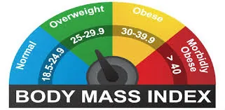

The body mass index (BMI) is used to estimate the ideal weight according to height. Its calculation is simple: it corresponds to the weight divided by the square of the height (BMI = weight in kg/height² in m).

The figure obtained is used to estimate the corpulence and possibly the overweight or obesity of an adult man or woman.

You are curious to determine your BMI to take precautions and take care of your health. The code below will allow you to calculate your BMI and know if you are overweight or not.

```python
# calcul BMI
def calcul_bmi(height,weight):
    bmi= weight/height**2
    bmi_round = round(bmi,2)
    if bmi < 18.5:
        print('your BMI is ' + str(bmi_round) + ' and you are underweight')
    elif bmi <= 24.9 :
        print('your BMI is ' + str(bmi_round) +' and you have normal wieght')
    elif bmi <= 29.9 :
        print('your BMI is ' + str(bmi_round) + ' and you are overweight')
    else :
        print('your BMI is ' + str(bmi_round) + 'and you are obese')
```

We used the round() function to convert the BMI values to two decimal places.

Let's practice by giving an example with this code. The input is written as follows:

```python
calcul_bmi(1.80, 70)
```

The result showing Kodjo's BMI reveals that he has a normal weight. The output below confirms this.

```python
your BMI is 21.6 and you have normal wieght
```

Link to the GitHub repository <https://github.com/Dorlote/Data_insight_programme_2021/blob/main/BMI%20calculator.ipynb>
