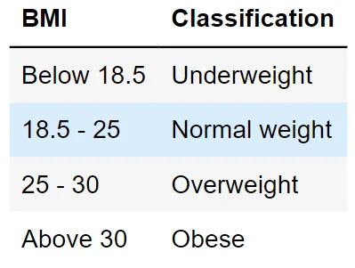

This blog post describes a program that calculates body mass index(BMI). It classifies your weight status whether it is underweight, normal weight, overweight, or obese. Knowing your BMI is important as it may indicate any possible health risk, and implies immediate control, if needed. The following table shows the BMI ranges and their classifications:



**Step 1**: Generate a code that asks users to input their weight and height.

```python
#For weight
try:
    weight = float(input("\nEnter your weight (in kg): "))
except ValueError:
    print("\nInvalid Input! Please input a number.")
    weight = float(input("\nEnter your weight (in kg): "))

#For height
try:
    height = float(input("\nEnter your height (in m): "))
except ValueError:
    print("\nInvalid Input! Please input a number.")
    height = float(input("\nEnter your height (in m): "))
```

The code above allows users to input the necessary information in order for the program to perform the calculation. It also restricts invalid inputs and lets users try inputting a valid input again.

**Step 2**: Define the formula of the BMI.

```python
BMI = weight / (height**2)
```

**Step 3**: Print the result.

```python
print("Your BMI is "+str(round(BMI,3)))
```

It displays the user's BMI. The program rounded it to three decimal places for an easier read.

**Step 4**: After getting the result, create conditions that classify the status.

```python
if BMI < 18.5:
    print("Status: Underweight")
elif BMI >= 18.5 and BMI < 25:
    print("Status: Normal weight")
elif BMI >= 25 and BMI < 30:
    print("Status: Overweight")
else:
    print("Status: Obese")
```

Then, the weight status of the user will display.
