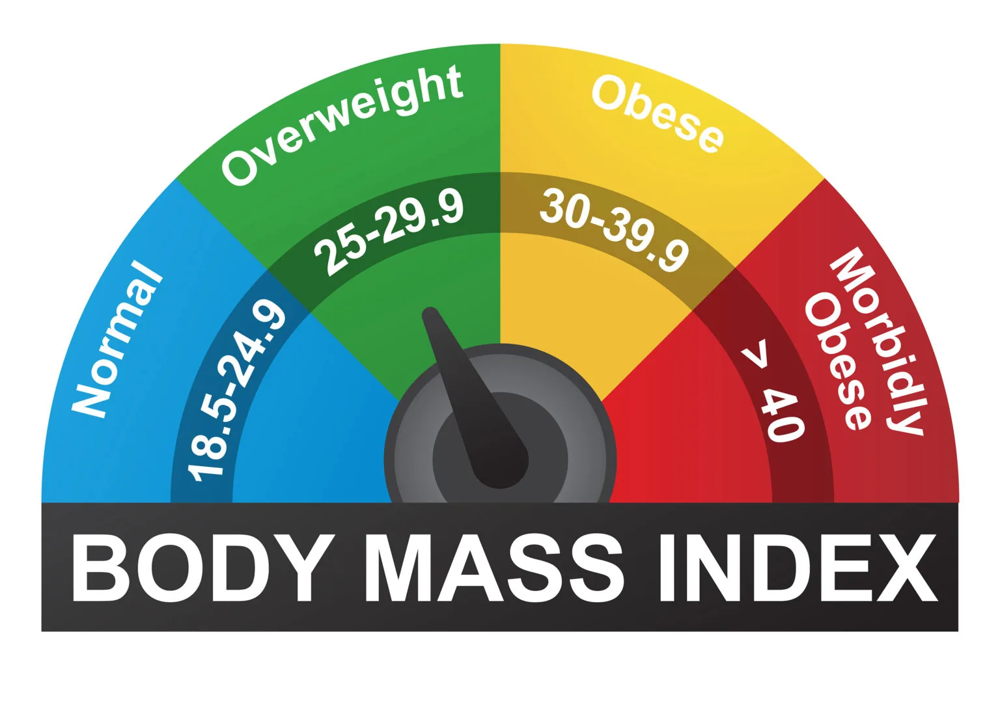

A person's **BMI** is a number derived from their weight and height. For most people, **BMI** is a reasonably trustworthy predictor of body fatness, and it's used to check for weight categories that could contribute to health issues.

This blog post explains how to calculate **BMI** using a program (**BMI**). It determines whether or whether you are underweight, regular weight, overweight, or obese. Knowing your **BMI** is vital since it can suggest any potential health risks and, if necessary, prompt action.

- 

Steps to be followed for the creation of **BMI** Calculator.

1. The code that prompts users to enter their weight and height.

```python
print('Body Mass Index Calculation App!')

#For height
try:
    height = float(input("\nPlease Enter Your Height in centimetres (in cm): "))
except ValueError:
    print("\nInvalid Input! Please input a valid number.")
    height = float(input("\nPlease Enter Your Height in centimetres (in cm): "))

    #For weight
try:
    weight = float(input("\nPlease Enter Your Weight in kilograms(in kg): "))
except ValueError:
    print("\nInvalid Input! Please input a number.")
    weight = float(input("\nPlease Enter Your Weight in kilograms(in kg): "))
```

This code will take User Height & Weight. In the input it also validates the right input from user.

2. This code below is the implementation of The formula of BMI

```python
BMI = weight *10000/ (height**2)
```

3. The code below will print out the calculated result rounded to three decimal places.

```python
print("Your BMI is "+str(round(BMI,3)))
```

4. The code below is the implementation of the conditions according the above result. And, depending on the conditions it will finally display the status of BMI.

```python
if BMI < 18.5:print("Status: Underweight")
elif BMI >= 18.5 and BMI < 25:print("Status: Normal weight")
elif BMI >= 25 and BMI < 30:print("Status: Overweight")
else:print("Status: Obese")
```
