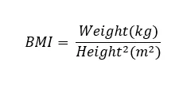

Ever wondered where you fall in the weight category, then strap in as I present to you a never failing approach; The Body Mass Index

Body Mass Index(BMI) is a simple calculation of dividing a person’s weight by the square of his/her height. Both parameters should be in the metric units. Mathematically,



The result from the calculation can be compared to the BMI ranges to determine where one falls in weight category. The ranges are as follows:

|  |  |
| --- | --- |
| **BMI Range** | **Weight Category** |
| Under **18.5** | Under weight |
| Between **18.5** and **24.9** | Normal weight |
| Between **25** and **29.9** | Over weight |
| Greater than **30** | Obese |

A python program can be written to ease the calculation and classify individuals into the various weight categories. The code below accomplishes such task.

**Body Mass Index Calculator**

```python
name = input('Please enter your name: ')
```

The above code takes an input from the user and stores it in a variable, name. This is intended to save the name of the user.

```python
introduction = 'Welcome ' + name + ', to the Body Mass Index Calculator. Your mass in kilograms and height in meters will be needed. Please proceed to the next step.'
```

The ‘introduction’ variable contains a welcome message to the Body Mass Index Calculator. It also informs the user of the parameters needed to perform the computation.

```python
print(introduction)
```

This line prints the ‘introduction’ variable

```python
try:
    mass_in_kg = float(input('Please enter your mass in kilogram: '))
except ValueError:
    print('Please your mass must be a number')
    mass_in_kg = float(input('Please enter your mass in kilogram: '))
```

The above block of code takes an input from the user and stores it as a ‘float’ in ‘mass_in_kg’. This represents the user’s weight. The ‘try’ and ‘except’ block ensures that only numbers are inputted.

```python
try:
    height_in_meters = float(input('Please enter your height in meters: '))
except ValueError:
    print('Please your height must be a number')
    height_in_meters = float(input('Please enter your height in meters: '))
```

The above block of code takes an input from the user and stores it as a ‘float’ in ‘height_in_meters’. This represents the user’s height. The ‘try’ and ‘except’ block ensures that only numbers are inputted.

The next line of code calculates the Body Mass Index of the user and stores it in a variable, ‘body_mass_index’.

```python
body_mass_index = mass_in_kg / (height_in_meters ** 2)
```

```python
if body_mass_index < 18.5:
    print('Hello ' + name + ', your Body Mass Index is ' + str(body_mass_index) + ' and in the Underweight category.')
elif 18.5 < body_mass_index < 24.9:
    print('Hello ' + name + ', your Body Mass Index is ' + str(body_mass_index) + ' and in the Normal category.')
elif 25 < body_mass_index < 29.9:
    print('Hello ' + name + ', your Body Mass Index is ' + str(body_mass_index) + ' and in the Overweight category.')
else:
    print('Hello ' + name + ', your Body Mass Index is ' + str(body_mass_index) + ' and in the Obese category.')
```

The block of code above takes the ‘body_mass_index’ variable and compares it to the various BMI ranges. It then displays a feedback in the following generic form

```python
Hello {user' name}, your Body Mass Index is {user's calculated BMI} and in the {BMI range} category.
```

This is a [link](https://github.com/catiemokeseku/Body-Mass-Index-Calculator.git) to the repo on github
