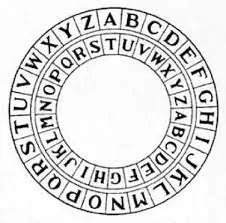
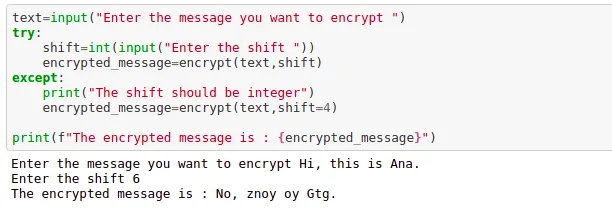
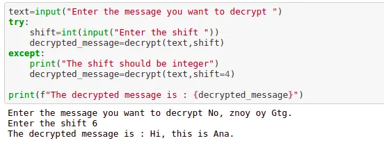

In today's world, messages to be sent are modified and encrypted using different patterns so that they won't get into the wrong hand and only the sender knows the key to decrypt it. This pattern has been since ancient times, where kings used to communicate sending messages encrypted into a different pattern. And the enemy doesn't get the information from it.

So recalling this, today we will learn about encrypting and decrypting the message. Here we are concerned with the alphabets that we will shift and the receiver only needs the knowledge of shift to decrypt it.

**1) Encrypt the message**

```python
def encrypt(text,shift):
    message=''
    for i in text:
        if (i.isupper()):
            message+=chr((ord(i)+shift-65)%26+65)
        elif (i.islower()):
            message+=chr((ord(i)+shift-97)%26+97)
        else:
            message+=i
    return message
```

Here we put the message to be encrypted. Then each letter of the words is converted to ASCII numbers which are increased by the shift (the user provides). If the character is Uppercase, 65(ASCII of 'A') is added to convert the code back to string and for lowercase 97(ASCII of 'a') is added.

The output of the encryption is:



**2) Decrypt the message**

```python
def decrypt(text,shift):
    message=''
    for i in text:
        if (i.isupper()):
            message+=chr((ord(i)-shift-65)%26+65)
        elif (i.islower()):
            message+=chr((ord(i)-shift-97)%26+97)
        else:
            message+=i
    return message
```

Here in decryption, we should subtract the shift value from the ASCII code of the encrypted message to get the actual message.

The output of decryption can be seen as below:



You can get the [repo from here.](https://github.com/Ayushma00/DataInsight_Project/blob/main/Caeser%20Cipher%20Game.ipynb)
