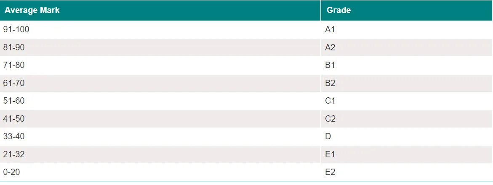

In this blog, we are going to talk about How to calculate the overall grade of the student in the final exams.

The system of the grades in this college follow the following grading system



Our python application depends on taking input from the user in the 6 subjects by using the following line code

```python
print("Enter Your Marks in 6 Subjects: ")
markOne = float(input())
markTwo = float(input())
markThree = float(input())
markFour = float(input())
markFive = float(input())
markSix = float(input())
```

The output will be like this:

```python
Enter Your Marks in 6 Subjects:
50
57.5
38
91
85
70
```

We take these inputs and we calculate the average by the following line code:

```python
total =markOne+markTwo+markThree+markFour+markFive+markSix
avg = total/6
```

After that, we pass the avg to the cal_grade function to calculate the grade of the student

```python
cal_grade(avg)
```

The cal_grade function calculates the grades as shown in the following code

```python
def cal_grade(input_avg):
if input_avg>=91 and input_avg<=100:
    print("Your Grade is A1")
elif input_avg>=81 and input_avg<91:
    print("Your Grade is A2")
elif input_avg>=71 and input_avg<81:
    print("Your Grade is B1")
elif input_avg>=61 and input_avg<71:
    print("Your Grade is B2")
elif input_avg>=51 and input_avg<61:
    print("Your Grade is C1")
elif input_avg>=41 and input_avg<51:
    print("Your Grade is C2")
elif input_avg>=33 and input_avg<41:
    print("Your Grade is D")
elif input_avg>=21 and input_avg<33:
    print("Your Grade is E1")
elif input_avg>=0 and input_avg<21:
    print("Your Grade is E2")
else:
    print("Invalid Input!")
```

The output for the previous inputs will be

```python
Your Grade is B2
```

you can refer to the complete code from the following [link](https://github.com/MarehanRefaat/Calculate_Grades/blob/main/Calculate_Grade.ipynb)
