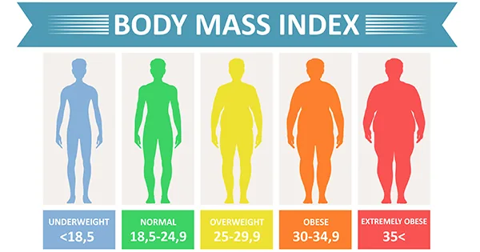

As obesity doesn't only affect your physical health it can have a damaging effect on the quality of life. thus evaluating the body mass index is needed to let you understand the status of your body on the spectrum.

Such evaluations can help to clarify how your weight influences your overall health and wellbeing.

Here is the python code for calculating your BMI and analyzing the result through comparing it to the BMI spectrum

```python
#defining a function to calculate body mass index
 #the function takes the weight and height and return the bmi and print the statues of the body
 def bmi_calculate(m,h):
    #calculating bmi using the formula
      bmi=m/(h*h)
    #checking in which category the body lies
    if bmi <= 18.5:
            print('Underweight',bmi)
    elif bmi >=18.5 and bmi<24.9:
            print('Normal weight',bmi)
    elif bmi >=25 and bmi <29.9:
            print('Overweight',bmi)
    else:
            print('Obesity',bmi)
```

```python
#taking input from the user
height = float(input("Input your height in m: "))
weight = float(input("Input your weight in Kilogram: "))
#calling the function
bmi_calculate(weight,height)
```
