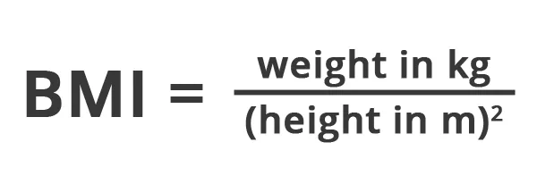

Writing a program in python is easy yet confusing. The simpler the language the complex it is sometimes to handle. But simply python is more of a language for everyone and it's sometimes easier to decode.

"

I did programming with C, C++ basically. I find python understandable but difficult to write. Thanks to the huge community of python, there's always solution available. "

For calculating BMI the first thing to notice is the input of the value. By default the input type is str, so the typecasting was required .

```python
#check the input type
x=input()
print(type(x)) #<class 'str'>
```

```python
h = float(input("Enter an Height in (m): "))
w = float(input("Enter an Weight in kg: "))
```

Secondly the formula was written and lastly I had to compare the result for the condition of the health.



```python
BMI= w/(h*h)
```

```python
if BMI <= 18.4:
    print("You are underweight.")
elif BMI <= 24.9:
    print("You are healthy.")
elif BMI <= 29.9:
    print("You are over weight.")
elif BMI <= 34.9:
    print("You are severely over weight.")
elif BMI <= 39.9:
    print("You are obese.")
else:
    print("You are severely obese.")
```
