Neurodegenerative disease is an umbrella term for a range of conditions which primarily affect the neurons in the human brain. Neurons are the building blocks of the nervous system which includes the brain and spinal cord. Neurons normally do not reproduce or replace themselves, so when they become damaged or die, they cannot be replaced by the body. Examples of neurodegenerative diseases include Parkinson’s, Alzheimer’s, and Huntington’s disease.

Neurodegenerative diseases are incurable and debilitating conditions that result in progressive degeneration and / or death of nerve cells. This causes problems with movement (called ataxias), or mental functioning (called dementias).
 In this blog, we talk about Parkinson’s disease. Data from the UCL repository has been for exploratory data-analysis. The same data was used to draw inferencing about the possibility of a patient being a Parkinson patient or not. Let us dig through the data.

Parkinsons Disease Data Set, obtained from the Oxford Parkinson's Disease Detection Dataset, was created by Max Little of the University of Oxford, in
 collaboration with the National Centre for Voice and Speech, Denver,
 Colorado, who recorded the speech signals. The original study published the feature extraction methods for general voice disorders. This dataset is composed of a range of biomedical voice measurements from
 31 people, 23 with Parkinson's disease (PD). Each column in the table is a
 particular patient’s voice measure, and each row corresponds one of 195 voice
 recording from these individuals ("name" column). The main aim of the data
 is to discriminate healthy people from those with PD, according to "status" column which is set to 0 for healthy and 1 for PD.
 The data is in ASCII CSV format. The rows of the CSV file contain an
 instance corresponding to one voice recording. There are around six
 recordings per patient, the name of the patient is identified in the first
 column. The various attribute information have been given below:

**name** - ASCII subject name and recording number
**MDVP:Fo(Hz)** - Average vocal fundamental frequency
**MDVP:Fhi(Hz)** - Maximum vocal fundamental frequency
**MDVP:Flo(Hz)** - Minimum vocal fundamental frequency
**MDVP:Jitter(%),MDVP:Jitter(Abs),MDVP:RAP,MDVP:PPQ,Jitter:DDP** - Several
 measures of variation in fundamental frequency
**MDVP:**Shimmer,MDVP:Shimmer(dB),Shimmer:APQ3,Shimmer:APQ5,MDVP:APQ,Shimmer:D**DA** - Several measures of variation in amplitude
**NHR,HNR** - Two measures of ratio of noise to tonal components in the voice
 status - Health status of the subject (one) - Parkinson's, (zero) - healthy
**RPDE,D2** - Two nonlinear dynamical complexity measures
**DFA** - Signal fractal scaling exponent
**spread1,spread2,PPE** - Three nonlinear measures of fundamental frequency variation

Now, that we have enough information about our dataset, let us have at our exploratory data analysis. All the necessary libraries were imported and the dataset was loaded as shown below.

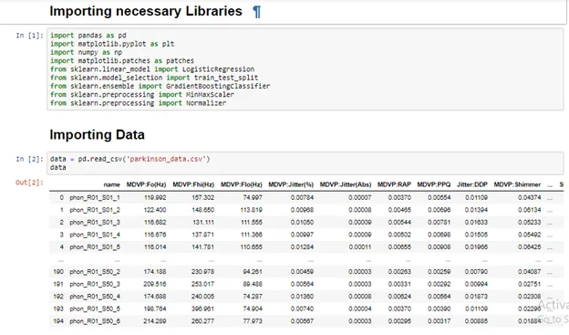

As mentioned earlier, the dataset contains 24 columns and 195 rows. A descriptive-statistics of the data has been shown below.

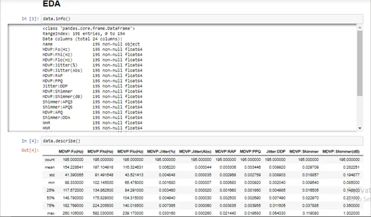

An eyeball of the descriptive statistics indicates some columns have huge values compared to the other columns. Some of these columns include **MDVP:Fhi(Hz), MDVP:Flo(Hz)** and **MDVP:Fo(Hz).** One of the questions that popped up was the role the average vocal frequency played in a person being a Parkinson dataset or not. To answer this question, the dataset was segregated into two data frames; the first was a data frame with data for only diabetic patients and the other for non-diabetic patients. As we can see in the graph below, the average vocal frequencies of healthy people are generally higher than that of Parkinson patients.

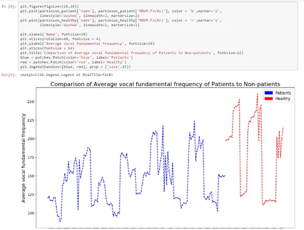

Another question that popped up was whether the amplitude of recorded voices had a correlation with Parkinson patients. To answer this questions, three samples were randomly drawn from the non-patient Parkinson data frame (patients without Parkinson from the original dataset). Scatter plots for the amplitude of these three samples from non-patients were plotted against amplitude of patients. The scatter plot showed a fairly-low negative correlation between the amplitude of patients and non-patients.

First sample:

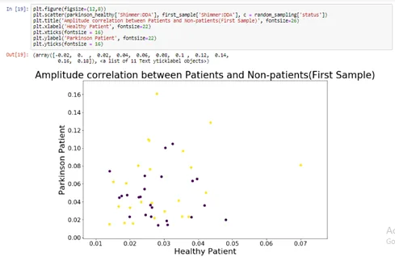

Second sample:

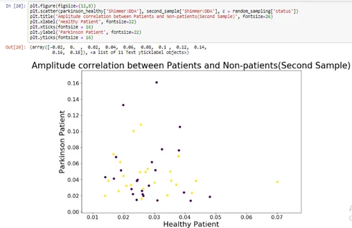

Third sample:

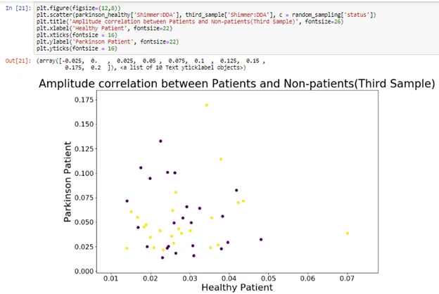

To instantiate this fact, the amplitude healthy people and Parkinson patients were plotted on a line chat as shown below. The amplitude of patients are significantly lower than healthy people.

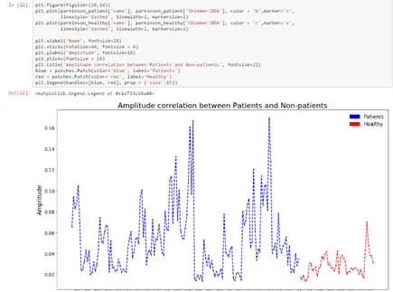

If a person is a Parkinson patient, is the person having more noise in his vocals or not. This is a very sensitive question our data set will help us answer. The “**noise to total components in the voice**” columns of the patient and healthy data frames we extracted from the original data frame were used for this analysis. These columns were **“NHR”** and **“HNR”.** An empirical distribution cumulative was made for these two columns each for patients and non-patients. For both, **patient “NHR” and healthy “NHR”** columns, it can be inferred that less than all the patients had almost zero **noise to total components** in their voices. So, a tangible answer could not be obtained from these columns.

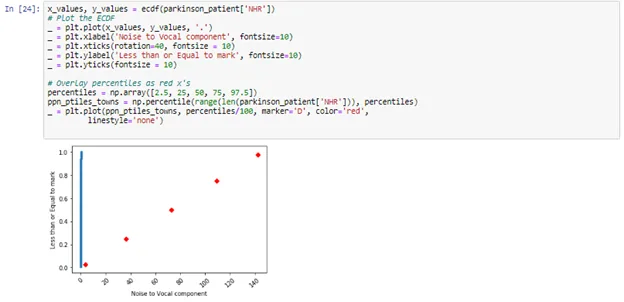

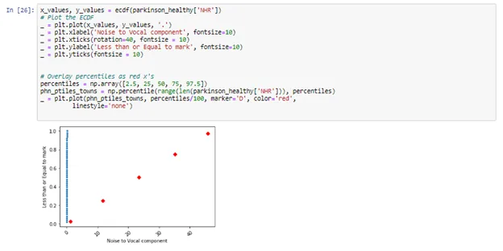

The same could not be said about the **patient “HNR” and healthy “HNR”** columns. For **patient “HNR”,** where hundred percent of the healthy people had a noise to tonal component of about 30. Patients had less noise to vocal component of about 35.

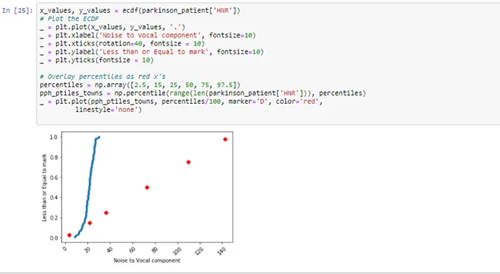

And for healthy people:

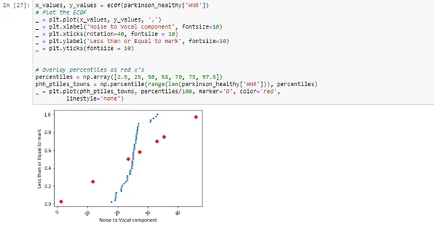

This information was buttressed by the line where patients had a high noise to vocal component as shown below.

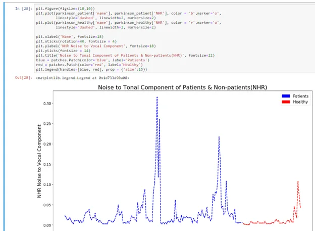

Yes, a lot of questions have indeed been explored. EDA is indeed a great principle. With the questions out of the way, we can go on to do a prediction to know who a healthy person or a patient can be provided we get the same data from new people around the around.

To make this prediction, Linear regression and GradientBoostingClassifier were used to ascertain this information. First, the features and the label were instantiated as for both algorithms. After that, the large-value columns were normalized to be on the same scale with the smaller-value columns. This helps to get a better prediction. The normalized dataset was then split using 80% for training and 20% for testing. These three processes were done for both algorithms. The diagram below depicts this information.

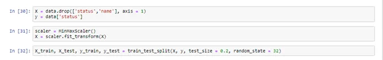

After the features were fed to the both algorithms (Linear regression and GradientBoostingClassifier), an accuracy of 92.3% of knowing a diabetic or a non-diabetic patient. Shown below is the result for the Linear Regression.

Shown below is the result for the GradientBoostingClassifier.

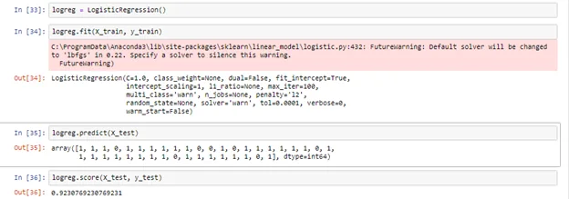

With all the above information, we can highly predict a Parkinson patient and a healthy person provided we have all the necessary information as shown in our feature columns. Indeed, Machine learning has really come to stay and it is transforming the WORLD!!!
