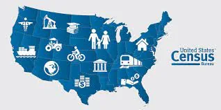
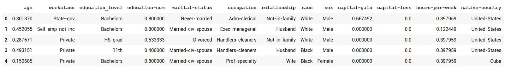

Census data Machine Learning Solution:



This article discusses the approach of solving the finding donors problem, we try first to explain the data and get into its numerical statistical details in order to have more insights of it, then we try to find a machine learning solution and an evaluation method to assure the credibility of the model, let's begin with the data and the purpose of the model. This data was extracted from the [1994 Census bureau database](http://www.census.gov/en.html) by Ronny Kohavi and Barry Becker (Data Mining and Visualization, Silicon Graphics). A set of reasonably clean records was extracted using the following conditions: ((AAGE>16) && (AGI>100) && (AFNLWGT>1) && (HRSWK>0)). *The prediction task is to determine whether a person makes over $50K a year*.

Link for code, [here](https://github.com/omarmohamed2011/census-dataset-exploration-and-solution).

### Dataset

Let's firstly describe the data in brief;

The weights on the Current Population Survey (CPS) files are controlled to independent estimates of the civilian noninstitutional population of the US. These are prepared monthly for us by Population Division here at the Census Bureau. We use 3 sets of controls. These are:

1. A single cell estimate of the population 16+ for each state.
2. Controls for Hispanic Origin by age and sex.
3. Controls by Race, age and gender.

We use all three sets of controls in our weighting program and "rake" through them 6 times so that by the end we come back to all the controls we used. The term estimate refers to population totals derived from CPS by creating "weighted tallies" of any specified social-economic characteristics of the population. People with similar demographic characteristics should have similar weights. There is one important caveat to remember about this statement. That is that since the CPS sample is actually a collection of 51 state samples, each with its own probability of selection, the statement only applies within state.

### Data exploration

Let's now get some info about the data;

```python
total_records = len(data.occupation)

# Number of records where individual's income is more than $50,000
n_greater_50k  = len(data[data['income'] == ">50K"])

# Number of records where individual's income is at most $50,000
n_at_most_50k = len(data[data['income'] == "<=50K"])

# Percentage of individuals whose income is more than $50,000
greater_percent = n_greater_50k/total_records*100
```

Results:

```python
>>Total number of records: 45222
>>Individuals making more than $50,000: 11208
>>Individuals making at most $50,000: 34014
>>Percentage of individuals making more than $50,000: 24.78%
```

Let's now split features and labels before further exploration;

```python
# Split the data into features and target label
income_raw = data['income']
features_raw = data.drop('income', axis = 1)
```

Log transformation and skewed features;

```python
# Log-transform the skewed features
skewed = ['capital-gain', 'capital-loss']
features_log_transformed = pd.DataFrame(data = features_raw)
features_log_transformed[skewed] = features_raw[skewed].apply(lambda x: np.log(x + 1))
```

Let's normalize the values of the features age, education num, capital-gain, capital-loss, and hours-per-week;

```python
# Import sklearn.preprocessing.StandardScaler
from sklearn.preprocessing import MinMaxScaler

# Initialize a scaler, then apply it to the features
scaler = MinMaxScaler()
numerical = ['age', 'education-num', 'capital-gain', 'capital-loss', 'hours-per-week']

features_log_minmax_transform = pd.DataFrame(data = features_log_transformed)
features_log_minmax_transform[numerical] = scaler.fit_transform(features_log_transformed[numerical])

# Show an example of a record with scaling applied
display(features_log_minmax_transform.head(n = 5))
```

Results:



Now the crucial part, we transform and encode the non-numerical values in order to have them in a form ready to be input to a model;

```python
# One-hot encode the 'features_log_minmax_transform' data using pandas.get_dummies()
features_final = pd.get_dummies(features_log_minmax_transform,dummy_na=False)
# Encode the 'income_raw' data to numerical values
income =  []
for inc in income_raw:
  if inc =='>50K':
    income.append(1)
  else:
    income.append(0)
income = pd.Series(income)

# Print the number of features after one-hot encoding
encoded = list(features_final.columns)
print("{} total features after one-hot encoding.".format(len(encoded)))

# Uncomment the following line to see the encoded feature names
print(encoded)
```

Results:

```python
>>>103 total features after one-hot encoding.
>>>['age', 'education-num', 'capital-gain', 'capital-loss', 'hours-per-week', 'workclass_ Federal-gov', 'workclass_ Local-gov', 'workclass_ Private', 'workclass_ Self-emp-inc', 'workclass_ Self-emp-not-inc', 'workclass_ State-gov', 'workclass_ Without-pay', 'education_level_ 10th', 'education_level_ 11th', 'education_level_ 12th', 'education_level_ 1st-4th', 'education_level_ 5th-6th', 'education_level_ 7th-8th', 'education_level_ 9th', 'education_level_ Assoc-acdm', 'education_level_ Assoc-voc', 'education_level_ Bachelors', 'education_level_ Doctorate', 'education_level_ HS-grad', 'education_level_ Masters', 'education_level_ Preschool', 'education_level_ Prof-school', 'education_level_ Some-college', 'marital-status_ Divorced', 'marital-status_ Married-AF-spouse', 'marital-status_ Married-civ-spouse', 'marital-status_ Married-spouse-absent', 'marital-status_ Never-married', 'marital-status_ Separated', 'marital-status_ Widowed', 'occupation_ Adm-clerical', 'occupation_ Armed-Forces', 'occupation_ Craft-repair', 'occupation_ Exec-managerial', 'occupation_ Farming-fishing', 'occupation_ Handlers-cleaners', 'occupation_ Machine-op-inspct', 'occupation_ Other-service', 'occupation_ Priv-house-serv', 'occupation_ Prof-specialty', 'occupation_ Protective-serv', 'occupation_ Sales', 'occupation_ Tech-support', 'occupation_ Transport-moving', 'relationship_ Husband', 'relationship_ Not-in-family', 'relationship_ Other-relative', 'relationship_ Own-child', 'relationship_ Unmarried', 'relationship_ Wife', 'race_ Amer-Indian-Eskimo', 'race_ Asian-Pac-Islander', 'race_ Black', 'race_ Other', 'race_ White', 'sex_ Female', 'sex_ Male', 'native-country_ Cambodia', 'native-country_ Canada', 'native-country_ China', 'native-country_ Columbia', 'native-country_ Cuba', 'native-country_ Dominican-Republic', 'native-country_ Ecuador', 'native-country_ El-Salvador', 'native-country_ England', 'native-country_ France', 'native-country_ Germany', 'native-country_ Greece', 'native-country_ Guatemala', 'native-country_ Haiti', 'native-country_ Holand-Netherlands', 'native-country_ Honduras', 'native-country_ Hong', 'native-country_ Hungary', 'native-country_ India', 'native-country_ Iran', 'native-country_ Ireland', 'native-country_ Italy', 'native-country_ Jamaica', 'native-country_ Japan', 'native-country_ Laos', 'native-country_ Mexico', 'native-country_ Nicaragua', 'native-country_ Outlying-US(Guam-USVI-etc)', 'native-country_ Peru', 'native-country_ Philippines', 'native-country_ Poland', 'native-country_ Portugal', 'native-country_ Puerto-Rico', 'native-country_ Scotland', 'native-country_ South', 'native-country_ Taiwan', 'native-country_ Thailand', 'native-country_ Trinadad&Tobago', 'native-country_ United-States', 'native-country_ Vietnam', 'native-country_ Yugoslavia']
```

Now we are almost ready for a Machine Learning Solution..

### Modeling phase

Firstly let's split train and test data;

```python
# Import train_test_split
from sklearn.model_selection import train_test_split

# Split the 'features' and 'income' data into training and testing sets
X_train, X_test, y_train, y_test = train_test_split(features_final, income, test_size = 0.2,
random_state = 0)

# Show the results of the split
print("Training set has {} samples.".format(X_train.shape[0]))
print("Testing set has {} samples.".format(X_test.shape[0]))
```

Result:

```python
>>Training set has 36177 samples.
>>Testing set has 9045 samples.
```

Let's now prepare the evaluation metrics and check the naive prediction:

```python
'''
TP = np.sum(income) # Counting the ones as this is the naive case. Note that 'income' is the 'income_raw' data
encoded to numerical values done in the data preprocessing step.
FP = income.count() - TP # Specific to the naive case

TN = 0 # No predicted negatives in the naive case
FN = 0 # No predicted negatives in the naive case
'''

# TODO: Calculate accuracy, precision and recall

TruePositives  = np.sum(income)
FalsePositives = income.count() - TruePositives
TrueNegatives  = 00
FalseNegatives = 00

accuracy = (TruePositives + TrueNegatives)/(TruePositives + TrueNegatives + FalsePositives + FalseNegatives)

recall = TruePositives/(TruePositives + FalseNegatives)

precision = TruePositives/(TruePositives + FalsePositives)

# Calculate F-score using the formula above for beta = 0.5 and correct values for precision and recall.
beta = 0.5
fscore = (1 + beta**2)*(precision*recall)/((beta**2*precision)+recall)

# Print the results
print("Naive Prediction Scores: [Accuracy: {:.2f}, F-score: {:.2f}]".format(accuracy*100, fscore*100))
```

Results:

```python
Naive Prediction Scores: [Accuracy: 24.78, F-score: 29.17]
```

Let's define the function for models prediction:

```python
# Import two metrics from sklearn - fbeta_score and accuracy_score
from sklearn.metrics import accuracy_score, fbeta_score
from sklearn import tree

def train_predict(learner, sample_size, X_train, y_train, X_test, y_test):
    '''
    inputs:
       - learner: the learning algorithm to be trained and predicted on
       - sample_size: the size of samples (number) to be drawn from training set
       - X_train: features training set
       - y_train: income training set
       - X_test: features testing set
       - y_test: income testing set
    '''

    results = {}

    # Fit the learner to the training data using slicing with 'sample_size' using .fit(training_features[:], training_labels[:])
    start_time = time()
    training_features,training_labels = X_train[:sample_size], y_train[:sample_size]

    learner = learner.fit(training_features[:],training_labels[:])
    end_time = time()

    # Calculate the training time
    results['train_time'] = round(end_time - start_time, 3)

    # Get the predictions on the test set(X_test),
    #       then get predictions on the first 300 training samples(X_train) using .predict()
    start_time = time()

    predictions_test = learner.predict(X_test)
    predictions_train = learner.predict(X_train[:300])

    end_time = time()

    # Calculate the total prediction time
    results['prediction_time'] = round(end_time - start_time, 3)

    # Compute accuracy on the first 300 training samples which is y_train[:300]
    results['train_accuracy'] = accuracy_score(y_train[:300], predictions_train)

    # Compute accuracy on test set using accuracy_score()
    results['test_accuracy'] = accuracy_score(y_test, predictions_test)

    # Compute F-score on the the first 300 training samples using fbeta_score()
    results['train_fscore'] = fbeta_score(y_train[:300], predictions_train, beta=0.5)

    # Compute F-score on the test set which is y_test
    results['test_fscore'] = fbeta_score(y_test, predictions_test, beta=0.5)

    # Success
    print("{} trained on {} samples.".format(learner.__class__.__name__, sample_size))

    # Return the results
    return results
```

Let's now train the models taking AdaBoost, GaussianNB, and SVC as examples;

```python
# Import the three supervised learning models from sklearn
from sklearn.ensemble import AdaBoostClassifier
from sklearn.naive_bayes import GaussianNB
from sklearn.svm import SVC

# Initialize the three models
clf_A = AdaBoostClassifier(random_state=42)
clf_B = GaussianNB()
clf_C = SVC(random_state=42)

# Calculate the number of samples for 1%, 10%, and 100% of the training data
# samples_100 is the entire training set i.e. len(y_train)
# samples_10 is 10% of samples_100
# samples_1 is 1% of samples_100
samples_100 = len(y_train)
samples_10 = samples_100//10
samples_1 = samples_100//100

# Collect results on the learners
results = {}
for clf in [clf_A, clf_B, clf_C]:
    clf_name = clf.__class__.__name__
    print(clf_name)
    results[clf_name] = {}

    for i, samples in enumerate([samples_1, samples_10, samples_100]):
        results[clf_name][i] = \
        train_predict(clf, samples, X_train, y_train, X_test, y_test)
```

Results for each model:

```python
AdaBoostClassifier
AdaBoostClassifier trained on 361 samples.
AdaBoostClassifier trained on 3617 samples.
AdaBoostClassifier trained on 36177 samples.
GaussianNB
GaussianNB trained on 361 samples.
GaussianNB trained on 3617 samples.
GaussianNB trained on 36177 samples.
SVC
SVC trained on 361 samples.
SVC trained on 3617 samples.
SVC trained on 36177 samples.
```

We now have lots of models, let's run our GridSearch to eliminate values that can't make it to a good accuracy and only have parameter values that are convenient for the solution:

```python
# Import 'GridSearchCV', 'make_scorer', and any other necessary libraries
from sklearn.model_selection import GridSearchCV
from sklearn.metrics import make_scorer, fbeta_score

# Initialize the classifier
ada_clf = AdaBoostClassifier(random_state=42)

# Create the parameters list you wish to tune, using a dictionary if needed.
# parameters = {'parameter_1': [value1, value2], 'parameter_2': [value1, value2]}
parameters_tune = {'learning_rate': [0.5,1.0, 1.5, 2.0,2.5], 'n_estimators':[50,100,200], 'algorithm': ['SAMME.R', 'SAMME']}

# Make an fbeta_score scoring object using make_scorer()
score_method = make_scorer(fbeta_score, beta=0.5)
# Perform grid search on the classifier using 'scorer' as the scoring method using GridSearchCV()
grid_obj = GridSearchCV(ada_clf, parameters_tune, scoring = score_method)

# Fit the grid search object to the training data and find the optimal parameters using fit()
grid_fit = grid_obj.fit(X_train, y_train)

# Get the estimator
best_clf_params = grid_fit.best_estimator_

# Make predictions using the unoptimized and model
clf = (clf.fit(X_train, y_train))
preds = clf.predict(X_test)
best_preds = best_clf_params.predict(X_test)

# Report the before-and-afterscores
print("Unoptimized model\n------")
print("Accuracy score on testing data: {:.4f}".format(accuracy_score(y_test, preds)))
print("F-score on testing data: {:.4f}".format(fbeta_score(y_test, preds, beta = 0.5)))
print("\nOptimized Model\n------")
print("Final accuracy score on the testing data: {:.4f}".format(accuracy_score(y_test, best_preds)))
print("Final F-score on the testing data: {:.4f}".format(fbeta_score(y_test, best_preds, beta = 0.5)))
```

And there you go the results of the best parameters and compare them to the previous results:

```python
Unoptimized model
------
Accuracy score on testing data: 0.8423
F-score on testing data: 0.6851

Optimized Model
------
Final accuracy score on the testing data: 0.8640
Final F-score on the testing data: 0.7355
```

We can easily extract the best parameters and use it to train our model with the best parameters, and obtain the final results and print them:

```python
# Import a supervised learning model that has 'feature_importances_'
from sklearn.tree import DecisionTreeClassifier

# Train the supervised model on the training set using .fit(X_train, y_train)
model = DecisionTreeClassifier(random_state=0).fit(X_train, y_train)

# Extract the feature importances using .feature_importances_
importances = model.feature_importances_

# Import functionality for cloning a model
from sklearn.base import clone

# Reduce the feature space
X_train_reduced = X_train[X_train.columns.values[(np.argsort(importances)[::-1])[:5]]]
X_test_reduced = X_test[X_test.columns.values[(np.argsort(importances)[::-1])[:5]]]

# Train on the "best" model found from grid search earlier
clf = (clone(best_clf_params)).fit(X_train_reduced, y_train)

# Make new predictions
reduced_predictions = clf.predict(X_test_reduced)

# Report scores from the final model using both versions of data
print("Final Model trained on full data\n------")
print("Accuracy on testing data: {:.4f}".format(accuracy_score(y_test, best_preds)))
print("F-score on testing data: {:.4f}".format(fbeta_score(y_test, best_preds, beta = 0.5)))
print("\nFinal Model trained on reduced data\n------")
print("Accuracy on testing data: {:.4f}".format(accuracy_score(y_test, reduced_predictions)))
print("F-score on testing data: {:.4f}".format(fbeta_score(y_test, reduced_predictions, beta = 0.5)))
```

Final Results Output:

```python
>>Final Model trained on full data ------
>>Accuracy on testing data: 0.8640
>>F-score on testing data: 0.7355
>>Final Model trained on reduced data ------
>>Accuracy on testing data: 0.8494
>>F-score on testing data: 0.7067
```

### Conclusion

In this article we have seen how to explore the dataset, preprocess it and prepare it for the modeling, model it using Machine Learning models with a variety of algorithms and how to obtain the best of each model and search best outcomes, and finally how to evaluate the results gotten, I really hope that the article was insightful and helpful for you to seek approach to solve a variety of Machine Learning challenges, until next time !
